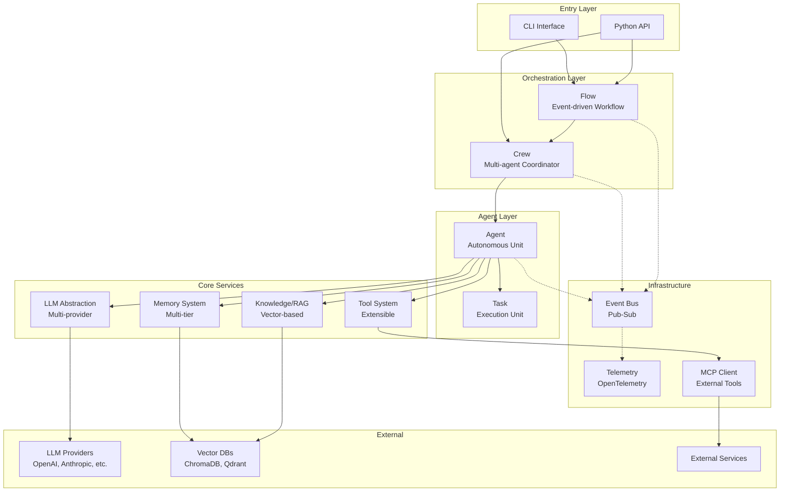
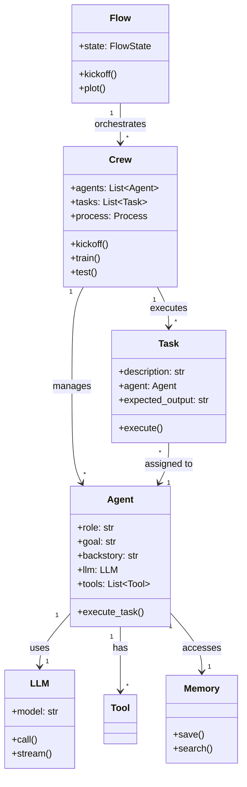
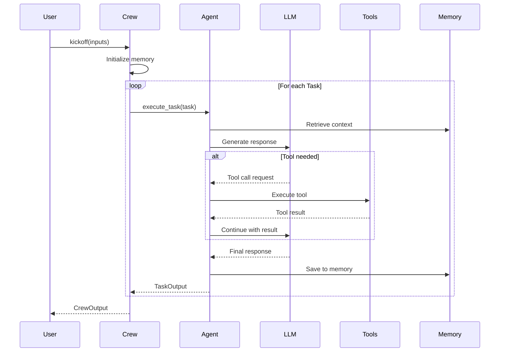
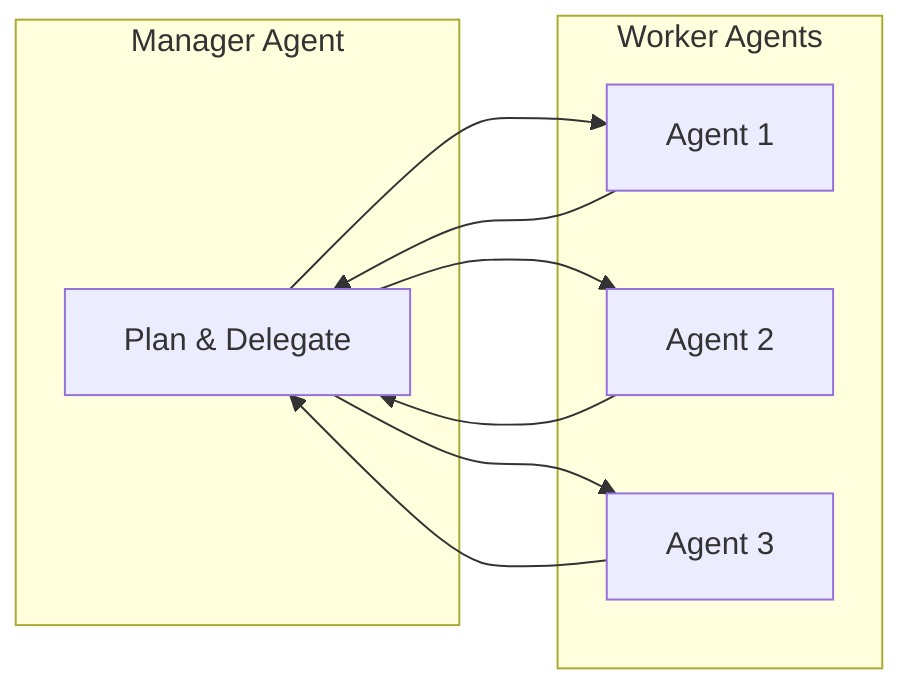

# CrewAI Architecture Overview

## TL;DR
CrewAI là một **multi-agent orchestration framework** cho phép tạo và điều phối nhiều AI agents làm việc cùng nhau. Kiến trúc theo pattern **hierarchical composition**: `Flow` → `Crew` → `Agent` → `Task`, với event-driven communication và pluggable components cho LLM, memory, tools.

---

## 1. High-Level Architecture Diagram



---

## 2. Core Components Architecture

### 2.1 Layered Architecture

```
┌─────────────────────────────────────────────────────────────────┐
│                      APPLICATION LAYER                          │
│  ┌──────────┐  ┌──────────┐  ┌──────────────────────────────┐  │
│  │   CLI    │  │ @project │  │     Decorators (@crew,...)   │  │
│  └──────────┘  └──────────┘  └──────────────────────────────┘  │
├─────────────────────────────────────────────────────────────────┤
│                    ORCHESTRATION LAYER                          │
│  ┌─────────────────────────────┐  ┌─────────────────────────┐  │
│  │           Flow              │  │         Process         │  │
│  │  - @start, @listen, @router │  │  - Sequential           │  │
│  │  - State management         │  │  - Hierarchical         │  │
│  │  - Conditional execution    │  └─────────────────────────┘  │
│  └─────────────────────────────┘                                │
├─────────────────────────────────────────────────────────────────┤
│                      EXECUTION LAYER                            │
│  ┌──────────────────────────┐  ┌────────────────────────────┐  │
│  │          Crew            │  │           Task             │  │
│  │  - Agent coordination    │  │  - Task definition         │  │
│  │  - Task assignment       │  │  - Output validation       │  │
│  │  - Memory management     │  │  - Guardrails              │  │
│  └──────────────────────────┘  └────────────────────────────┘  │
│  ┌─────────────────────────────────────────────────────────────┐│
│  │                        Agent                                ││
│  │  - Role, Goal, Backstory                                    ││
│  │  - LLM integration                                          ││
│  │  - Tool execution                                           ││
│  │  - Memory access                                            ││
│  └─────────────────────────────────────────────────────────────┘│
├─────────────────────────────────────────────────────────────────┤
│                      SERVICE LAYER                              │
│  ┌──────────┐ ┌──────────┐ ┌──────────┐ ┌──────────────────┐   │
│  │   LLM    │ │  Memory  │ │  Tools   │ │  Knowledge/RAG   │   │
│  └──────────┘ └──────────┘ └──────────┘ └──────────────────┘   │
├─────────────────────────────────────────────────────────────────┤
│                   INFRASTRUCTURE LAYER                          │
│  ┌──────────┐ ┌──────────┐ ┌──────────┐ ┌──────────────────┐   │
│  │  Events  │ │Telemetry │ │   MCP    │ │     Storage      │   │
│  └──────────┘ └──────────┘ └──────────┘ └──────────────────┘   │
└─────────────────────────────────────────────────────────────────┘
```

### 2.2 Component Relationships



---

## 3. Execution Flow

### 3.1 Standard Execution Path



### 3.2 Hierarchical Process Flow



---

## 4. Key Design Decisions

### 4.1 Pydantic-First Architecture
```python
# File: lib/crewai/src/crewai/crew.py:133
class Crew(FlowTrackable, BaseModel):
    """Uses Pydantic BaseModel for:
    - Runtime type validation
    - JSON serialization
    - Configuration via Field()
    """
    tasks: list[Task] = Field(default_factory=list)
    agents: list[BaseAgent] = Field(default_factory=list)
    process: Process = Field(default=Process.sequential)
```

**Rationale**: Pydantic v2 provides:
- Strong type safety at runtime
- Automatic validation
- Easy serialization for persistence
- Clear API contracts

### 4.2 Event-Driven Observability
```python
# File: lib/crewai/src/crewai/events/event_bus.py
crewai_event_bus.emit(
    AgentExecutionStartedEvent(agent=agent, task=task)
)
```

**Rationale**: Decoupled event system enables:
- Non-invasive telemetry
- Custom listeners for logging/monitoring
- Easy integration with external observability tools

### 4.3 Provider Abstraction Pattern
```python
# LLM providers follow common interface
# File: lib/crewai/src/crewai/llms/base_llm.py
class BaseLLM:
    def call(self, messages, tools=None): ...
    def stream(self, messages): ...
```

**Rationale**: Single interface for multiple providers allows:
- Easy switching between OpenAI, Anthropic, etc.
- Consistent behavior across providers
- Simple testing with mock providers

---

## 5. Directory Structure Overview

```
lib/crewai/src/crewai/
├── __init__.py              # Public API exports
├── agent/                   # Agent core implementation
│   └── core.py             # Agent class (2,162 LOC)
├── crew.py                  # Crew orchestrator (2,039 LOC)
├── task.py                  # Task definition (1,261 LOC)
├── flow/                    # Workflow engine
│   └── flow.py             # Flow class (2,641 LOC)
├── llm.py                   # LLM wrapper (2,362 LOC)
├── llms/                    # LLM providers
│   └── providers/          # OpenAI, Anthropic, Bedrock, etc.
├── memory/                  # Memory system
│   ├── short_term/         # Conversation history
│   ├── long_term/          # Persistent storage
│   ├── entity/             # Fact extraction
│   └── external/           # Mem0 integration
├── tools/                   # Tool system
├── rag/                     # Vector embeddings
│   └── embeddings/         # 13+ embedding providers
├── knowledge/               # Knowledge base
├── events/                  # Event system
├── mcp/                     # Model Context Protocol
├── utilities/               # Helper modules (45+)
└── cli/                     # Command-line interface
```

---

## 6. Key Takeaways

1. **Composition over Inheritance**: Framework uses composition (`Flow` contains `Crew`, `Crew` contains `Agent`) rather than deep inheritance hierarchies.

2. **Plugin Architecture**: Tools, LLM providers, embedding providers, and memory backends are all pluggable via interfaces.

3. **Event-Driven Design**: Decoupled event bus enables observability without tight coupling between components.

4. **Type Safety**: Heavy use of Pydantic v2 for runtime validation and clear API contracts.

5. **Multi-Provider Support**: Abstractions allow switching between LLM providers (OpenAI, Anthropic, Bedrock, etc.) without code changes.

6. **Async-First**: Native async support throughout the codebase for better concurrency.

7. **Memory Hierarchy**: Multi-tier memory system (short-term, long-term, entity, external) for context retention.

---

## File References

| Component | File Path | LOC |
|-----------|-----------|-----|
| Agent Core | `lib/crewai/src/crewai/agent/core.py` | 2,162 |
| Crew | `lib/crewai/src/crewai/crew.py` | 2,039 |
| Task | `lib/crewai/src/crewai/task.py` | 1,261 |
| Flow | `lib/crewai/src/crewai/flow/flow.py` | 2,641 |
| LLM | `lib/crewai/src/crewai/llm.py` | 2,362 |
| Events | `lib/crewai/src/crewai/events/` | - |
| Memory | `lib/crewai/src/crewai/memory/` | - |
