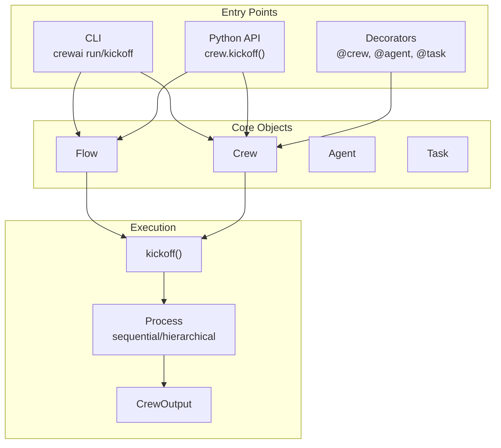
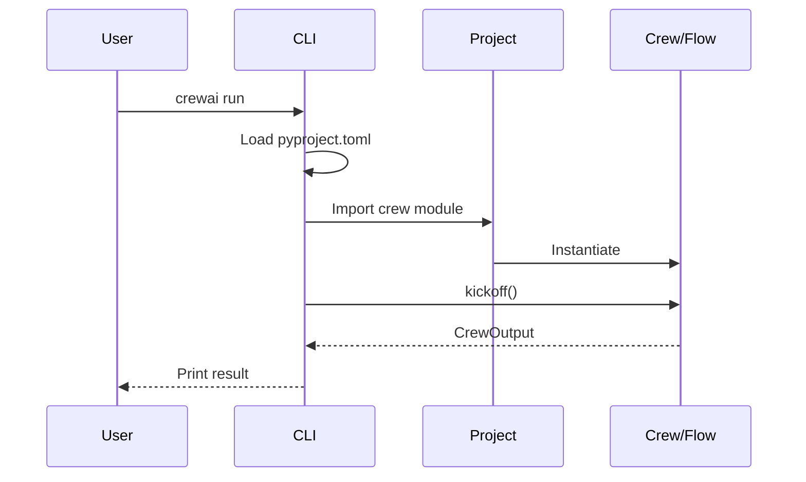
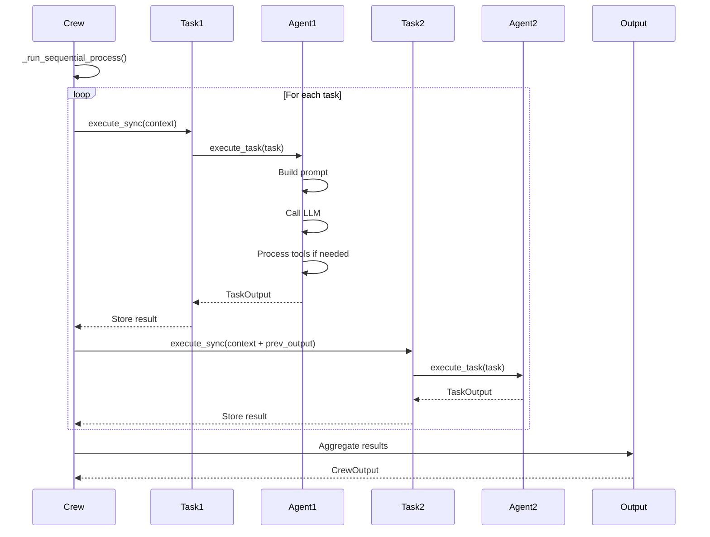
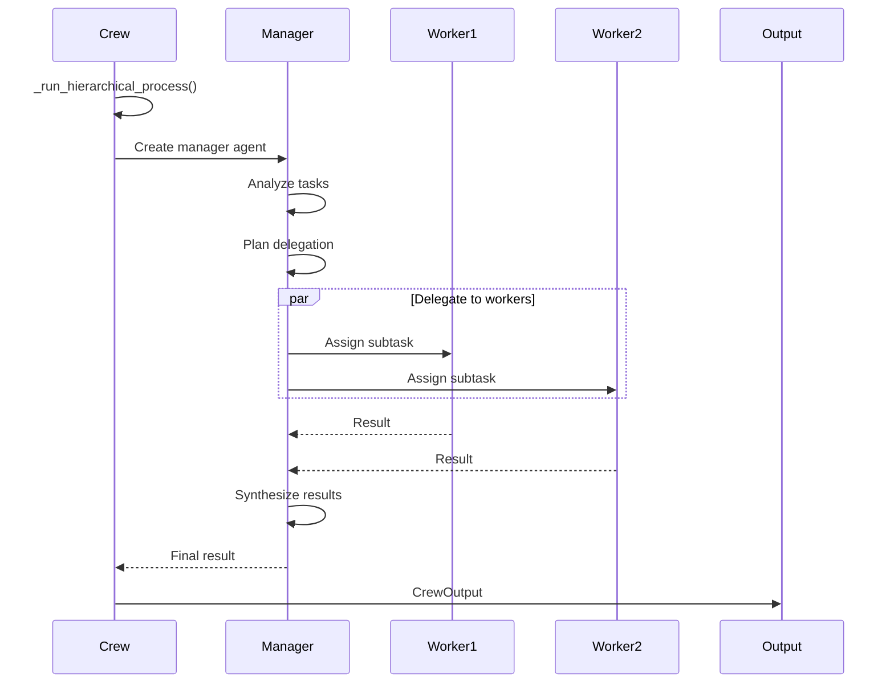
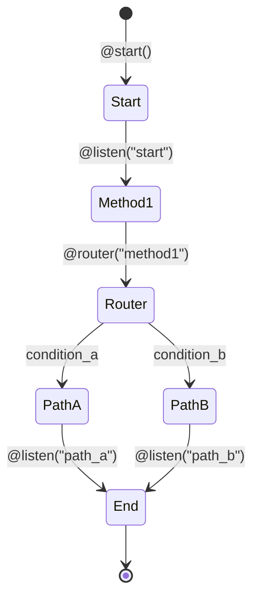

# Entry Points và Luồng Chính

## TL;DR
CrewAI có **3 entry points chính**: CLI (`crewai` command), Python API trực tiếp (`Crew`, `Flow`), và Decorator-based (`@crew`, `@agent`, `@task`). Luồng thực thi bắt đầu từ `kickoff()` method, đi qua Process (sequential/hierarchical), và kết thúc với `CrewOutput`.

---

## 1. Entry Points Overview



---

## 2. Entry Point 1: Command Line Interface (CLI)

### 2.1 CLI Commands Overview

```python
# File: lib/crewai/src/crewai/cli/cli.py:34-38
@click.group()
@click.version_option(get_version("crewai"))
def crewai():
    """Top-level command group for crewai."""
```

**Các lệnh chính:**

| Command | Description | Handler |
|---------|-------------|---------|
| `crewai create crew <name>` | Tạo project crew mới | `create_crew()` |
| `crewai create flow <name>` | Tạo project flow mới | `create_flow()` |
| `crewai run` | Chạy crew | `run_crew()` |
| `crewai kickoff` | Kickoff flow | `kickoff_flow()` |
| `crewai train` | Train crew | `train_crew()` |
| `crewai test` | Test crew | `evaluate_crew()` |
| `crewai chat` | Interactive chat | `run_chat()` |
| `crewai deploy` | Deploy to cloud | `DeployCommand` |

### 2.2 CLI Flow



### 2.3 CLI Entry Point Registration

```toml
# File: lib/crewai/pyproject.toml:106-107
[project.scripts]
crewai = "crewai.cli.cli:crewai"
```

---

## 3. Entry Point 2: Python API Trực Tiếp

### 3.1 Crew Instantiation

```python
# Cách sử dụng phổ biến
from crewai import Agent, Task, Crew, Process

# Tạo agents
researcher = Agent(
    role="Researcher",
    goal="Find relevant information",
    backstory="Expert researcher with 10 years experience",
    llm="gpt-4"
)

writer = Agent(
    role="Writer",
    goal="Write compelling content",
    backstory="Award-winning writer",
    llm="gpt-4"
)

# Tạo tasks
research_task = Task(
    description="Research the topic: {topic}",
    agent=researcher,
    expected_output="Research findings"
)

write_task = Task(
    description="Write article based on research",
    agent=writer,
    expected_output="Article draft"
)

# Tạo và chạy crew
crew = Crew(
    agents=[researcher, writer],
    tasks=[research_task, write_task],
    process=Process.sequential,
    verbose=True
)

result = crew.kickoff(inputs={"topic": "AI in healthcare"})
```

### 3.2 Kickoff Methods

```python
# File: lib/crewai/src/crewai/crew.py:693-899

class Crew(FlowTrackable, BaseModel):
    def kickoff(
        self,
        inputs: dict[str, Any] | None = None,
        input_files: dict[str, FileInput] | None = None,
    ) -> CrewOutput | CrewStreamingOutput:
        """Synchronous execution - main entry point"""
        # Line 742-745: Process routing
        if self.process == Process.sequential:
            result = self._run_sequential_process()
        elif self.process == Process.hierarchical:
            result = self._run_hierarchical_process()
        return result

    async def kickoff_async(self, inputs=None, input_files=None):
        """Async wrapper around sync kickoff (runs in thread)"""
        return await asyncio.to_thread(self.kickoff, inputs, input_files)

    async def akickoff(self, inputs=None, input_files=None):
        """Native async execution - uses async throughout"""
        # True async implementation
        pass

    def kickoff_for_each(self, inputs: list[dict], input_files=None):
        """Execute for multiple input sets sequentially"""
        results = []
        for input_data in inputs:
            crew = self.copy()
            output = crew.kickoff(inputs=input_data)
            results.append(output)
        return results

    async def kickoff_for_each_async(self, inputs: list[dict], input_files=None):
        """Execute for multiple input sets concurrently"""
        pass
```

### 3.3 Flow API

```python
# File: lib/crewai/src/crewai/flow/flow.py:122-194

from crewai.flow.flow import Flow, start, listen, router

class MyFlow(Flow):
    @start()
    def begin(self):
        """Starting point - unconditional"""
        return "Started"

    @listen("begin")
    def process(self, result):
        """Listen to 'begin' method output"""
        return f"Processed: {result}"

    @router("process")
    def route(self, result):
        """Route based on result"""
        if "success" in result:
            return "success_handler"
        return "error_handler"

# Kickoff flow
flow = MyFlow()
result = flow.kickoff()
```

---

## 4. Entry Point 3: Decorator-Based (Project Structure)

### 4.1 Project Decorators

```python
# File: lib/crewai/src/crewai/project/annotations.py:41-86

@before_kickoff   # Execute before crew starts
def prepare(self, inputs):
    return modified_inputs

@after_kickoff    # Execute after crew finishes
def cleanup(self, result):
    return modified_result

@agent            # Define an agent
def researcher(self) -> Agent:
    return Agent(role="Researcher", ...)

@task             # Define a task
def research_task(self) -> Task:
    return Task(description="...", agent=self.researcher())

@crew             # Define the crew
def my_crew(self) -> Crew:
    return Crew(agents=[...], tasks=[...])

@llm              # Define LLM instance
def custom_llm(self) -> LLM:
    return LLM(model="gpt-4")

@tool             # Define a tool
def search_tool(self):
    return MySearchTool()
```

### 4.2 CrewBase Class

```python
# File: lib/crewai/src/crewai/project/crew_base.py

from crewai.project import CrewBase, agent, task, crew

class ResearchCrew(CrewBase):
    """Crew definitions using decorators"""

    agents_config = "config/agents.yaml"
    tasks_config = "config/tasks.yaml"

    @agent
    def researcher(self) -> Agent:
        return Agent(
            config=self.agents_config["researcher"],
            llm=self.llm()
        )

    @task
    def research_task(self) -> Task:
        return Task(
            config=self.tasks_config["research"],
            agent=self.researcher()
        )

    @crew
    def crew(self) -> Crew:
        return Crew(
            agents=self.agents,  # Auto-collected from @agent methods
            tasks=self.tasks,    # Auto-collected from @task methods
            process=Process.sequential
        )

# Usage
research_crew = ResearchCrew()
result = research_crew.crew().kickoff()
```

---

## 5. Main Execution Flows

### 5.1 Sequential Process Flow



### 5.2 Hierarchical Process Flow



### 5.3 Flow-Based Execution



---

## 6. Output Types

### 6.1 CrewOutput

```python
# File: lib/crewai/src/crewai/crews/crew_output.py

class CrewOutput(BaseModel):
    """Result of crew execution"""
    raw: str                           # Raw text output
    pydantic: BaseModel | None = None  # Structured output
    json_dict: dict | None = None      # JSON output
    tasks_output: list[TaskOutput]     # Individual task outputs
    token_usage: dict                  # Token usage stats
```

### 6.2 TaskOutput

```python
# File: lib/crewai/src/crewai/tasks/task_output.py

class TaskOutput(BaseModel):
    """Result of single task execution"""
    description: str
    name: str | None = None
    expected_output: str
    summary: str | None = None
    raw: str
    pydantic: BaseModel | None = None
    json_dict: dict | None = None
    agent: str
    output_format: OutputFormat = OutputFormat.RAW
```

### 6.3 Streaming Output

```python
# When stream=True
crew = Crew(..., stream=True)
output = crew.kickoff()

# Sync iteration
for chunk in output:
    print(chunk, end="")

# Access final result
final_result = output.result

# Async iteration
async for chunk in output:
    print(chunk, end="")
```

---

## 7. Input Interpolation

### 7.1 Template Variables

```python
# Task descriptions support {variable} interpolation
task = Task(
    description="Research about {topic} in {domain}",
    expected_output="Summary of {topic}"
)

crew = Crew(agents=[agent], tasks=[task])
result = crew.kickoff(inputs={
    "topic": "machine learning",
    "domain": "healthcare"
})
```

### 7.2 File Inputs

```python
# With crewai-files package
from crewai_files import FileInput

result = crew.kickoff(
    inputs={"topic": "AI"},
    input_files={
        "document": FileInput(path="./report.pdf"),
        "image": FileInput(path="./chart.png")
    }
)
```

---

## 8. Key Takeaways

1. **3 Entry Points**: CLI, Python API, Decorators - tất cả đều converge về `kickoff()` method.

2. **Kickoff Variants**:
   - `kickoff()` - Sync, single input
   - `kickoff_async()` - Async wrapper (runs sync in thread)
   - `akickoff()` - Native async
   - `kickoff_for_each()` - Multiple inputs sequentially
   - `kickoff_for_each_async()` - Multiple inputs concurrently

3. **Process Types**: Sequential (tasks in order) và Hierarchical (manager delegates to workers).

4. **Flow Decorators**: `@start`, `@listen`, `@router` cho event-driven workflows.

5. **Project Decorators**: `@agent`, `@task`, `@crew` cho declarative crew definition.

6. **Output Types**: `CrewOutput`, `TaskOutput`, `CrewStreamingOutput` với support cho structured output (Pydantic, JSON).

---

## File References

| Component | File Path | Key Methods |
|-----------|-----------|-------------|
| CLI Entry | `lib/crewai/src/crewai/cli/cli.py` | `crewai()`, `run()` |
| Crew | `lib/crewai/src/crewai/crew.py:693-899` | `kickoff()`, `akickoff()` |
| Flow | `lib/crewai/src/crewai/flow/flow.py:122-194` | `@start`, `@listen`, `@router` |
| Annotations | `lib/crewai/src/crewai/project/annotations.py` | `@agent`, `@task`, `@crew` |
| CrewBase | `lib/crewai/src/crewai/project/crew_base.py` | `CrewBase` |
| CrewOutput | `lib/crewai/src/crewai/crews/crew_output.py` | `CrewOutput` |
| TaskOutput | `lib/crewai/src/crewai/tasks/task_output.py` | `TaskOutput` |
