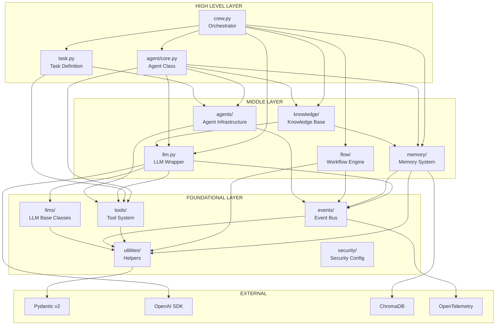
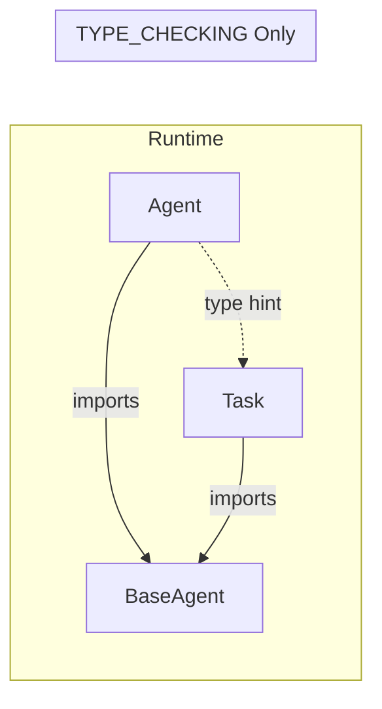
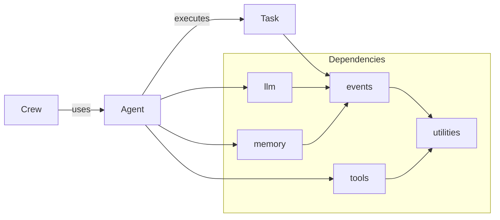
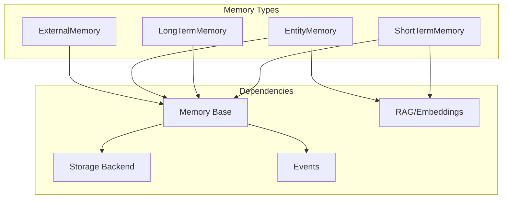
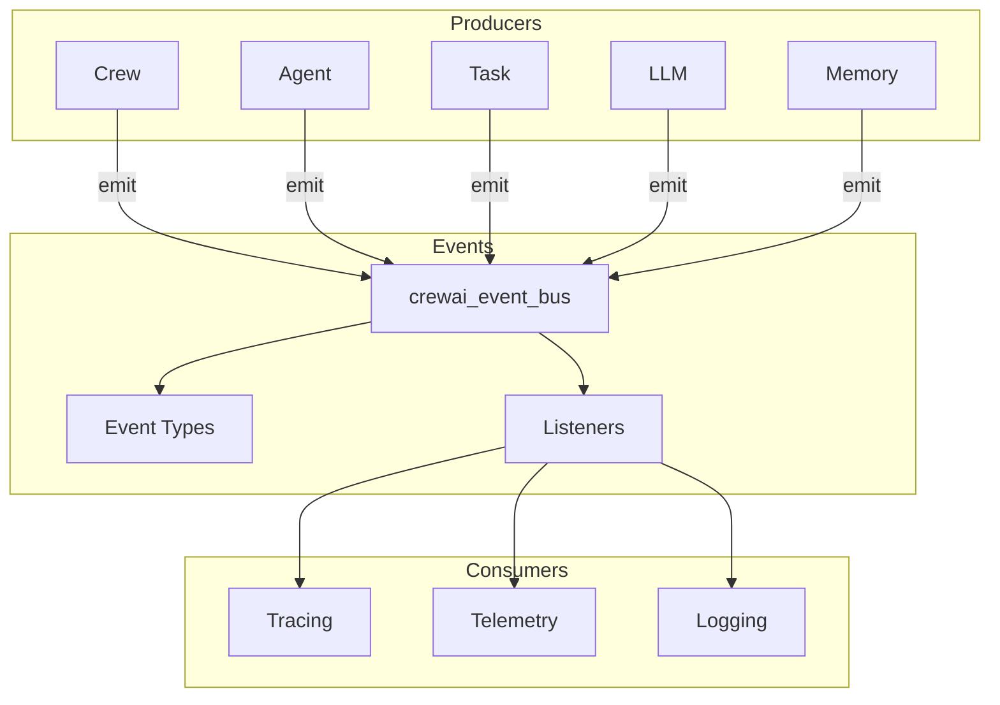

# Module Dependency Graph

## TL;DR
CrewAI theo kiến trúc **layered dependency**: `utilities/` → `events/`, `tools/` → `memory/`, `llm.py` → `agent/`, `task.py` → `crew.py`. Không có circular dependencies ở runtime nhờ sử dụng `TYPE_CHECKING`. Module `crew.py` là điểm hội tụ của tất cả dependencies.

---

## 1. Dependency Hierarchy Diagram



---

## 2. Dependency Layers Breakdown

### Layer 1: Foundational (No Internal Dependencies)

| Module | Purpose | External Dependencies |
|--------|---------|----------------------|
| `utilities/` | Helpers, converters, constants | Pydantic, rich |
| `tools/base_tool.py` | Tool interface definition | Pydantic |
| `events/` | Event system, pub-sub | OpenTelemetry |
| `llms/base_llm.py` | LLM base class | Pydantic |
| `security/` | Fingerprinting, config | Pydantic |

```python
# File: lib/crewai/src/crewai/tools/base_tool.py
# Minimal dependencies - only Pydantic and utilities
from pydantic import BaseModel, Field
from crewai.utilities.printer import Printer
from crewai.utilities.string_utils import sanitize_tool_name
```

### Layer 2: Middle (Depends on Foundational)

| Module | Depends On | Purpose |
|--------|------------|---------|
| `memory/` | events, utilities | Memory storage & retrieval |
| `llm.py` | llms/base_llm, events, tools | LLM wrapper |
| `flow/` | events, utilities | Workflow orchestration |
| `agents/` | tools, events, memory | Agent infrastructure |
| `knowledge/` | memory, llm, rag | Knowledge base |

```python
# File: lib/crewai/src/crewai/memory/short_term/short_term_memory.py
from crewai.events.event_bus import crewai_event_bus
from crewai.memory.memory import Memory
from crewai.utilities.string_utils import sanitize_tool_name
```

### Layer 3: High Level (Depends on All Lower Layers)

| Module | Major Dependencies | Role |
|--------|-------------------|------|
| `task.py` | agents, events, tools, utilities | Task definition |
| `agent/core.py` | agents, memory, llm, tools, knowledge | Agent execution |
| `crew.py` | agent, task, memory, llm, knowledge | Orchestration |

```python
# File: lib/crewai/src/crewai/crew.py (simplified)
from crewai.agent import Agent
from crewai.task import Task
from crewai.memory.short_term import ShortTermMemory
from crewai.memory.long_term import LongTermMemory
from crewai.llm import LLM
from crewai.events.event_bus import crewai_event_bus
```

---

## 3. Import Dependency Matrix

```
                    crew  agent  task  llm   memory  flow  tools  events  utilities
crew.py              -     ✓      ✓     ✓      ✓      ✓      ✓       ✓        ✓
agent/core.py              -      TC    ✓      ✓             ✓       ✓        ✓
task.py                           -           TC             ✓       ✓        ✓
llm.py                                  -                    TC      ✓        ✓
memory/                                        -                     ✓        ✓
flow/                                                 -              ✓        ✓
tools/                                                       -                ✓
events/                                                              -        ✓
utilities/                                                                    -

✓ = Direct import
TC = TYPE_CHECKING only (no runtime dependency)
```

---

## 4. Circular Dependency Management

### 4.1 Agent ↔ Task Cycle



**Solution**: Agent uses `TYPE_CHECKING` để import Task chỉ cho type hints.

```python
# File: lib/crewai/src/crewai/agent/core.py

from typing import TYPE_CHECKING

if TYPE_CHECKING:
    from crewai.task import Task  # Only for type hints
    from crewai.tools.base_tool import BaseTool

class Agent(BaseAgent):
    def execute_task(self, task: "Task") -> str:  # Quoted type hint
        ...
```

### 4.2 LLM ↔ Agent Cycle

```python
# File: lib/crewai/src/crewai/llm.py

if TYPE_CHECKING:
    from crewai.agent.core import Agent
    from crewai.task import Task
    from crewai.tools.base_tool import BaseTool
```

**Solution**: LLM chỉ reference Agent/Task trong TYPE_CHECKING block.

### 4.3 No Runtime Circular Dependencies

| Potential Cycle | Resolution |
|-----------------|------------|
| Agent → Task → Agent | Task imports BaseAgent, not Agent |
| Crew → Agent → Crew | Agent never imports Crew |
| LLM → Agent → LLM | LLM uses TYPE_CHECKING for Agent |

---

## 5. Dependency Flow by Feature

### 5.1 Task Execution Flow



### 5.2 Memory System Dependencies



### 5.3 Event System Dependencies



---

## 6. Module Size & Complexity

| Module | File Count | Total LOC | Complexity |
|--------|------------|-----------|------------|
| `crew.py` | 1 | ~2,039 | HIGH |
| `agent/core.py` | 1 | ~2,162 | HIGH |
| `task.py` | 1 | ~1,261 | MEDIUM |
| `llm.py` | 1 | ~2,362 | HIGH |
| `flow/flow.py` | 1 | ~2,641 | HIGH |
| `memory/` | ~10 | ~1,500 | MEDIUM |
| `tools/` | ~8 | ~800 | LOW |
| `events/` | ~20 | ~1,200 | LOW |
| `utilities/` | ~45 | ~3,000 | LOW |

---

## 7. Key Integration Points

### 7.1 Crew as Central Hub

```python
# crew.py imports nearly everything
from crewai.agent import Agent
from crewai.task import Task
from crewai.llm import LLM
from crewai.memory.short_term import ShortTermMemory
from crewai.memory.long_term import LongTermMemory
from crewai.memory.entity import EntityMemory
from crewai.memory.external import ExternalMemory
from crewai.knowledge import Knowledge
from crewai.tools.base_tool import BaseTool
from crewai.events.event_bus import crewai_event_bus
```

### 7.2 Agent as Execution Engine

```python
# agent/core.py imports execution dependencies
from crewai.agents.crew_agent_executor import CrewAgentExecutor
from crewai.memory.contextual import ContextualMemory
from crewai.llms.base_llm import BaseLLM
from crewai.mcp import MCPClient
from crewai.knowledge import Knowledge
```

### 7.3 Events as Cross-Cutting Concern

```python
# All major modules emit events
# No module depends on event consumers
crewai_event_bus.emit(AgentExecutionStartedEvent(...))
crewai_event_bus.emit(TaskCompletedEvent(...))
crewai_event_bus.emit(LLMCallStartedEvent(...))
```

---

## 8. Dependency Best Practices Used

### 8.1 Dependency Inversion

```python
# High-level modules depend on abstractions
class Agent(BaseAgent):  # Depends on BaseAgent, not concrete
    llm: BaseLLM         # Depends on BaseLLM, not LLM
    tools: list[BaseTool]  # Depends on BaseTool interface
```

### 8.2 Interface Segregation

```python
# Small, focused interfaces
class BaseTool:
    def _run(self, *args, **kwargs): ...

class BaseLLM:
    def call(self, messages): ...

class Memory:
    def save(self, value): ...
    def search(self, query): ...
```

### 8.3 Single Responsibility

```
utilities/converter.py    - Only conversion logic
utilities/printer.py      - Only printing logic
utilities/llm_utils.py    - Only LLM creation logic
utilities/guardrail.py    - Only output validation
```

---

## 9. Key Takeaways

1. **Clean Layered Architecture**: Dependencies flow upward from utilities → middle → high-level.

2. **No Runtime Cycles**: All potential circular dependencies handled with `TYPE_CHECKING`.

3. **Dependency Inversion**: High-level modules depend on abstract base classes (`BaseLLM`, `BaseTool`, `BaseAgent`).

4. **Event System Decoupling**: Events provide cross-cutting observability without creating dependencies.

5. **Crew as Integration Point**: `crew.py` is the central hub connecting all major components.

6. **Agent Self-Contained**: Once configured, Agent has all dependencies needed for execution.

7. **Utilities are Foundational**: `utilities/` package has no internal dependencies, making it safe to import anywhere.

---

## File References

| Module | Path | Dependencies Count |
|--------|------|-------------------|
| Crew | `lib/crewai/src/crewai/crew.py` | 13+ major |
| Agent | `lib/crewai/src/crewai/agent/core.py` | 11+ major |
| Task | `lib/crewai/src/crewai/task.py` | 8 major |
| LLM | `lib/crewai/src/crewai/llm.py` | 5 major |
| Flow | `lib/crewai/src/crewai/flow/flow.py` | 6 major |
| Memory | `lib/crewai/src/crewai/memory/` | 3-4 per type |
| Tools | `lib/crewai/src/crewai/tools/base_tool.py` | 2 |
| Events | `lib/crewai/src/crewai/events/` | 1-2 |
| Utilities | `lib/crewai/src/crewai/utilities/` | 0-1 |
