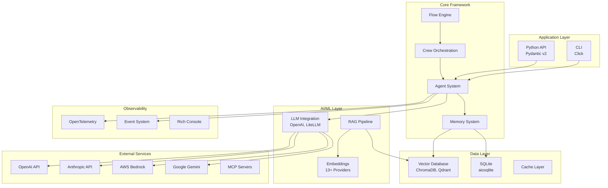
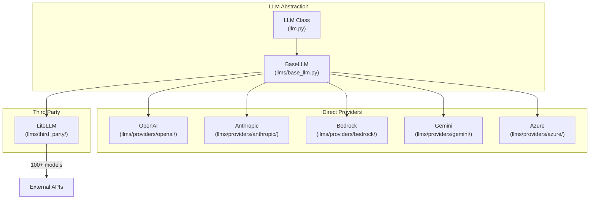

# Technology Stack

## TL;DR
CrewAI được xây dựng trên **Python 3.10+** với **Pydantic v2** làm core validation. LLM integration qua **OpenAI SDK** (primary) và **LiteLLM** (multi-provider). Vector storage sử dụng **ChromaDB**, observability qua **OpenTelemetry**, và CLI với **Click**.

---

## 1. Tech Stack Overview



---

## 2. Core Dependencies

### 2.1 Runtime Dependencies

```toml
# File: lib/crewai/pyproject.toml:10-42

[project]
requires-python = ">=3.10, <3.14"

dependencies = [
    # Core Framework
    "pydantic~=2.11.9",           # Data validation & serialization
    "pydantic-settings~=2.10.1",  # Settings management

    # LLM Integration
    "openai~=1.83.0",             # Primary LLM provider
    "instructor>=1.3.3",           # Structured output from LLMs

    # Text Processing
    "pdfplumber~=0.11.4",         # PDF parsing
    "regex~=2024.9.11",           # Advanced regex

    # Vector Database
    "chromadb~=1.1.0",            # Vector storage
    "tokenizers~=0.20.3",         # Token counting

    # Telemetry
    "opentelemetry-api~=1.34.0",
    "opentelemetry-sdk~=1.34.0",
    "opentelemetry-exporter-otlp-proto-http~=1.34.0",

    # Data Handling
    "openpyxl~=3.1.5",            # Excel files

    # Configuration
    "python-dotenv~=1.1.1",       # Environment variables
    "pyjwt>=2.9.0,<3",            # JWT tokens
    "click~=8.1.7",               # CLI framework
    "appdirs~=1.4.4",             # App directories

    # JSON/TOML
    "jsonref~=1.1.0",             # JSON references
    "json-repair~=0.25.2",        # Fix malformed JSON
    "json5~=0.10.0",              # Extended JSON
    "tomli-w~=1.1.0",             # TOML writing
    "tomli~=2.0.2",               # TOML reading

    # Utilities
    "portalocker~=2.7.0",         # File locking
    "mcp~=1.23.1",                # Model Context Protocol
    "uv~=0.9.13",                 # Python package manager
    "aiosqlite~=0.21.0",          # Async SQLite
]
```

### 2.2 Dependency Categories

| Category | Libraries | Purpose |
|----------|-----------|---------|
| **Data Validation** | Pydantic v2 | Type validation, serialization |
| **LLM** | OpenAI, instructor | API calls, structured output |
| **Vector DB** | ChromaDB | Embedding storage & retrieval |
| **Observability** | OpenTelemetry | Tracing, metrics |
| **CLI** | Click | Command-line interface |
| **Async** | aiosqlite | Async database operations |
| **Protocol** | MCP | External tool integration |

---

## 3. Optional Dependencies

### 3.1 LLM Providers

```toml
# File: lib/crewai/pyproject.toml:80-94

[project.optional-dependencies]
litellm = ["litellm~=1.74.9"]           # Multi-provider abstraction
anthropic = ["anthropic~=0.73.0"]        # Claude models
google-genai = ["google-genai~=1.49.0"]  # Gemini models
azure-ai-inference = ["azure-ai-inference~=1.0.0b9"]
bedrock = ["boto3~=1.40.45"]             # AWS Bedrock
watson = ["ibm-watsonx-ai~=1.3.39"]      # IBM Watson
```

### 3.2 Embeddings & Vector DBs

```toml
embeddings = ["tiktoken~=0.8.0"]         # OpenAI token counting
qdrant = ["qdrant-client[fastembed]~=1.14.3"]  # Alternative vector DB
voyageai = ["voyageai~=0.3.5"]           # VoyageAI embeddings
```

### 3.3 Enhanced Features

```toml
tools = ["crewai-tools==1.9.2"]          # Official tools package
file-processing = ["crewai-files"]        # File handling
mem0 = ["mem0ai~=0.1.94"]                 # External memory
docling = ["docling~=2.63.0"]             # Document parsing
pandas = ["pandas~=2.2.3"]                # Data processing
a2a = [
    "a2a-sdk~=0.3.10",                    # Agent-to-Agent
    "httpx-auth~=0.23.1",
    "httpx-sse~=0.4.0",
    "aiocache[redis,memcached]~=0.12.3",
]
```

---

## 4. LLM Provider Integration

### 4.1 Provider Architecture



### 4.2 Provider Implementation Pattern

```python
# File: lib/crewai/src/crewai/llms/base_llm.py

class BaseLLM(ABC):
    """Abstract base class for all LLM providers"""

    @abstractmethod
    def call(
        self,
        messages: list[dict],
        tools: list[dict] | None = None,
        callbacks: list | None = None,
    ) -> str:
        """Make LLM API call"""
        pass

    @abstractmethod
    def stream(self, messages: list[dict]) -> Iterator[str]:
        """Stream LLM response"""
        pass
```

### 4.3 Supported Models

| Provider | Models | Package |
|----------|--------|---------|
| **OpenAI** | GPT-4, GPT-4o, GPT-3.5 | `openai` |
| **Anthropic** | Claude 3, Claude 3.5 | `anthropic` |
| **Google** | Gemini Pro, Gemini Ultra | `google-genai` |
| **AWS Bedrock** | Claude, Titan, Llama | `boto3` |
| **Azure** | OpenAI models via Azure | `azure-ai-inference` |
| **LiteLLM** | 100+ models | `litellm` |

---

## 5. Embedding Providers

### 5.1 Available Providers

```
lib/crewai/src/crewai/rag/embeddings/providers/
├── openai/          # OpenAI text-embedding-3
├── cohere/          # Cohere Embed
├── huggingface/     # HuggingFace models
├── sentence_transformer/
├── instructor/      # Instructor embeddings
├── jina/            # Jina AI
├── google/          # Google PaLM
├── microsoft/       # Azure embeddings
├── aws/             # Amazon Titan
├── ibm/             # IBM Watson
├── voyageai/        # Voyage AI
├── ollama/          # Local Ollama
├── onnx/            # ONNX models
├── openclip/        # Vision-language
├── roboflow/        # Vision models
├── text2vec/        # Text2Vec
└── custom/          # Custom embeddings
```

### 5.2 Embedder Configuration

```python
# File: lib/crewai/src/crewai/rag/embeddings/types.py

class EmbedderConfig(BaseModel):
    """Configuration for embeddings"""
    provider: str = "openai"
    config: dict = {}

# Usage
crew = Crew(
    embedder=EmbedderConfig(
        provider="openai",
        config={"model": "text-embedding-3-small"}
    )
)
```

---

## 6. Vector Database Options

### 6.1 ChromaDB (Default)

```python
# File: lib/crewai/src/crewai/rag/chromadb/

# Default vector storage
# - In-memory or persistent
# - Built-in embedding support
# - Automatic index management

from chromadb import Client
client = Client()
collection = client.create_collection("crew_memory")
```

### 6.2 Qdrant (Alternative)

```python
# File: lib/crewai/src/crewai/rag/qdrant/

# Alternative vector storage
# - Cloud or self-hosted
# - Production-ready
# - FastEmbed integration

from qdrant_client import QdrantClient
client = QdrantClient(url="http://localhost:6333")
```

---

## 7. Observability Stack

### 7.1 OpenTelemetry Integration

```python
# File: lib/crewai/src/crewai/telemetry/telemetry.py

from opentelemetry import trace
from opentelemetry.exporter.otlp.proto.http.trace_exporter import OTLPSpanExporter

# Automatic tracing of:
# - Crew executions
# - Agent actions
# - LLM calls
# - Tool invocations
# - Memory operations
```

### 7.2 Event System

```python
# File: lib/crewai/src/crewai/events/

# Event types for observability
- CrewKickoffStartedEvent
- AgentExecutionStartedEvent
- TaskStartedEvent
- LLMCallStartedEvent
- ToolUsageStartedEvent
- MemoryRetrievalStartedEvent
```

### 7.3 Console Output

```python
# Using Rich for formatted console output
from rich.console import Console
from rich.panel import Panel

console = Console()
console.print(Panel("Agent output", title="Research Agent"))
```

---

## 8. Build & Development Tools

### 8.1 Build System

```toml
# File: lib/crewai/pyproject.toml:133-138

[build-system]
requires = ["hatchling"]
build-backend = "hatchling.build"

[tool.hatch.version]
path = "src/crewai/__init__.py"
```

### 8.2 Package Manager

```toml
# UV for fast package management
"uv~=0.9.13"

# PyTorch index configuration
[[tool.uv.index]]
name = "pytorch"
url = "https://download.pytorch.org/whl/cpu"
```

---

## 9. External Integrations

### 9.1 Model Context Protocol (MCP)

```python
# File: lib/crewai/src/crewai/mcp/

# MCP enables external tool servers
from crewai.mcp import (
    MCPClient,
    MCPServerConfig,
    MCPServerHTTP,
    MCPServerSSE,
    MCPServerStdio,
)

# Transport options:
# - HTTP
# - SSE (Server-Sent Events)
# - Stdio (subprocess)
```

### 9.2 Agent-to-Agent (A2A)

```python
# File: lib/crewai/src/crewai/a2a/

# Agent communication protocol
from a2a_sdk import A2AClient

# Features:
# - Streaming updates
# - Push notifications
# - Authentication
```

### 9.3 Mem0 Integration

```python
# External memory service
from mem0ai import Mem0

# Enhanced long-term memory
# - Cloud-based storage
# - Semantic search
# - User context
```

---

## 10. Version Compatibility

### 10.1 Python Version Support

```
Python 3.10  ✓ Supported
Python 3.11  ✓ Supported
Python 3.12  ✓ Supported
Python 3.13  ✓ Supported (with PyTorch nightly)
Python 3.14  ✗ Not yet supported
```

### 10.2 Key Library Versions

| Library | Version | Notes |
|---------|---------|-------|
| Pydantic | 2.11.9 | v2 required (not v1) |
| OpenAI | 1.83.0 | v1.x API |
| ChromaDB | 1.1.0 | Latest stable |
| LiteLLM | 1.74.9 | Optional |
| OpenTelemetry | 1.34.0 | Stable |

---

## 11. Key Takeaways

1. **Pydantic v2 Foundation**: Runtime type validation throughout the codebase, enabling safe data handling and automatic serialization.

2. **Multi-Provider LLM**: OpenAI as primary, with abstraction layer supporting 100+ models via LiteLLM.

3. **ChromaDB Default**: Built-in vector storage with option to switch to Qdrant for production.

4. **OpenTelemetry Native**: First-class observability support for tracing and monitoring.

5. **Async-Ready**: `aiosqlite` and async patterns throughout for non-blocking operations.

6. **Extensible Architecture**: Optional dependencies for specific features (embeddings, LLM providers, tools).

7. **Modern Python**: Requires Python 3.10+ for advanced type hints and asyncio features.

8. **MCP Protocol**: Enables integration with external tool servers via standardized protocol.

---

## File References

| Component | File Path |
|-----------|-----------|
| Dependencies | `lib/crewai/pyproject.toml` |
| LLM Wrapper | `lib/crewai/src/crewai/llm.py` |
| LLM Base | `lib/crewai/src/crewai/llms/base_llm.py` |
| LLM Providers | `lib/crewai/src/crewai/llms/providers/` |
| Embeddings | `lib/crewai/src/crewai/rag/embeddings/` |
| ChromaDB | `lib/crewai/src/crewai/rag/chromadb/` |
| Qdrant | `lib/crewai/src/crewai/rag/qdrant/` |
| Telemetry | `lib/crewai/src/crewai/telemetry/` |
| Events | `lib/crewai/src/crewai/events/` |
| MCP | `lib/crewai/src/crewai/mcp/` |
