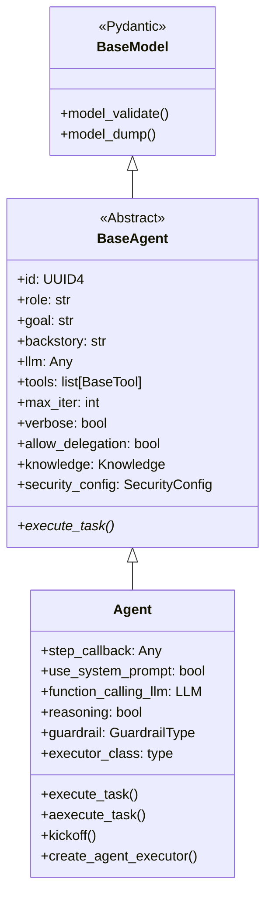
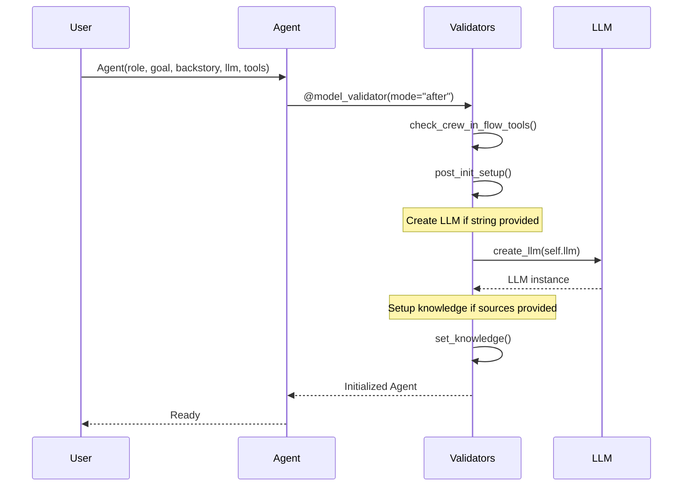

# Agent Class Analysis

## TL;DR
`Agent` class là core execution unit của crewAI, kế thừa từ `BaseAgent`. Agent được định nghĩa bởi **role, goal, backstory** và sử dụng LLM để reasoning, tools để hành động, và memory để lưu trữ context. Agent execution loop theo pattern ReAct (Reasoning + Acting).

---

## 1. Class Structure & Inheritance



### Inheritance Chain

```python
# File: lib/crewai/src/crewai/agent/core.py:120
class Agent(BaseAgent):
    """Represents an agent in a system."""
    pass

# File: lib/crewai/src/crewai/agents/agent_builder/base_agent.py
class BaseAgent(BaseModel, metaclass=AgentMeta):
    """Abstract base class for all agents."""
    pass
```

---

## 2. Key Attributes

### 2.1 Identity Attributes (từ BaseAgent)

```python
# File: lib/crewai/src/crewai/agents/agent_builder/base_agent.py:119-202

id: UUID4 = Field(default_factory=uuid4)
role: str = Field(description="Role of the agent")
goal: str = Field(description="Objective of the agent")
backstory: str = Field(description="Backstory of the agent")
```

**Ý nghĩa:**
- `role`: Định danh vai trò (e.g., "Senior Researcher")
- `goal`: Mục tiêu cần đạt được
- `backstory`: Context/background cho agent reasoning

### 2.2 LLM Configuration

```python
# File: lib/crewai/src/crewai/agent/core.py:164-178

llm: str | InstanceOf[BaseLLM] | Any = Field(
    default=None,
    description="Language model for the agent"
)

function_calling_llm: str | InstanceOf[BaseLLM] | Any | None = Field(
    default=None,
    description="Separate LLM for tool calling (overrides crew's)"
)
```

### 2.3 Tools & Memory

```python
# File: lib/crewai/src/crewai/agents/agent_builder/base_agent.py:142-165

tools: list[BaseTool] | None = Field(
    default_factory=list,
    description="Tools available to the agent"
)

knowledge: Knowledge | None = Field(
    default=None,
    description="Knowledge base for RAG"
)

knowledge_sources: list[BaseKnowledgeSource] = Field(
    default_factory=list,
    description="Sources for knowledge"
)
```

### 2.4 Execution Control

```python
# File: lib/crewai/src/crewai/agent/core.py:152-162

max_execution_time: int | None = Field(
    default=None,
    description="Max execution time per task"
)

max_iter: int = Field(
    default=25,
    description="Max iterations for agent loop"
)

max_retry_limit: int = Field(
    default=2,
    description="Max retries on errors"
)
```

### 2.5 Advanced Features

```python
# File: lib/crewai/src/crewai/agent/core.py:207-258

reasoning: bool = Field(
    default=False,
    description="Enable reasoning before execution"
)

guardrail: GuardrailType | None = Field(
    default=None,
    description="Output validation function"
)

allow_code_execution: bool = Field(
    default=False,
    description="Enable code interpreter tool"
)

respect_context_window: bool = Field(
    default=True,
    description="Keep messages within context limits"
)
```

### 2.6 External Integrations

```python
# File: lib/crewai/src/crewai/agents/agent_builder/base_agent.py:187-202

apps: list[PlatformAppOrAction] | None = Field(
    default=None,
    description="Platform apps (Gmail, Salesforce, etc.)"
)

mcps: list[str | MCPServerConfig] | None = Field(
    default=None,
    description="MCP servers for external tools"
)
```

---

## 3. Attribute Summary Table

| Attribute | Type | Default | Description |
|-----------|------|---------|-------------|
| `role` | str | Required | Agent's role/title |
| `goal` | str | Required | Agent's objective |
| `backstory` | str | Required | Agent's background |
| `llm` | str/LLM | None | Language model |
| `tools` | list[BaseTool] | [] | Available tools |
| `max_iter` | int | 25 | Max loop iterations |
| `verbose` | bool | False | Verbose logging |
| `allow_delegation` | bool | False | Can delegate to others |
| `memory` | bool | False | Use memory system |
| `reasoning` | bool | False | Enable reasoning phase |
| `guardrail` | Callable | None | Output validation |
| `cache` | bool | True | Cache tool results |

---

## 4. Initialization Flow



### Initialization Code

```python
# File: lib/crewai/src/crewai/agent/core.py:268-303

@model_validator(mode="after")
def post_init_setup(self) -> Self:
    """Post-initialization setup."""
    # Create LLM from string if needed
    self.llm = create_llm(self.llm)

    # Create function_calling_llm if provided
    if self.function_calling_llm and not isinstance(
        self.function_calling_llm, BaseLLM
    ):
        self.function_calling_llm = create_llm(self.function_calling_llm)

    return self

@model_validator(mode="after")
def set_knowledge(self) -> Self:
    """Setup knowledge base from sources."""
    if self.knowledge_sources:
        self.knowledge = Knowledge(
            sources=self.knowledge_sources,
            embedder=self.embedder,
        )
    return self
```

---

## 5. Main Methods

### 5.1 execute_task()

```python
# File: lib/crewai/src/crewai/agent/core.py:336-501

def execute_task(
    self,
    task: Task,
    context: str | None = None,
    tools: list[BaseTool] | None = None,
) -> Any:
    """Execute a task with the agent.

    Args:
        task: Task to execute
        context: Additional context string
        tools: Override tools for this task

    Returns:
        Task execution result
    """
```

**Execution Steps:**

1. **Reasoning Phase** (nếu enabled)
2. **Build Task Prompt** với schema và context
3. **Memory Retrieval** từ short/long/entity/external memory
4. **Knowledge Retrieval** từ RAG
5. **Prepare Tools** và apply training data
6. **Create/Update Executor**
7. **Execute** với timeout nếu configured
8. **Process Results** và emit events

### 5.2 create_agent_executor()

```python
# File: lib/crewai/src/crewai/agent/core.py:773-838

def create_agent_executor(
    self,
    tools: list[BaseTool] | None = None,
    task: Task | None = None
) -> None:
    """Create and configure the agent executor."""

    # Parse tools to structured format
    parsed_tools = parse_tools(tools or self.tools or [])

    # Check if LLM supports native tool calling
    supports_native = self._supports_native_tool_calling(parsed_tools)

    # Build prompt from templates
    prompt = Prompts(
        agent=self,
        tools=parsed_tools,
        i18n=self.i18n,
        system_template=self.system_template,
        prompt_template=self.prompt_template,
        response_template=self.response_template,
    ).task_execution()

    # Create executor instance
    self.agent_executor = self.executor_class(
        llm=self.llm,
        task=task,
        crew=self.crew,
        agent=self,
        prompt=prompt,
        tools=parsed_tools,
        original_tools=parsed_tools,
        max_iter=self.max_iter,
        tools_handler=self.tools_handler,
        step_callback=self.step_callback,
        function_calling_llm=self.function_calling_llm,
        respect_context_window=self.respect_context_window,
        request_within_rpm_limit=self._rpm_controller.check_or_wait,
    )
```

### 5.3 kickoff() (Standalone Execution)

```python
# File: lib/crewai/src/crewai/agent/core.py:1762-1839

def kickoff(
    self,
    inputs: dict[str, Any] | None = None,
    prompt: str | None = None,
    response_format: type[BaseModel] | None = None,
) -> LiteAgentOutput | Coroutine[Any, Any, LiteAgentOutput]:
    """Standalone agent execution without crew/task.

    Args:
        inputs: Input variables for prompt interpolation
        prompt: Task prompt (required if no default)
        response_format: Pydantic model for structured output

    Returns:
        LiteAgentOutput with raw/pydantic/json output
    """
```

---

## 6. Agent ↔ Component Interactions

### 6.1 Agent → LLM

```python
# LLM is used via agent_executor
self.agent_executor.invoke({
    "input": task_prompt,
    "tool_names": self.agent_executor.tools_names,
    "tools": self.agent_executor.tools_description,
})
```

### 6.2 Agent → Tools

```python
# Tools are parsed and passed to executor
parsed_tools = parse_tools(self.tools)
self.agent_executor = CrewAgentExecutor(
    tools=parsed_tools,
    original_tools=parsed_tools,
)
```

### 6.3 Agent → Memory

```python
# File: lib/crewai/src/crewai/agent/core.py:367-415

if self._is_any_available_memory():
    contextual_memory = ContextualMemory(
        self.crew._short_term_memory,
        self.crew._long_term_memory,
        self.crew._entity_memory,
        self.crew._external_memory,
        agent=self,
        task=task,
    )

    memory = contextual_memory.build_context_for_task(task, context)
    task_prompt += self.i18n.slice("memory").format(memory=memory)
```

### 6.4 Agent → Knowledge

```python
# File: lib/crewai/src/crewai/agent/core.py:417-425

knowledge_config = get_knowledge_config(self)
task_prompt = handle_knowledge_retrieval(
    self,
    task,
    task_prompt,
    knowledge_config,
    self.knowledge.query if self.knowledge else lambda *a: None,
)
```

---

## 7. Event Emission

```python
# File: lib/crewai/src/crewai/agent/core.py:437-499

# Execution Started
crewai_event_bus.emit(
    self,
    event=AgentExecutionStartedEvent(
        agent=self,
        tools=self.tools,
        task_prompt=task_prompt,
        task=task,
    ),
)

# Execution Completed
crewai_event_bus.emit(
    self,
    event=AgentExecutionCompletedEvent(
        agent=self,
        task=task,
        output=result
    ),
)

# Execution Error
crewai_event_bus.emit(
    self,
    event=AgentExecutionErrorEvent(
        agent=self,
        task=task,
        error=str(e),
    ),
)
```

---

## 8. Key Takeaways

1. **Pydantic-Based**: Agent kế thừa từ Pydantic BaseModel, cho phép runtime validation và serialization.

2. **Identity Triplet**: `role`, `goal`, `backstory` định nghĩa persona của agent, được inject vào system prompt.

3. **Dual LLM Support**: `llm` cho reasoning chính, `function_calling_llm` riêng cho tool calling.

4. **Memory Integration**: Agent truy cập 4 loại memory qua Crew: short-term, long-term, entity, external.

5. **Knowledge RAG**: Embedded knowledge retrieval với query rewriting.

6. **Executor Pattern**: Agent không trực tiếp gọi LLM mà delegate cho `CrewAgentExecutor`.

7. **Event-Driven**: Mọi action đều emit events cho observability.

8. **Extensible**: MCP, Platform Apps, Custom Tools đều pluggable.

---

## File References

| Component | Path | Lines |
|-----------|------|-------|
| Agent Class | `lib/crewai/src/crewai/agent/core.py` | 120-2162 |
| BaseAgent | `lib/crewai/src/crewai/agents/agent_builder/base_agent.py` | 119-202 |
| Agent Executor | `lib/crewai/src/crewai/agents/crew_agent_executor.py` | - |
| Agent Utils | `lib/crewai/src/crewai/agent/utils.py` | - |
