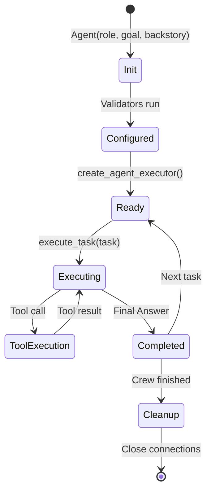
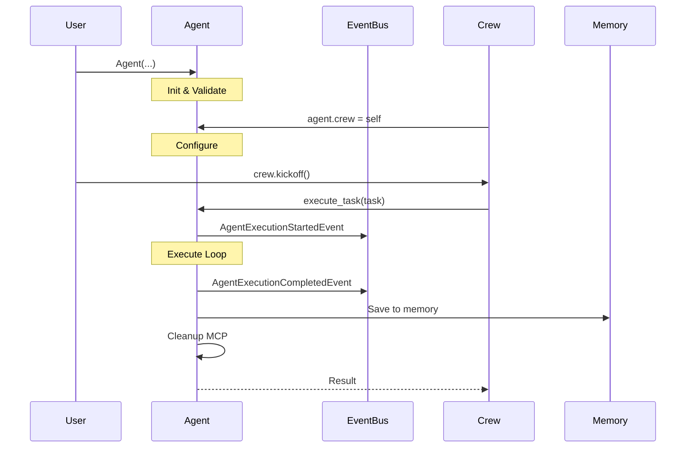

# Agent Lifecycle

## TL;DR
Agent lifecycle trong crewAI: **Init** (create & validate) → **Configure** (setup executor, tools, memory) → **Execute** (ReAct loop) → **Cleanup** (close MCP clients, emit events). Agent được reuse across multiple tasks trong cùng Crew, với executor được recreate hoặc update cho mỗi task.

---

## 1. Lifecycle Overview



---

## 2. Phase 1: Initialization

### 2.1 Constructor Call

```python
# User creates agent
agent = Agent(
    role="Senior Researcher",
    goal="Find accurate information",
    backstory="Expert with 10 years experience",
    llm="gpt-4",
    tools=[search_tool, calculator],
    verbose=True,
)
```

### 2.2 Pydantic Validation

```python
# File: lib/crewai/src/crewai/agent/core.py

class Agent(BaseAgent):
    # Field validation happens automatically
    role: str = Field(description="Role of the agent")
    goal: str = Field(description="Objective of the agent")
    backstory: str = Field(description="Backstory of the agent")

    # Default values applied
    max_iter: int = Field(default=25)
    verbose: bool = Field(default=False)
```

### 2.3 Post-Init Validators

```python
# File: lib/crewai/src/crewai/agent/core.py:268-303

@model_validator(mode="after")
def post_init_setup(self) -> Self:
    """Post-initialization setup."""

    # 1. Create LLM instance from string
    self.llm = create_llm(self.llm)

    # 2. Create function_calling_llm if provided
    if self.function_calling_llm:
        self.function_calling_llm = create_llm(self.function_calling_llm)

    return self

@model_validator(mode="after")
def set_knowledge(self) -> Self:
    """Setup knowledge base from sources."""

    if self.knowledge_sources:
        self.knowledge = Knowledge(
            sources=self.knowledge_sources,
            embedder=self.embedder,
        )
    return self

@model_validator(mode="after")
def check_crew_in_flow_tools(self) -> Self:
    """Validate tools for flow context."""
    # Ensure tools are properly configured
    return self
```

---

## 3. Phase 2: Configuration

### 3.1 Crew Assignment

```python
# When agent is added to crew
crew = Crew(
    agents=[agent],
    tasks=[task],
)

# Agent receives crew reference
# File: lib/crewai/src/crewai/crew.py
for agent in self.agents:
    agent.crew = self

    if self.cache:
        agent.set_cache_handler(self._cache_handler)

    if self.max_rpm:
        agent.set_rpm_controller(self._rpm_controller)
```

### 3.2 Memory Setup

```python
# Memory is configured at crew level
# Agent accesses via crew reference
def _is_any_available_memory(self) -> bool:
    return (
        self.crew and (
            self.crew._short_term_memory or
            self.crew._long_term_memory or
            self.crew._entity_memory or
            self.crew._external_memory
        )
    )
```

### 3.3 Executor Creation

```python
# File: lib/crewai/src/crewai/agent/core.py:773-838

def create_agent_executor(
    self,
    tools: list[BaseTool] | None = None,
    task: Task | None = None
) -> None:
    """Create and configure the agent executor."""

    # 1. Parse tools
    parsed_tools = parse_tools(tools or self.tools or [])

    # 2. Add delegation tools if allowed
    if self.allow_delegation and self.crew:
        parsed_tools += self.get_delegation_tools(self.crew.agents)

    # 3. Add code execution tools if enabled
    if self.allow_code_execution:
        parsed_tools += self.get_code_execution_tools()

    # 4. Add MCP tools
    mcp_tools = self.get_mcp_tools()
    parsed_tools += mcp_tools

    # 5. Build prompt
    prompt = Prompts(
        agent=self,
        tools=parsed_tools,
        i18n=self.i18n,
    ).task_execution()

    # 6. Create executor
    self.agent_executor = self.executor_class(
        llm=self.llm,
        task=task,
        crew=self.crew,
        agent=self,
        prompt=prompt,
        tools=parsed_tools,
        max_iter=self.max_iter,
        step_callback=self.step_callback,
    )
```

---

## 4. Phase 3: Execution

### 4.1 Task Execution Entry

```python
# File: lib/crewai/src/crewai/agent/core.py:336-501

def execute_task(
    self,
    task: Task,
    context: str | None = None,
    tools: list[BaseTool] | None = None,
) -> Any:
    """Execute a task with the agent."""

    # 1. Handle reasoning if enabled
    handle_reasoning(self, task)

    # 2. Inject current date if configured
    self._inject_date_to_task(task)

    # 3. Build task prompt
    task_prompt = task.prompt()
    task_prompt = build_task_prompt_with_schema(task, task_prompt)
    task_prompt = format_task_with_context(task_prompt, context)

    # 4. Memory retrieval
    if self._is_any_available_memory():
        memory = self._build_contextual_memory(task, context)
        task_prompt += memory

    # 5. Knowledge retrieval
    task_prompt = handle_knowledge_retrieval(self, task, task_prompt)

    # 6. Prepare tools
    prepare_tools(self, tools, task)

    # 7. Apply training data
    task_prompt = apply_training_data(self, task_prompt)
```

### 4.2 Event Emission

```python
    # 8. Emit execution started event
    crewai_event_bus.emit(
        self,
        event=AgentExecutionStartedEvent(
            agent=self,
            tools=self.tools,
            task_prompt=task_prompt,
            task=task,
        ),
    )

    # 9. Execute with timeout handling
    try:
        if self.max_execution_time:
            result = self._execute_with_timeout(task_prompt, task, timeout)
        else:
            result = self._execute_without_timeout(task_prompt, task)
    except Exception as e:
        # Emit error event
        crewai_event_bus.emit(
            self,
            event=AgentExecutionErrorEvent(
                agent=self,
                task=task,
                error=str(e),
            ),
        )
        raise
```

### 4.3 Execution Loop

```python
def _execute_without_timeout(self, task_prompt: str, task: Task) -> Any:
    """Execute via agent executor."""

    return self.agent_executor.invoke({
        "input": task_prompt,
        "tool_names": self.agent_executor.tools_names,
        "tools": self.agent_executor.tools_description,
        "ask_for_human_input": task.human_input,
    })["output"]
```

---

## 5. Phase 4: Completion & Cleanup

### 5.1 Result Processing

```python
    # 10. Process tool results
    result = process_tool_results(self, result)

    # 11. Emit completion event
    crewai_event_bus.emit(
        self,
        event=AgentExecutionCompletedEvent(
            agent=self,
            task=task,
            output=result,
        ),
    )

    # 12. Cleanup MCP clients
    self._cleanup_mcp_clients()

    return result
```

### 5.2 MCP Client Cleanup

```python
# File: lib/crewai/src/crewai/agent/core.py

def _cleanup_mcp_clients(self) -> None:
    """Close MCP client connections."""
    for client in self._mcp_clients:
        try:
            client.close()
        except Exception:
            pass
    self._mcp_clients = []
```

### 5.3 Memory Saving

```python
# In CrewAgentExecutor after task completion
def _create_short_term_memory(self, output: str) -> None:
    if self.crew and self.crew._short_term_memory:
        self.crew._short_term_memory.save(
            value=output,
            metadata={"agent": self.agent.role, "task": self.task.description},
        )

def _create_long_term_memory(self, output: str) -> None:
    if self.crew and self.crew._long_term_memory:
        self.crew._long_term_memory.save(
            LongTermMemoryItem(
                agent=self.agent.role,
                task=self.task.description,
                expected_output=self.task.expected_output,
                datetime=datetime.now().isoformat(),
                quality=self._calculate_quality_score(output),
            )
        )
```

---

## 6. Lifecycle Events



---

## 7. Executor Reuse

### 7.1 Update vs Recreate

```python
# File: lib/crewai/src/crewai/agent/core.py

def execute_task(self, task, context=None, tools=None):
    # Check if executor needs update or recreation
    if self.agent_executor is None:
        self.create_agent_executor(tools=tools, task=task)
    else:
        self._update_executor_parameters(task=task, tools=tools)
```

### 7.2 Parameter Update

```python
def _update_executor_parameters(
    self,
    task: Task,
    tools: list[BaseTool] | None = None
) -> None:
    """Update existing executor for new task."""

    # Reset iteration counter
    self.agent_executor.iterations = 0

    # Update task reference
    self.agent_executor.task = task

    # Update tools if provided
    if tools:
        parsed_tools = parse_tools(tools)
        self.agent_executor.tools = parsed_tools

    # Rebuild prompt with new task
    self.agent_executor.prompt = Prompts(
        agent=self,
        tools=self.agent_executor.tools,
    ).task_execution()
```

---

## 8. Async Lifecycle

### 8.1 Async Execution

```python
# File: lib/crewai/src/crewai/agent/core.py:558-720

async def aexecute_task(
    self,
    task: Task,
    context: str | None = None,
    tools: list[BaseTool] | None = None,
) -> Any:
    """Async version of execute_task."""

    # Same phases but with async operations
    # Memory retrieval can be concurrent
    memory = await self._abuild_contextual_memory(task, context)

    # Async tool execution
    result = await self._aexecute_without_timeout(task_prompt, task)

    return result
```

### 8.2 Standalone Kickoff

```python
# File: lib/crewai/src/crewai/agent/core.py:1762-1839

def kickoff(
    self,
    inputs: dict | None = None,
    prompt: str | None = None,
    response_format: type[BaseModel] | None = None,
) -> LiteAgentOutput:
    """Standalone agent execution without crew."""

    # Simplified lifecycle for standalone use
    executor, inputs_dict, agent_info, tools = self._prepare_kickoff(
        inputs, prompt, response_format
    )

    return self._execute_and_build_output(
        executor, inputs_dict, agent_info, response_format
    )
```

---

## 9. Lifecycle Summary Table

| Phase | Actions | Events |
|-------|---------|--------|
| **Init** | Validate fields, create LLM, setup knowledge | - |
| **Configure** | Assign crew, setup cache/rpm, create executor | - |
| **Pre-Execute** | Reasoning, memory retrieval, knowledge query | `AgentExecutionStartedEvent` |
| **Execute** | ReAct loop, tool calls, LLM interactions | `ToolUsageEvents`, `LLMEvents` |
| **Post-Execute** | Process results, save to memory | `AgentExecutionCompletedEvent` |
| **Cleanup** | Close MCP clients, reset state | - |

---

## 10. Key Takeaways

1. **Pydantic-Based Init**: Automatic validation và default value assignment.

2. **Lazy Executor Creation**: Executor created on first task, updated for subsequent tasks.

3. **Event-Driven**: All lifecycle transitions emit events for observability.

4. **Memory Integration**: Memory save/retrieve happens at execution boundaries.

5. **Cleanup Required**: MCP clients need explicit cleanup to avoid resource leaks.

6. **Reusable Agents**: Same agent instance can execute multiple tasks in a crew.

7. **Async Support**: Full async lifecycle for non-blocking operations.

8. **Standalone Mode**: Agent có thể chạy independently via `kickoff()`.

---

## File References

| Component | Path |
|-----------|------|
| Agent Init | `lib/crewai/src/crewai/agent/core.py:268-303` |
| Executor Creation | `lib/crewai/src/crewai/agent/core.py:773-838` |
| Task Execution | `lib/crewai/src/crewai/agent/core.py:336-501` |
| Async Execution | `lib/crewai/src/crewai/agent/core.py:558-720` |
| Standalone Kickoff | `lib/crewai/src/crewai/agent/core.py:1762-1839` |
| Memory Save | `lib/crewai/src/crewai/agents/crew_agent_executor.py` |
