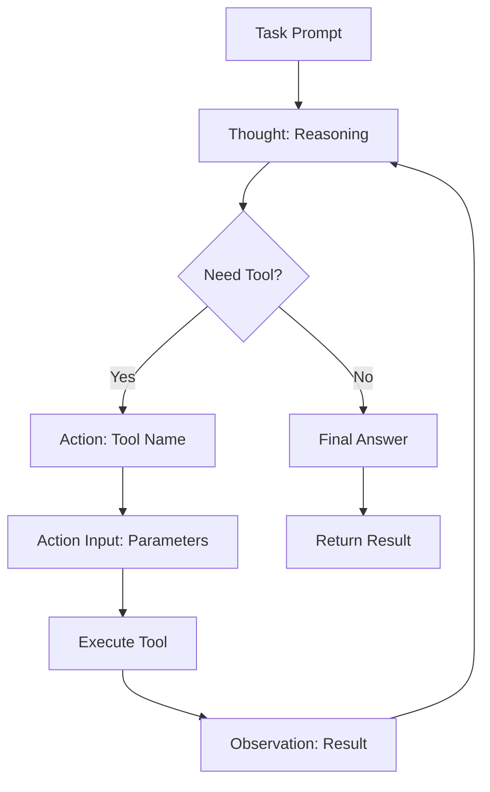
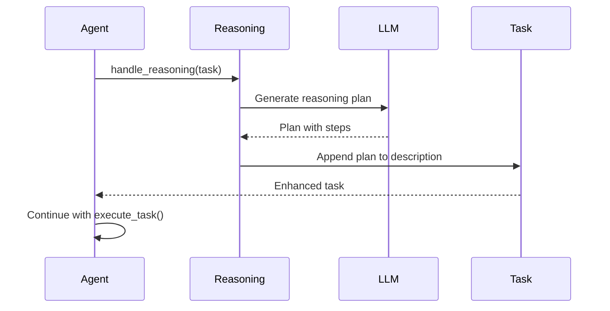
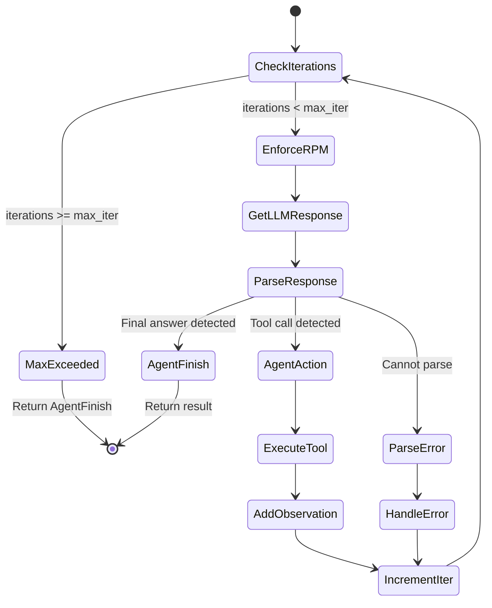

# Reasoning Loop Analysis

## TL;DR
CrewAI sử dụng **ReAct (Reasoning + Acting) pattern** cho agent execution loop. Agent lặp đi lặp lại: nhận task → suy nghĩ (Thought) → quyết định hành động (Action) → thực thi tool → quan sát kết quả (Observation) → tiếp tục cho đến khi có Final Answer.

---

## 1. ReAct Pattern Overview



---

## 2. Execution Loop Implementation

### 2.1 Main Loop Entry

```python
# File: lib/crewai/src/crewai/agents/crew_agent_executor.py:287-310

def _invoke_loop(self) -> AgentFinish:
    """Execute agent loop until completion."""

    # Check if model supports native function calling
    use_native_tools = (
        hasattr(self.llm, "supports_function_calling")
        and self.llm.supports_function_calling()
        and self.original_tools
    )

    if use_native_tools:
        return self._invoke_loop_native_tools()
    else:
        return self._invoke_loop_react()
```

### 2.2 ReAct Loop (Text-Based)

```python
# File: lib/crewai/src/crewai/agents/crew_agent_executor.py:310-449

def _invoke_loop_react(self) -> AgentFinish:
    """Execute ReAct pattern loop."""
    formatted_answer = None

    while not isinstance(formatted_answer, AgentFinish):
        try:
            # 1. Check max iterations
            if has_reached_max_iterations(self.iterations, self.max_iter):
                formatted_answer = handle_max_iterations_exceeded(...)
                break

            # 2. Enforce RPM limit
            enforce_rpm_limit(self.request_within_rpm_limit)

            # 3. Get LLM response
            answer = get_llm_response(
                llm=self.llm,
                messages=self.messages,
                callbacks=self.callbacks,
                verbose=self.agent.verbose,
            )

            # 4. Parse response
            formatted_answer = process_llm_response(
                answer_str,
                self.use_stop_words
            )

            # 5. Handle AgentAction (tool call)
            if isinstance(formatted_answer, AgentAction):
                tool_result = execute_tool_and_check_finality(
                    agent_action=formatted_answer,
                    tools=self.tools,
                )
                formatted_answer = self._handle_agent_action(
                    formatted_answer,
                    tool_result
                )

            # 6. Append to message history
            self._append_message(formatted_answer.text)

        except OutputParserError as e:
            formatted_answer = handle_output_parser_exception(...)

        except Exception as e:
            if is_context_length_exceeded(e):
                handle_context_length(...)
                continue
            raise

        finally:
            self.iterations += 1

    return formatted_answer
```

---

## 3. Output Format & Parsing

### 3.1 Expected LLM Output Format

```
Thought: I need to search for information about AI in healthcare.
Action: search_tool
Action Input: {"query": "AI healthcare applications 2024"}
```

hoặc

```
Thought: I have gathered all the information needed.
Final Answer: Based on my research, AI in healthcare is used for...
```

### 3.2 Response Parsing

```python
# File: lib/crewai/src/crewai/agents/parser.py

def process_llm_response(
    answer_str: str,
    use_stop_words: bool
) -> AgentAction | AgentFinish:
    """Parse LLM response into Action or Finish."""

    # Check for Final Answer
    if "Final Answer:" in answer_str:
        thought, output = answer_str.split("Final Answer:", 1)
        return AgentFinish(
            thought=thought.strip(),
            output=output.strip(),
            text=answer_str,
        )

    # Parse Action
    thought_match = re.search(r"Thought:(.*?)(?=Action:|$)", answer_str, re.DOTALL)
    action_match = re.search(r"Action:(.*?)(?=Action Input:|$)", answer_str)
    input_match = re.search(r"Action Input:(.*?)$", answer_str, re.DOTALL)

    if action_match:
        return AgentAction(
            thought=thought_match.group(1).strip() if thought_match else "",
            tool=action_match.group(1).strip(),
            tool_input=input_match.group(1).strip() if input_match else "",
            text=answer_str,
        )

    raise OutputParserError(f"Could not parse: {answer_str}")
```

### 3.3 Action & Finish Classes

```python
# AgentAction - represents a tool call
@dataclass
class AgentAction:
    thought: str      # Agent's reasoning
    tool: str         # Tool name to call
    tool_input: str   # Tool parameters (JSON string)
    text: str         # Full LLM response

# AgentFinish - represents final answer
@dataclass
class AgentFinish:
    thought: str      # Final reasoning
    output: str       # Final answer
    text: str         # Full LLM response
```

---

## 4. Native Tool Calling Loop

### 4.1 When Native Tool Calling is Used

```python
# Conditions for native tool calling
use_native_tools = (
    hasattr(self.llm, "supports_function_calling")
    and self.llm.supports_function_calling()  # LLM has capability
    and self.original_tools                    # Tools are provided
)
```

### 4.2 Native Loop Implementation

```python
# File: lib/crewai/src/crewai/agents/crew_agent_executor.py:458-581

def _invoke_loop_native_tools(self) -> AgentFinish:
    """Execute loop with native function calling."""

    # Convert tools to OpenAI schema
    openai_tools, available_functions = convert_tools_to_openai_schema(
        self.original_tools
    )

    while True:
        # 1. Check iterations
        if has_reached_max_iterations(self.iterations, self.max_iter):
            break

        # 2. Call LLM with tools schema
        answer = get_llm_response(
            llm=self.llm,
            messages=self.messages,
            tools=openai_tools,  # Pass tool definitions
        )

        # 3. Check for tool calls
        if isinstance(answer, list) and self._is_tool_call_list(answer):
            # Execute tool calls
            tool_finish = self._handle_native_tool_calls(
                answer,
                available_functions
            )
            if tool_finish is not None:
                return tool_finish
            continue

        # 4. Text response = final answer
        if isinstance(answer, str):
            return AgentFinish(
                thought="",
                output=answer,
                text=answer,
            )

        self.iterations += 1

    return self._generate_final_answer()
```

### 4.3 Tool Call Handling

```python
def _handle_native_tool_calls(
    self,
    tool_calls: list,
    available_functions: dict,
) -> AgentFinish | None:
    """Handle native tool calls from LLM."""

    for tool_call in tool_calls:
        function_name = tool_call.function.name
        function_args = json.loads(tool_call.function.arguments)

        # Execute tool
        function = available_functions[function_name]
        result = function(**function_args)

        # Add result to messages
        self.messages.append({
            "role": "tool",
            "tool_call_id": tool_call.id,
            "content": str(result),
        })

        # Check if tool marked result_as_answer
        if hasattr(function, "result_as_answer") and function.result_as_answer:
            return AgentFinish(output=result, thought="", text=str(result))

    return None  # Continue loop
```

---

## 5. Message History Management

### 5.1 Initial Messages

```python
# System message with agent identity
messages = [
    {
        "role": "system",
        "content": """You are {role}.

Your goal is: {goal}

Backstory: {backstory}

You have access to the following tools:
{tools_description}
"""
    },
    {
        "role": "user",
        "content": task_prompt  # Includes memory, knowledge, context
    }
]
```

### 5.2 Message Evolution During Loop

```
Iteration 1:
├── system: Agent identity + tools
├── user: Task prompt
└── assistant: "Thought: I need to search... Action: search_tool..."

Iteration 2:
├── system: Agent identity + tools
├── user: Task prompt
├── assistant: "Thought: I need to search... Action: search_tool..."
├── user: "Observation: [search results]"
└── assistant: "Thought: Now I have the data... Final Answer: ..."
```

### 5.3 Append Message Logic

```python
def _append_message(self, content: str) -> None:
    """Add message to history."""
    if isinstance(content, AgentAction):
        # Tool action as assistant message
        self.messages.append({
            "role": "assistant",
            "content": content.text,
        })
    elif isinstance(content, str):
        # Observation as user message
        self.messages.append({
            "role": "user",
            "content": f"Observation: {content}",
        })
```

---

## 6. Reasoning Phase (Optional)

### 6.1 Enable Reasoning

```python
# Agent configuration
agent = Agent(
    role="Researcher",
    goal="Find accurate information",
    backstory="Expert researcher",
    reasoning=True,  # Enable reasoning phase
    max_reasoning_attempts=3,
)
```

### 6.2 Reasoning Implementation

```python
# File: lib/crewai/src/crewai/agent/utils.py:30-53

def handle_reasoning(agent: Agent, task: Task) -> None:
    """Handle reasoning process before task execution."""
    if not agent.reasoning:
        return

    from crewai.utilities.reasoning_handler import (
        AgentReasoning,
        AgentReasoningOutput,
    )

    # Create reasoning handler
    reasoning_handler = AgentReasoning(task=task, agent=agent)

    # Execute reasoning
    reasoning_output: AgentReasoningOutput = (
        reasoning_handler.handle_agent_reasoning()
    )

    # Append reasoning plan to task
    task.description += f"\n\nReasoning Plan:\n{reasoning_output.plan.plan}"
```

### 6.3 Reasoning Flow



---

## 7. Iteration Control

### 7.1 Max Iterations Check

```python
# File: lib/crewai/src/crewai/agents/crew_agent_executor.py:323

def has_reached_max_iterations(iterations: int, max_iter: int) -> bool:
    return iterations >= max_iter

if has_reached_max_iterations(self.iterations, self.max_iter):
    formatted_answer = handle_max_iterations_exceeded(
        max_iter=self.max_iter,
        agent=self.agent,
        task=self.task,
    )
    break
```

### 7.2 Default Limits

```python
# From BaseAgent
max_iter: int = Field(default=25)  # Max 25 iterations per task
```

### 7.3 Exceeded Handler

```python
def handle_max_iterations_exceeded(
    max_iter: int,
    agent: Agent,
    task: Task,
) -> AgentFinish:
    """Handle when max iterations reached."""

    message = f"Agent {agent.role} reached max iterations ({max_iter})"

    # Emit warning event
    crewai_event_bus.emit(
        agent,
        AgentMaxIterationsExceededEvent(
            agent=agent,
            task=task,
            iterations=max_iter,
        ),
    )

    return AgentFinish(
        thought="Max iterations reached",
        output=f"I was unable to complete the task within {max_iter} iterations.",
        text=message,
    )
```

---

## 8. Error Handling in Loop

### 8.1 Output Parser Errors

```python
except OutputParserError as e:
    formatted_answer = handle_output_parser_exception(
        error=e,
        agent=self.agent,
        task=self.task,
        messages=self.messages,
    )
```

### 8.2 Context Length Exceeded

```python
except Exception as e:
    if is_context_length_exceeded(e):
        # Summarize messages to reduce context
        handle_context_length(
            messages=self.messages,
            llm=self.llm,
            respect_context_window=self.respect_context_window,
        )
        continue  # Retry with shorter context
    raise
```

### 8.3 RPM Rate Limiting

```python
# Enforce rate limit before each LLM call
enforce_rpm_limit(self.request_within_rpm_limit)

# request_within_rpm_limit is a callback from RPMController
def check_or_wait(self) -> bool:
    """Check rate limit, wait if exceeded."""
    if self._is_rate_limited():
        time.sleep(self._wait_time())
    return True
```

---

## 9. Loop Diagram



---

## 10. Key Takeaways

1. **Dual Mode**: ReAct (text-based) và Native Tool Calling, tự động chọn dựa trên LLM capability.

2. **ReAct Pattern**: Thought → Action → Observation cycle cho phép agent reasoning step-by-step.

3. **Message History**: Toàn bộ conversation history được gửi mỗi LLM call để maintain context.

4. **Iteration Limit**: Default 25 iterations để tránh infinite loops.

5. **Optional Reasoning**: Có thể enable reasoning phase trước execution để planning.

6. **Error Recovery**: Output parser errors và context exceeded đều được handle gracefully.

7. **Rate Limiting**: Built-in RPM controller để tránh API rate limits.

8. **Native Tool Calling**: Khi LLM support, sử dụng structured tool calls thay vì text parsing.

---

## File References

| Component | Path |
|-----------|------|
| Crew Agent Executor | `lib/crewai/src/crewai/agents/crew_agent_executor.py` |
| Parser | `lib/crewai/src/crewai/agents/parser.py` |
| Agent Utils | `lib/crewai/src/crewai/agent/utils.py` |
| Reasoning Handler | `lib/crewai/src/crewai/utilities/reasoning_handler.py` |
