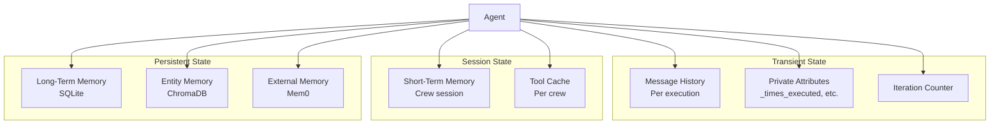
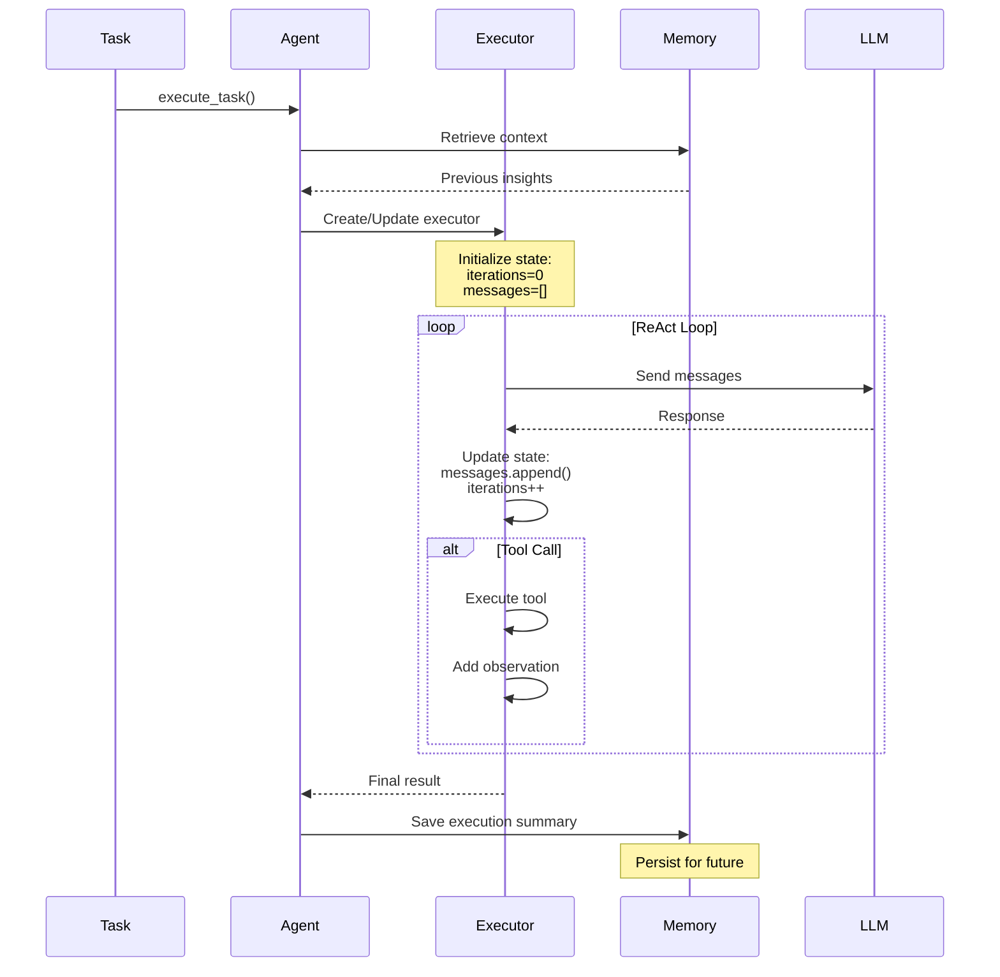

# State Management

## TL;DR
Agent state trong crewAI được quản lý qua **message history** (conversation context), **private attributes** (runtime state), và **memory systems** (persistent state). State không được persist giữa các task executions trừ khi sử dụng memory system.

---

## 1. State Types Overview



---

## 2. Message History (Conversation State)

### 2.1 Structure

```python
# Message history là list of dicts
messages: list[dict[str, str]] = [
    {"role": "system", "content": "You are..."},
    {"role": "user", "content": "Task: ..."},
    {"role": "assistant", "content": "Thought: ..."},
    {"role": "user", "content": "Observation: ..."},
]
```

### 2.2 Initialization

```python
# File: lib/crewai/src/crewai/agents/crew_agent_executor.py

def __init__(self, ...):
    self.messages: list[dict[str, str]] = []

def invoke(self, inputs: dict) -> dict:
    # Build initial messages
    self.messages = self._build_initial_messages(inputs)

def _build_initial_messages(self, inputs: dict) -> list[dict]:
    return [
        {"role": "system", "content": self.prompt},
        {"role": "user", "content": inputs["input"]},
    ]
```

### 2.3 Message Accumulation

```python
def _append_message(self, content: str | AgentAction) -> None:
    """Append message to history during loop."""

    if isinstance(content, str):
        # Tool observation
        self.messages.append({
            "role": "user",
            "content": f"Observation: {content}",
        })
    else:
        # Agent response
        self.messages.append({
            "role": "assistant",
            "content": content.text,
        })
```

### 2.4 Context Window Management

```python
# When context exceeds limit
def handle_context_length(
    messages: list[dict],
    llm: BaseLLM,
    respect_context_window: bool,
) -> None:
    """Summarize messages to fit context window."""

    if not respect_context_window:
        raise ContextWindowExceededError()

    # Summarize middle messages
    summary = summarize_messages(messages[1:-1], llm)

    # Replace with summary
    messages[1:-1] = [{
        "role": "user",
        "content": f"Previous context summary: {summary}",
    }]
```

---

## 3. Private Attributes (Runtime State)

### 3.1 Agent Private State

```python
# File: lib/crewai/src/crewai/agent/core.py:149-151

class Agent(BaseAgent):
    # Private attributes for internal state
    _times_executed: int = PrivateAttr(default=0)
    _mcp_clients: list[Any] = PrivateAttr(default_factory=list)
    _last_messages: list[LLMMessage] = PrivateAttr(default_factory=list)
```

### 3.2 Executor State

```python
# File: lib/crewai/src/crewai/agents/crew_agent_executor.py

class CrewAgentExecutor:
    def __init__(self, ...):
        # Iteration tracking
        self.iterations: int = 0

        # Message history
        self.messages: list[dict] = []

        # Tool results
        self.tools_results: list[dict] = []

        # Intermediate steps
        self.intermediate_steps: list[tuple] = []
```

### 3.3 State Reset Between Tasks

```python
def execute_task(self, task: Task) -> Any:
    # Executor is recreated for each task
    self.create_agent_executor(tools=tools, task=task)

    # Or updated if already exists
    self._update_executor_parameters(task=task, tools=tools)

    # State from previous task is not carried over
    self.agent_executor.iterations = 0
    self.agent_executor.messages = []
```

---

## 4. Memory-Based State

### 4.1 Short-Term Memory (Session State)

```python
# File: lib/crewai/src/crewai/memory/short_term/short_term_memory.py

class ShortTermMemory(Memory):
    """Transient memory for current session."""

    def save(self, value: Any, metadata: dict = None) -> None:
        """Save insight from current execution."""
        item = ShortTermMemoryItem(
            data=value,
            metadata=metadata,
            agent=self.agent.role if self.agent else None,
        )
        super().save(item.data, item.metadata)

    def search(self, query: str, limit: int = 5) -> list:
        """Retrieve relevant context from session."""
        return self.storage.search(query, limit)
```

### 4.2 Long-Term Memory (Persistent State)

```python
# File: lib/crewai/src/crewai/memory/long_term/long_term_memory.py

class LongTermMemory(Memory):
    """Persistent memory across sessions."""

    def save(self, item: LongTermMemoryItem) -> None:
        """Save task execution history."""
        self.storage.save(
            task_description=item.task,
            score=item.quality,
            metadata=item.metadata,
            datetime=item.datetime,
        )

    def search(self, task: str, latest_n: int = 5) -> list:
        """Retrieve historical task data."""
        return self.storage.load(task, latest_n)
```

### 4.3 Entity Memory (Structured State)

```python
# File: lib/crewai/src/crewai/memory/entity/entity_memory.py

class EntityMemory(Memory):
    """Structured entity information."""

    def save(self, value: EntityMemoryItem) -> None:
        """Save entity information."""
        data = f"{value.name}({value.type}): {value.description}"
        super().save(data, value.metadata)
```

---

## 5. State Flow Diagram



---

## 6. State Persistence Patterns

### 6.1 Per-Task State (Not Persisted)

```python
# These are reset each task
executor.iterations = 0
executor.messages = []
executor.intermediate_steps = []
```

### 6.2 Per-Crew State (Session)

```python
# Shared across tasks in same crew run
crew._short_term_memory  # Session insights
crew._cache_handler      # Tool result cache
```

### 6.3 Cross-Session State (Persistent)

```python
# Persisted to disk/database
crew._long_term_memory   # SQLite
crew._entity_memory      # ChromaDB
crew._external_memory    # Mem0
```

---

## 7. Context Building

### 7.1 Contextual Memory Aggregation

```python
# File: lib/crewai/src/crewai/memory/contextual/contextual_memory.py

class ContextualMemory:
    """Aggregate state from all memory sources."""

    def build_context_for_task(
        self,
        task: Task,
        context: str
    ) -> str:
        """Build complete context string."""

        query = f"{task.description} {context}".strip()

        context_parts = [
            self._fetch_ltm_context(task.description),  # Historical
            self._fetch_stm_context(query),              # Recent
            self._fetch_entity_context(query),           # Entities
            self._fetch_external_context(query),         # External
        ]

        return "\n".join(filter(None, context_parts))
```

### 7.2 Context Injection

```python
# File: lib/crewai/src/crewai/agent/core.py:367-415

def execute_task(self, task, context=None):
    # Build task prompt
    task_prompt = task.prompt()

    # Add memory context
    if self._is_any_available_memory():
        contextual_memory = ContextualMemory(
            self.crew._short_term_memory,
            self.crew._long_term_memory,
            self.crew._entity_memory,
            self.crew._external_memory,
        )

        memory = contextual_memory.build_context_for_task(task, context)

        if memory.strip():
            task_prompt += self.i18n.slice("memory").format(
                memory=memory
            )
```

---

## 8. State in Multi-Agent Scenarios

### 8.1 Shared Crew Memory

```python
# All agents in a crew share memory
crew = Crew(
    agents=[agent1, agent2, agent3],
    tasks=[task1, task2, task3],
    memory=True,
)

# agent1's output saved to shared memory
# agent2 can retrieve it
```

### 8.2 State Passing Between Agents

```python
# Task output becomes next task's context
task1 = Task(description="Research topic", agent=agent1)
task2 = Task(
    description="Write summary",
    agent=agent2,
    context=[task1],  # Receives task1's output
)
```

### 8.3 Hierarchical Manager State

```python
# Manager tracks all worker outputs
# In hierarchical process
manager_agent.execute_task(
    task=overall_task,
    context="\n".join(worker_outputs),  # Aggregated state
)
```

---

## 9. Key Takeaways

1. **Ephemeral by Default**: Message history và iteration state reset mỗi task execution.

2. **Memory for Persistence**: Cần enable `memory=True` để persist state across tasks/sessions.

3. **Layered State**:
   - Transient: messages, iterations (per task)
   - Session: short-term memory (per crew run)
   - Persistent: long-term, entity, external memory

4. **Context Window**: Message history được summarize khi exceed context limit.

5. **Shared Memory**: Agents trong cùng Crew share memory systems.

6. **Task Context**: Output của task trước có thể inject vào task sau via context parameter.

7. **Private Attributes**: Sử dụng Pydantic PrivateAttr cho internal state không serialize.

---

## File References

| Component | Path |
|-----------|------|
| Agent State | `lib/crewai/src/crewai/agent/core.py:149-151` |
| Executor State | `lib/crewai/src/crewai/agents/crew_agent_executor.py` |
| Short-Term Memory | `lib/crewai/src/crewai/memory/short_term/` |
| Long-Term Memory | `lib/crewai/src/crewai/memory/long_term/` |
| Contextual Memory | `lib/crewai/src/crewai/memory/contextual/` |
