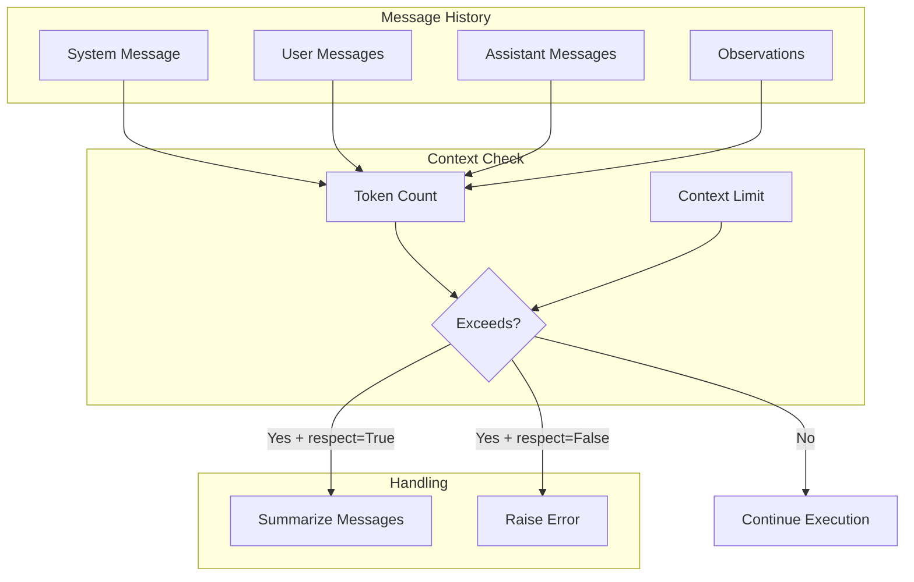
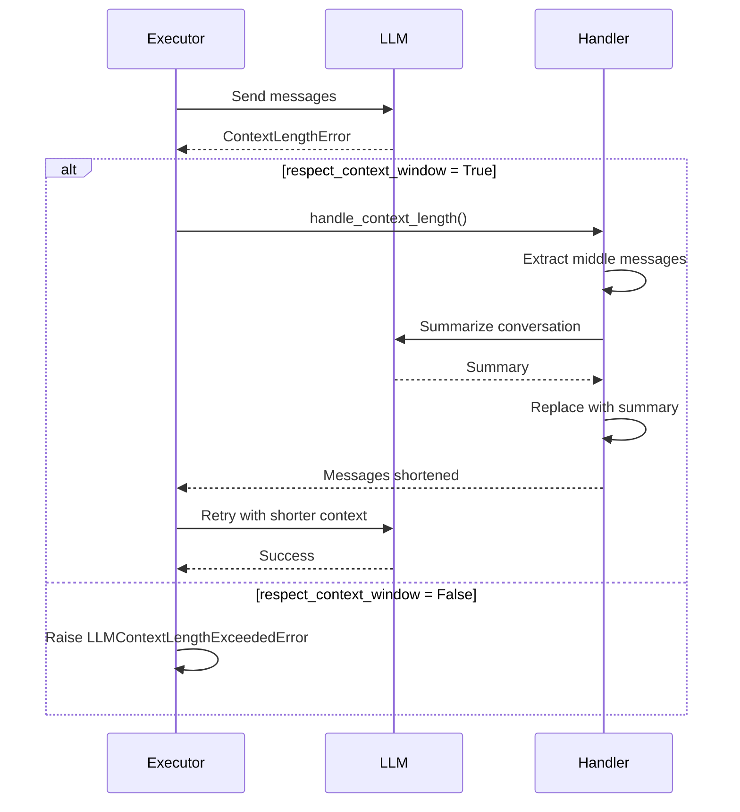

# Context Window Management

## TL;DR
CrewAI xử lý context window limit qua **automatic summarization** khi message history exceed limit. `respect_context_window` flag controls behavior - summarize để continue hoặc raise error để abort. LLM context sizes được hardcoded trong `LLM_CONTEXT_WINDOW_SIZES`.

---

## 1. Context Window Overview



---

## 2. Context Window Sizes

### 2.1 Hardcoded Limits

```python
# File: lib/crewai/src/crewai/llms/constants.py

LLM_CONTEXT_WINDOW_SIZES = {
    # OpenAI
    "gpt-4": 8192,
    "gpt-4-32k": 32768,
    "gpt-4-turbo": 128000,
    "gpt-4o": 128000,
    "gpt-4o-mini": 128000,
    "o1": 128000,
    "o1-mini": 128000,

    # Anthropic
    "claude-3-opus": 200000,
    "claude-3-sonnet": 200000,
    "claude-3-haiku": 200000,
    "claude-3.5-sonnet": 200000,

    # Google
    "gemini-pro": 32768,
    "gemini-1.5-pro": 1000000,
    "gemini-1.5-flash": 1000000,

    # Default fallback
    "DEFAULT": 8192,
}
```

### 2.2 Getting Context Size

```python
# File: lib/crewai/src/crewai/llm.py

def get_context_window_size(self) -> int:
    """Get context window size for current model."""

    model_name = self.model.lower()

    # Check exact match
    if model_name in LLM_CONTEXT_WINDOW_SIZES:
        return LLM_CONTEXT_WINDOW_SIZES[model_name]

    # Check partial match
    for key, size in LLM_CONTEXT_WINDOW_SIZES.items():
        if key in model_name:
            return size

    # Default fallback
    return LLM_CONTEXT_WINDOW_SIZES["DEFAULT"]
```

---

## 3. Context Exceeded Detection

### 3.1 Error Detection

```python
# File: lib/crewai/src/crewai/utilities/llm_utils.py

def is_context_length_exceeded(error: Exception) -> bool:
    """Check if error is due to context length exceeded."""

    error_message = str(error).lower()

    indicators = [
        "context_length_exceeded",
        "context length",
        "maximum context",
        "token limit",
        "max_tokens",
        "too many tokens",
        "context window",
    ]

    return any(indicator in error_message for indicator in indicators)
```

### 3.2 In Execution Loop

```python
# File: lib/crewai/src/crewai/agents/crew_agent_executor.py

def _invoke_loop_react(self) -> AgentFinish:
    while not finished:
        try:
            answer = get_llm_response(
                llm=self.llm,
                messages=self.messages,
            )
            # ... process response

        except Exception as e:
            if is_context_length_exceeded(e):
                # Handle context length issue
                handle_context_length(
                    messages=self.messages,
                    llm=self.llm,
                    respect_context_window=self.respect_context_window,
                )
                continue  # Retry with shorter context

            raise  # Re-raise other errors
```

---

## 4. Context Handling Strategies

### 4.1 respect_context_window Flag

```python
# File: lib/crewai/src/crewai/agent/core.py

class Agent(BaseAgent):
    respect_context_window: bool = Field(
        default=True,
        description=(
            "Keep messages under context limit by summarizing. "
            "If False, raises ContextWindowExceededError."
        )
    )
```

### 4.2 Handle Context Length

```python
# File: lib/crewai/src/crewai/utilities/llm_utils.py

def handle_context_length(
    messages: list[dict],
    llm: BaseLLM,
    respect_context_window: bool,
) -> None:
    """Handle context length exceeded."""

    if not respect_context_window:
        raise LLMContextLengthExceededError(
            "Context length exceeded and respect_context_window is False"
        )

    # Summarize middle messages to reduce context
    summarize_messages(messages, llm)
```

### 4.3 Message Summarization

```python
def summarize_messages(
    messages: list[dict],
    llm: BaseLLM,
) -> None:
    """Summarize conversation history to fit context window."""

    # Keep system message and last few messages
    system_msg = messages[0]  # Always keep
    last_msgs = messages[-2:]  # Keep recent context

    # Summarize middle messages
    middle_msgs = messages[1:-2]

    if not middle_msgs:
        return  # Nothing to summarize

    # Build summary prompt
    summary_prompt = """
    Summarize the following conversation concisely,
    preserving key information and decisions:

    {conversation}
    """

    conversation_text = "\n".join(
        f"{m['role']}: {m['content']}" for m in middle_msgs
    )

    # Get summary from LLM
    summary = llm.call([
        {"role": "user", "content": summary_prompt.format(
            conversation=conversation_text
        )}
    ])

    # Replace middle messages with summary
    messages.clear()
    messages.append(system_msg)
    messages.append({
        "role": "user",
        "content": f"Previous context summary:\n{summary}"
    })
    messages.extend(last_msgs)
```

---

## 5. Context Management Diagram



---

## 6. Token Counting

### 6.1 Estimating Token Count

```python
# Rough estimation (used for pre-check)
def estimate_tokens(text: str) -> int:
    """Estimate token count (rough: ~4 chars per token)."""
    return len(text) // 4

def estimate_message_tokens(messages: list[dict]) -> int:
    """Estimate total tokens in messages."""
    total = 0
    for msg in messages:
        total += estimate_tokens(msg.get("content", ""))
        total += 4  # Overhead per message
    return total
```

### 6.2 Using tiktoken (Optional)

```python
# With tiktoken package installed
import tiktoken

def count_tokens(text: str, model: str = "gpt-4") -> int:
    """Accurate token count using tiktoken."""
    try:
        encoding = tiktoken.encoding_for_model(model)
        return len(encoding.encode(text))
    except KeyError:
        # Fallback for unknown models
        encoding = tiktoken.get_encoding("cl100k_base")
        return len(encoding.encode(text))
```

---

## 7. Context Usage Ratio

### 7.1 Safe Usage Limit

```python
# File: lib/crewai/src/crewai/llm.py

CONTEXT_USAGE_RATIO = 0.85  # Use max 85% of context window

def get_safe_context_limit(self) -> int:
    """Get safe context limit (85% of max)."""
    max_context = self.get_context_window_size()
    return int(max_context * CONTEXT_USAGE_RATIO)
```

### 7.2 Pre-Check Before LLM Call

```python
def _check_context_before_call(
    self,
    messages: list[dict]
) -> None:
    """Pre-check context size before LLM call."""

    estimated_tokens = estimate_message_tokens(messages)
    safe_limit = self.get_safe_context_limit()

    if estimated_tokens > safe_limit:
        if self.respect_context_window:
            summarize_messages(messages, self.llm)
        else:
            raise LLMContextLengthExceededError(
                f"Estimated {estimated_tokens} tokens exceeds "
                f"safe limit of {safe_limit}"
            )
```

---

## 8. Memory Impact on Context

### 8.1 Memory adds to Context

```python
# In execute_task()
task_prompt = task.prompt()  # Base task

# Memory retrieval adds more context
if self._is_any_available_memory():
    memory = contextual_memory.build_context_for_task(task, context)
    task_prompt += self.i18n.slice("memory").format(memory=memory)
    # task_prompt is now larger

# Knowledge retrieval adds more
task_prompt = handle_knowledge_retrieval(...)
# task_prompt is even larger
```

### 8.2 Limiting Memory Results

```python
# Control memory retrieval size
results = short_term_memory.search(
    query=query,
    limit=3,  # Reduce from default 5
    score_threshold=0.7,  # Higher threshold = fewer results
)
```

---

## 9. Best Practices

### 9.1 Configuration Recommendations

```python
# For large tasks with much context
agent = Agent(
    role="Researcher",
    llm="gpt-4-turbo",  # 128k context
    respect_context_window=True,  # Enable auto-summarization
    max_iter=15,  # Fewer iterations = less accumulated context
)

# For quick tasks
agent = Agent(
    role="Calculator",
    llm="gpt-4o-mini",  # Smaller, faster
    respect_context_window=False,  # Fail fast if exceeded
    max_iter=5,
)
```

### 9.2 Memory Configuration

```python
# Limit memory impact on context
crew = Crew(
    agents=[agent],
    tasks=[task],
    memory=True,
    # Use smaller embedding model for memory
    embedder={"provider": "openai", "config": {"model": "text-embedding-3-small"}},
)
```

---

## 10. Key Takeaways

1. **Hardcoded Limits**: Context sizes defined in `LLM_CONTEXT_WINDOW_SIZES`.

2. **Auto-Summarization**: `respect_context_window=True` enables automatic message summarization.

3. **85% Safe Limit**: Use max 85% of context window để có room for response.

4. **Error Detection**: Pattern matching on error messages để detect context exceeded.

5. **Memory Impact**: Memory retrieval adds to context - limit results when needed.

6. **Retry Mechanism**: After summarization, execution loop retries automatically.

7. **Model Selection**: Choose model với appropriate context size cho use case.

---

## File References

| Component | Path |
|-----------|------|
| Context Sizes | `lib/crewai/src/crewai/llms/constants.py` |
| LLM Utils | `lib/crewai/src/crewai/utilities/llm_utils.py` |
| Agent Config | `lib/crewai/src/crewai/agent/core.py` |
| Executor Loop | `lib/crewai/src/crewai/agents/crew_agent_executor.py` |
