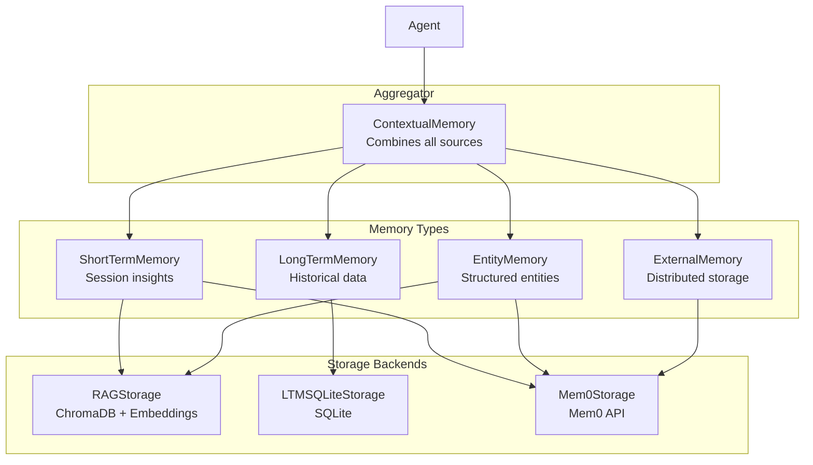

# Memory Types

## TL;DR
CrewAI implement **5 loại memory**: ShortTermMemory (session-based, RAG), LongTermMemory (persistent, SQLite), EntityMemory (structured entities, RAG), ExternalMemory (Mem0 integration), và ContextualMemory (aggregator). Mỗi loại phục vụ mục đích khác nhau trong việc lưu trữ và truy xuất context.

---

## 1. Memory System Overview



---

## 2. ShortTermMemory

### 2.1 Purpose
Lưu trữ **insights tạm thời** từ execution hiện tại trong session. Dùng cho việc share context giữa các tasks trong cùng một crew run.

### 2.2 Implementation

```python
# File: lib/crewai/src/crewai/memory/short_term/short_term_memory.py

class ShortTermMemory(Memory):
    """
    ShortTermMemory class for managing transient data related
    to immediate tasks and interactions.
    """

    def __init__(
        self,
        crew: Any = None,
        embedder_config: Any = None,
        storage: Any = None,
        path: str | None = None,
    ) -> None:
        memory_provider = None
        if embedder_config and isinstance(embedder_config, dict):
            memory_provider = embedder_config.get("provider")

        # Choose storage backend
        if memory_provider == "mem0":
            storage = Mem0Storage(type="short_term", crew=crew)
        else:
            storage = RAGStorage(
                type="short_term",
                embedder_config=embedder_config,
                crew=crew,
                path=path,
            )

        super().__init__(storage=storage)
```

### 2.3 Usage

```python
# Save insight
short_term_memory.save(
    value="User prefers detailed explanations",
    metadata={"agent": "researcher", "quality": 0.95}
)

# Search for relevant context
results = short_term_memory.search(
    query="user preferences",
    limit=5,
    score_threshold=0.6
)
```

### 2.4 Data Format

```python
class ShortTermMemoryItem:
    def __init__(
        self,
        data: Any,
        agent: str | None = None,
        metadata: dict[str, Any] | None = None,
    ):
        self.data = data
        self.agent = agent
        self.metadata = metadata or {}
```

---

## 3. LongTermMemory

### 3.1 Purpose
Lưu trữ **historical data** về task execution và performance. Persist across sessions để agent có thể học từ past experiences.

### 3.2 Implementation

```python
# File: lib/crewai/src/crewai/memory/long_term/long_term_memory.py

class LongTermMemory(Memory):
    """
    LongTermMemory class for managing cross runs data related
    to overall crew's execution and performance.
    """

    def __init__(
        self,
        storage: LTMSQLiteStorage | None = None,
        path: str | None = None,
    ) -> None:
        if not storage:
            storage = LTMSQLiteStorage(db_path=path) if path else LTMSQLiteStorage()
        super().__init__(storage=storage)

    def save(self, item: LongTermMemoryItem) -> None:
        """Save task execution history."""
        metadata = item.metadata
        self.storage.save(
            task_description=item.task,
            score=metadata["quality"],
            metadata=metadata,
            datetime=item.datetime,
        )

    def search(
        self,
        task: str,
        latest_n: int = 5,
    ) -> list[dict[str, Any]]:
        """Retrieve historical task data."""
        return self.storage.load(task, latest_n)
```

### 3.3 Data Format

```python
class LongTermMemoryItem:
    def __init__(
        self,
        agent: str,
        task: str,
        expected_output: str,
        datetime: str,
        quality: int | float | None = None,
        metadata: dict[str, Any] | None = None,
    ):
        self.task = task
        self.agent = agent
        self.quality = quality
        self.datetime = datetime
        self.expected_output = expected_output
        self.metadata = metadata or {}
```

### 3.4 SQLite Schema

```sql
CREATE TABLE IF NOT EXISTS long_term_memories (
    id INTEGER PRIMARY KEY AUTOINCREMENT,
    task_description TEXT,
    metadata TEXT,  -- JSON encoded
    datetime TEXT,
    score REAL
);
```

---

## 4. EntityMemory

### 4.1 Purpose
Lưu trữ **structured information** về entities (người, tổ chức, concepts) và relationships giữa chúng.

### 4.2 Implementation

```python
# File: lib/crewai/src/crewai/memory/entity/entity_memory.py

class EntityMemory(Memory):
    """
    EntityMemory class for managing structured information
    about entities and their relationships.
    """

    def save(
        self,
        value: EntityMemoryItem | list[EntityMemoryItem],
        metadata: dict[str, Any] | None = None,
    ) -> None:
        items = value if isinstance(value, list) else [value]

        for item in items:
            if self._memory_provider == "mem0":
                data = f"""
                Remember details about the following entity:
                Name: {item.name}
                Type: {item.type}
                Entity Description: {item.description}
                """
            else:
                data = f"{item.name}({item.type}): {item.description}"

            super().save(data, item.metadata)
```

### 4.3 Data Format

```python
class EntityMemoryItem:
    def __init__(
        self,
        name: str,
        type: str,
        description: str,
        relationships: str,
    ):
        self.name = name               # "John Doe"
        self.type = type               # "Person"
        self.description = description # "CEO of Acme Inc."
        self.metadata = {"relationships": relationships}
```

### 4.4 Example Usage

```python
entity_memory.save(
    EntityMemoryItem(
        name="OpenAI",
        type="Organization",
        description="AI research company, creator of GPT models",
        relationships="Partner of Microsoft, Competitor of Anthropic"
    )
)

# Search for entities
entities = entity_memory.search("AI companies", limit=5)
```

---

## 5. ExternalMemory

### 5.1 Purpose
Interface với **external memory services** như Mem0 để distributed memory management.

### 5.2 Implementation

```python
# File: lib/crewai/src/crewai/memory/external/external_memory.py

class ExternalMemory(Memory):
    """Interface with external memory systems."""

    @staticmethod
    def external_supported_storages() -> dict[str, Any]:
        return {
            "mem0": ExternalMemory._configure_mem0,
        }

    @staticmethod
    def create_storage(
        crew: Any,
        embedder_config: dict[str, Any] | ProviderSpec | None
    ) -> Storage:
        if not embedder_config:
            raise ValueError("embedder_config is required")

        provider = embedder_config["provider"]
        supported_storages = ExternalMemory.external_supported_storages()
        storage = supported_storages[provider](crew, embedder_config)
        return storage

    def set_crew(self, crew: Any) -> "ExternalMemory":
        """Lazy initialization with crew context."""
        self.crew = crew
        self.storage = self.create_storage(crew, self.embedder_config)
        return self
```

### 5.3 Mem0 Integration

```python
# Mem0 supports both cloud and local modes
if api_key := config.get("api_key") or os.getenv("MEM0_API_KEY"):
    # Cloud mode
    self.memory = MemoryClient(api_key=api_key)
else:
    # Local mode
    self.memory = Memory.from_config(local_config)
```

---

## 6. ContextualMemory

### 6.1 Purpose
**Aggregator** that combines all memory sources để build complete context cho task execution.

### 6.2 Implementation

```python
# File: lib/crewai/src/crewai/memory/contextual/contextual_memory.py

class ContextualMemory:
    """Aggregates and retrieves context from multiple memory sources."""

    def __init__(
        self,
        stm: ShortTermMemory,
        ltm: LongTermMemory,
        em: EntityMemory,
        exm: ExternalMemory,
        agent: Agent | None = None,
        task: Task | None = None,
    ) -> None:
        self.stm = stm
        self.ltm = ltm
        self.em = em
        self.exm = exm

    def build_context_for_task(self, task: Task, context: str) -> str:
        """Build contextual information for a task."""
        query = f"{task.description} {context}".strip()

        context_parts = [
            self._fetch_ltm_context(task.description),
            self._fetch_stm_context(query),
            self._fetch_entity_context(query),
            self._fetch_external_context(query),
        ]

        return "\n".join(filter(None, context_parts))
```

### 6.3 Async Support

```python
async def abuild_context_for_task(self, task: Task, context: str) -> str:
    """Build context asynchronously (concurrent fetches)."""
    results = await asyncio.gather(
        self._afetch_ltm_context(task.description),
        self._afetch_stm_context(query),
        self._afetch_entity_context(query),
        self._afetch_external_context(query),
    )
    return "\n".join(filter(None, results))
```

### 6.4 Context Formatting

```python
def _fetch_stm_context(self, query: str) -> str:
    """Format short-term memory results."""
    results = self.stm.search(query, limit=5)
    if not results:
        return ""

    formatted = "Recent Insights:\n"
    for item in results:
        content = item.get("content", item.get("memory", ""))
        formatted += f"- {content}\n"

    return formatted
```

---

## 7. Memory Type Comparison

| Memory Type | Storage | Persistence | Use Case |
|-------------|---------|-------------|----------|
| **ShortTerm** | RAG/Mem0 | Session | Recent task insights |
| **LongTerm** | SQLite | Permanent | Task history, quality scores |
| **Entity** | RAG/Mem0 | Session/Permanent | Structured entity data |
| **External** | Mem0 | Distributed | Cross-system memory |
| **Contextual** | - | - | Aggregation only |

---

## 8. Memory Configuration

### 8.1 Crew-Level Config

```python
crew = Crew(
    agents=[agent1, agent2],
    tasks=[task1, task2],
    memory=True,  # Enable memory system
    embedder={
        "provider": "openai",
        "config": {"model": "text-embedding-3-small"}
    },
)
```

### 8.2 Custom Memory Instances

```python
from crewai.memory import (
    ShortTermMemory,
    LongTermMemory,
    EntityMemory,
    ExternalMemory,
)

crew = Crew(
    agents=[agent],
    tasks=[task],
    short_term_memory=ShortTermMemory(
        embedder_config={"provider": "openai"}
    ),
    long_term_memory=LongTermMemory(
        path="./memory/ltm.db"
    ),
    entity_memory=EntityMemory(
        embedder_config={"provider": "openai"}
    ),
    external_memory=ExternalMemory(
        embedder_config={"provider": "mem0", "config": {"api_key": "..."}}
    ),
)
```

---

## 9. Key Takeaways

1. **5 Memory Types**: Mỗi loại phục vụ purpose riêng (session, persistent, structured, external, aggregation).

2. **Pluggable Storage**: RAGStorage, SQLite, Mem0 có thể swap tùy theo use case.

3. **Semantic Search**: ShortTerm và Entity memory dùng embeddings cho similarity search.

4. **ContextualMemory**: Aggregator pattern để combine all sources thành single context string.

5. **Async Support**: All memory operations có async variants cho non-blocking access.

6. **Event-Driven**: Memory save/search operations emit events cho observability.

7. **Crew-Scoped**: Memory instances thuộc về Crew, shared giữa all agents.

---

## File References

| Component | Path |
|-----------|------|
| Memory Base | `lib/crewai/src/crewai/memory/memory.py` |
| ShortTermMemory | `lib/crewai/src/crewai/memory/short_term/short_term_memory.py` |
| LongTermMemory | `lib/crewai/src/crewai/memory/long_term/long_term_memory.py` |
| EntityMemory | `lib/crewai/src/crewai/memory/entity/entity_memory.py` |
| ExternalMemory | `lib/crewai/src/crewai/memory/external/external_memory.py` |
| ContextualMemory | `lib/crewai/src/crewai/memory/contextual/contextual_memory.py` |
