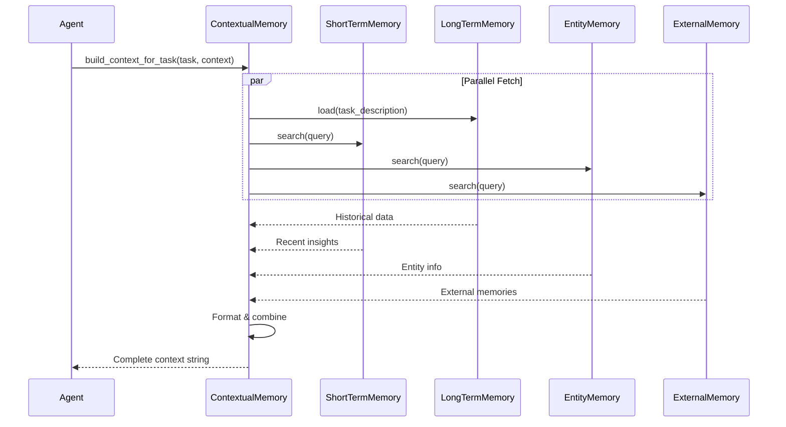
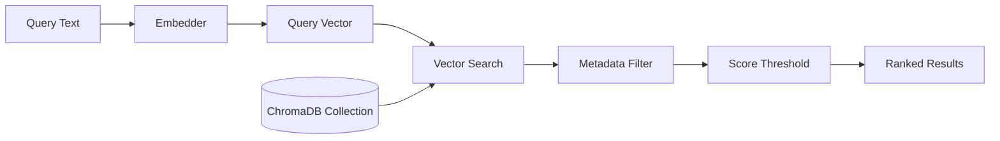

# Memory Retrieval

## TL;DR
Memory retrieval trong crewAI sử dụng **semantic search** (RAGStorage) hoặc **exact match** (SQLite). ContextualMemory aggregates từ tất cả sources và format thành context string. Retrieval được trigger tự động trong `execute_task()` flow.

---

## 1. Retrieval Flow Overview



---

## 2. Semantic Search (RAGStorage)

### 2.1 Search Implementation

```python
# File: lib/crewai/src/crewai/memory/storage/rag_storage.py

def search(
    self,
    query: str,
    limit: int = 5,
    filter: dict[str, Any] | None = None,
    score_threshold: float = 0.6,
) -> list[Any]:
    """Search with semantic similarity."""

    collection_name = f"memory_{self.type}_{self.agents}"

    # ChromaDB semantic search
    return self._client.search(
        collection_name=collection_name,
        query=query,                    # Query text (will be embedded)
        limit=limit,                    # Max results
        metadata_filter=filter,         # Filter by metadata
        score_threshold=score_threshold, # Min similarity score
    )
```

### 2.2 ChromaDB Search Flow



### 2.3 Search Parameters

| Parameter | Type | Default | Description |
|-----------|------|---------|-------------|
| `query` | str | Required | Search text |
| `limit` | int | 5 | Max results |
| `filter` | dict | None | Metadata filter |
| `score_threshold` | float | 0.6 | Min similarity (0-1) |

---

## 3. Exact Match Search (SQLite)

### 3.1 Load Implementation

```python
# File: lib/crewai/src/crewai/memory/storage/ltm_sqlite_storage.py

def load(
    self,
    task_description: str,
    latest_n: int
) -> list[dict[str, Any]]:
    """Query by exact task description match."""

    with sqlite3.connect(self.db_path) as conn:
        cursor = conn.cursor()
        cursor.execute(
            f"""
            SELECT metadata, datetime, score
            FROM long_term_memories
            WHERE task_description = ?
            ORDER BY datetime DESC, score ASC
            LIMIT {latest_n}
            """,
            (task_description,),
        )
        rows = cursor.fetchall()

        return [
            {
                "metadata": json.loads(row[0]),
                "datetime": row[1],
                "score": row[2],
            }
            for row in rows
        ]
```

### 3.2 SQLite Query Flow


---

## 4. ContextualMemory Aggregation

### 4.1 Build Context

```python
# File: lib/crewai/src/crewai/memory/contextual/contextual_memory.py

class ContextualMemory:
    def build_context_for_task(self, task: Task, context: str) -> str:
        """Build complete context from all memory sources."""

        query = f"{task.description} {context}".strip()

        # Fetch from each source
        context_parts = [
            self._fetch_ltm_context(task.description),
            self._fetch_stm_context(query),
            self._fetch_entity_context(query),
            self._fetch_external_context(query),
        ]

        # Combine non-empty parts
        return "\n".join(filter(None, context_parts))
```

### 4.2 Individual Fetch Methods

```python
def _fetch_ltm_context(self, task_description: str) -> str:
    """Fetch historical task data."""
    if not self.ltm:
        return ""

    results = self.ltm.search(task_description, latest_n=5)

    if not results:
        return ""

    formatted = "Historical Data:\n"
    for item in results:
        metadata = item.get("metadata", {})
        formatted += f"- Score: {item.get('score')}, "
        formatted += f"Date: {item.get('datetime')}\n"
        formatted += f"  Details: {metadata}\n"

    return formatted


def _fetch_stm_context(self, query: str) -> str:
    """Fetch recent insights from current session."""
    if not self.stm:
        return ""

    results = self.stm.search(query, limit=5)

    if not results:
        return ""

    formatted = "Recent Insights:\n"
    for item in results:
        content = item.get("content", item.get("memory", ""))
        formatted += f"- {content}\n"

    return formatted


def _fetch_entity_context(self, query: str) -> str:
    """Fetch entity information."""
    if not self.em:
        return ""

    results = self.em.search(query, limit=5)

    if not results:
        return ""

    formatted = "Relevant Entities:\n"
    for item in results:
        content = item.get("content", "")
        formatted += f"- {content}\n"

    return formatted


def _fetch_external_context(self, query: str) -> str:
    """Fetch from external memory service."""
    if not self.exm:
        return ""

    results = self.exm.search(query, limit=5)

    if not results:
        return ""

    formatted = "External Knowledge:\n"
    for item in results:
        content = item.get("content", item.get("memory", ""))
        formatted += f"- {content}\n"

    return formatted
```

### 4.3 Async Aggregation

```python
async def abuild_context_for_task(self, task: Task, context: str) -> str:
    """Build context with concurrent fetches."""

    query = f"{task.description} {context}".strip()

    # Concurrent execution
    results = await asyncio.gather(
        self._afetch_ltm_context(task.description),
        self._afetch_stm_context(query),
        self._afetch_entity_context(query),
        self._afetch_external_context(query),
    )

    return "\n".join(filter(None, results))
```

---

## 5. Retrieval in Agent Execution

### 5.1 Trigger Point

```python
# File: lib/crewai/src/crewai/agent/core.py:367-415

def execute_task(self, task, context=None, tools=None):
    # Build base task prompt
    task_prompt = task.prompt()

    # Memory retrieval
    if self._is_any_available_memory():
        contextual_memory = ContextualMemory(
            self.crew._short_term_memory,
            self.crew._long_term_memory,
            self.crew._entity_memory,
            self.crew._external_memory,
            agent=self,
            task=task,
        )

        memory = contextual_memory.build_context_for_task(task, context or "")

        if memory.strip():
            task_prompt += self.i18n.slice("memory").format(memory=memory)
```

### 5.2 Memory Check

```python
def _is_any_available_memory(self) -> bool:
    """Check if any memory source is available."""
    return (
        self.crew and (
            self.crew._short_term_memory or
            self.crew._long_term_memory or
            self.crew._entity_memory or
            self.crew._external_memory
        )
    )
```

---

## 6. Event Emission

### 6.1 Query Events

```python
# File: lib/crewai/src/crewai/memory/short_term/short_term_memory.py

def search(self, query: str, limit: int = 5, score_threshold: float = 0.6):
    # Emit start event
    crewai_event_bus.emit(
        self,
        event=MemoryQueryStartedEvent(
            query=query,
            limit=limit,
            score_threshold=score_threshold,
            source_type="short_term_memory",
            from_agent=self.agent,
            from_task=self.task,
        ),
    )

    start_time = time.time()

    try:
        results = self.storage.search(query, limit, score_threshold)

        # Emit completion event
        crewai_event_bus.emit(
            self,
            event=MemoryQueryCompletedEvent(
                query=query,
                results=results,
                query_time_ms=(time.time() - start_time) * 1000,
                source_type="short_term_memory",
            ),
        )

        return results

    except Exception as e:
        # Emit failure event
        crewai_event_bus.emit(
            self,
            event=MemoryQueryFailedEvent(
                query=query,
                error=str(e),
                source_type="short_term_memory",
            ),
        )
        raise
```

---

## 7. Context Output Format

### 7.1 Complete Context Example

```
Historical Data:
- Score: 0.95, Date: 2024-01-15T10:30:00
  Details: {"agent": "researcher", "task": "market analysis"}
- Score: 0.88, Date: 2024-01-14T14:20:00
  Details: {"agent": "researcher", "task": "competitor analysis"}

Recent Insights:
- User prefers detailed technical explanations
- Previous search found 15 relevant articles
- Data quality score improved to 92%

Relevant Entities:
- OpenAI(Organization): AI research company, creator of GPT
- Anthropic(Organization): AI safety company, creator of Claude
- GPT-4(Product): Large language model by OpenAI

External Knowledge:
- Team standard: Use APA citation format
- Project deadline: March 2024
```

### 7.2 Injection into Prompt

```python
# i18n template
MEMORY_TEMPLATE = """
This is the context you're working with:
{memory}
"""

# Applied in execute_task
task_prompt += self.i18n.slice("memory").format(memory=memory)
```

---

## 8. Key Takeaways

1. **Dual Search Modes**: Semantic (RAG) cho similarity, exact match (SQLite) cho structured queries.

2. **ContextualMemory**: Aggregator pattern để combine all memory sources.

3. **Parallel Fetching**: Async version fetches all sources concurrently.

4. **Score Threshold**: Default 0.6 filters out low-relevance results.

5. **Event-Driven**: All queries emit events cho observability.

6. **Auto-Trigger**: Memory retrieval automatically happens in `execute_task()`.

7. **Formatted Output**: Results được format thành human-readable context string.

---

## File References

| Component | Path |
|-----------|------|
| RAGStorage Search | `lib/crewai/src/crewai/memory/storage/rag_storage.py` |
| SQLite Load | `lib/crewai/src/crewai/memory/storage/ltm_sqlite_storage.py` |
| ContextualMemory | `lib/crewai/src/crewai/memory/contextual/contextual_memory.py` |
| Agent Integration | `lib/crewai/src/crewai/agent/core.py:367-415` |
| Memory Events | `lib/crewai/src/crewai/events/types/memory_events.py` |
