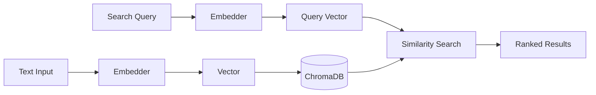
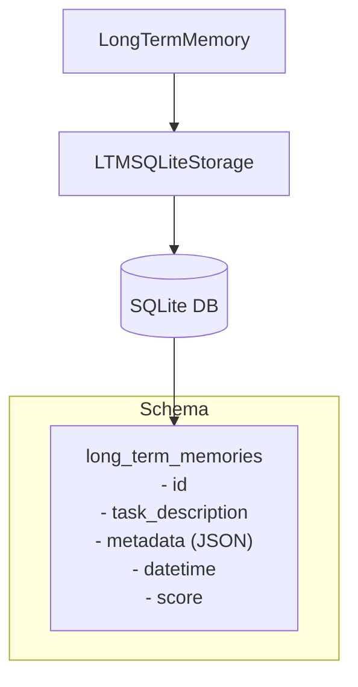
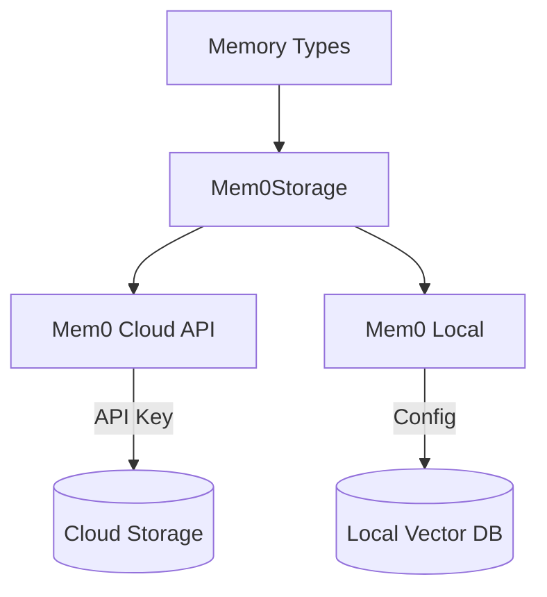

# Storage Backends

## TL;DR
CrewAI sử dụng **3 storage backends**: RAGStorage (ChromaDB + embeddings cho semantic search), LTMSQLiteStorage (SQLite cho structured data), và Mem0Storage (external service integration). Tất cả implement common `Storage` interface cho pluggability.

---

## 1. Storage Interface

```python
# File: lib/crewai/src/crewai/memory/storage/interface.py

class Storage:
    """Abstract base class defining the storage interface."""

    def save(self, value: Any, metadata: dict[str, Any]) -> None:
        """Save data with metadata."""
        pass

    def search(
        self,
        query: str,
        limit: int,
        score_threshold: float
    ) -> dict[str, Any] | list[Any]:
        """Search for relevant data."""
        return {}

    def reset(self) -> None:
        """Clear all stored data."""
        pass
```

---

## 2. RAGStorage (ChromaDB)

### 2.1 Overview



### 2.2 Implementation

```python
# File: lib/crewai/src/crewai/memory/storage/rag_storage.py

class RAGStorage(BaseRAGStorage):
    """
    Extends Storage to handle embeddings for memory entries,
    improving search efficiency.
    """

    def __init__(
        self,
        type: str,  # "short_term", "entities", etc.
        allow_reset: bool = True,
        embedder_config: ProviderSpec | BaseEmbeddingsProvider | None = None,
        crew: Crew | None = None,
        path: str | None = None,
    ) -> None:
        self.type = type
        self.allow_reset = allow_reset
        self.embedder_config = embedder_config
        self.crew = crew
        self.path = path

        # Build embedder from config
        embedding_function = build_embedder(self.embedder_config)

        # Create ChromaDB config
        config = ChromaDBConfig(embedding_function=embedding_function)

        # Set persistence directory
        if self.path:
            config.settings.persist_directory = self.path

        # Create client
        self._client = create_client(config)
```

### 2.3 Save Operation

```python
def save(self, value: Any, metadata: dict[str, Any]) -> None:
    """Save embeddings and metadata to ChromaDB."""

    # Build collection name from type and agents
    collection_name = f"memory_{self.type}_{self.agents}"

    # Create document record
    document: BaseRecord = {"content": value}
    if metadata:
        document["metadata"] = metadata

    # Add to ChromaDB
    self._client.add_documents(
        collection_name=collection_name,
        documents=[document]
    )
```

### 2.4 Search Operation

```python
def search(
    self,
    query: str,
    limit: int = 5,
    filter: dict[str, Any] | None = None,
    score_threshold: float = 0.6,
) -> list[Any]:
    """Search with semantic similarity."""

    collection_name = f"memory_{self.type}_{self.agents}"

    return self._client.search(
        collection_name=collection_name,
        query=query,
        limit=limit,
        metadata_filter=filter,
        score_threshold=score_threshold,
    )
```

### 2.5 Async Support

```python
async def asave(self, value: Any, metadata: dict[str, Any]) -> None:
    """Async save operation."""
    # ChromaDB supports async operations
    await self._client.aadd_documents(...)

async def asearch(self, query: str, limit: int = 5) -> list[Any]:
    """Async search operation."""
    return await self._client.asearch(...)
```

---

## 3. LTMSQLiteStorage

### 3.1 Overview



### 3.2 Implementation

```python
# File: lib/crewai/src/crewai/memory/storage/ltm_sqlite_storage.py

class LTMSQLiteStorage:
    """SQLite storage class for long-term memory data."""

    def __init__(
        self,
        db_path: str | None = None,
        verbose: bool = True
    ) -> None:
        if db_path is None:
            db_path = str(
                Path(db_storage_path()) / "long_term_memory_storage.db"
            )
        self.db_path = db_path
        self.verbose = verbose
        self._initialize_db()

    def _initialize_db(self) -> None:
        """Create the database table."""
        with sqlite3.connect(self.db_path) as conn:
            cursor = conn.cursor()
            cursor.execute("""
                CREATE TABLE IF NOT EXISTS long_term_memories (
                    id INTEGER PRIMARY KEY AUTOINCREMENT,
                    task_description TEXT,
                    metadata TEXT,
                    datetime TEXT,
                    score REAL
                )
            """)
            conn.commit()
```

### 3.3 Save Operation

```python
def save(
    self,
    task_description: str,
    metadata: dict[str, Any],
    datetime: str,
    score: int | float,
) -> None:
    """Insert memory record."""
    try:
        with sqlite3.connect(self.db_path) as conn:
            cursor = conn.cursor()
            cursor.execute(
                """
                INSERT INTO long_term_memories
                    (task_description, metadata, datetime, score)
                VALUES (?, ?, ?, ?)
                """,
                (task_description, json.dumps(metadata), datetime, score),
            )
            conn.commit()
    except Exception as e:
        if self.verbose:
            print(f"Error saving to LTM: {e}")
```

### 3.4 Load Operation

```python
def load(
    self,
    task_description: str,
    latest_n: int
) -> list[dict[str, Any]]:
    """Query by task description."""
    try:
        with sqlite3.connect(self.db_path) as conn:
            cursor = conn.cursor()
            cursor.execute(
                f"""
                SELECT metadata, datetime, score
                FROM long_term_memories
                WHERE task_description = ?
                ORDER BY datetime DESC, score ASC
                LIMIT {latest_n}
                """,
                (task_description,),
            )
            rows = cursor.fetchall()

            return [
                {
                    "metadata": json.loads(row[0]),
                    "datetime": row[1],
                    "score": row[2],
                }
                for row in rows
            ]
    except Exception as e:
        if self.verbose:
            print(f"Error loading from LTM: {e}")
        return []
```

### 3.5 Async Support

```python
# Uses aiosqlite for async operations
import aiosqlite

async def aload(
    self,
    task_description: str,
    latest_n: int
) -> list[dict[str, Any]]:
    """Async query."""
    async with aiosqlite.connect(self.db_path) as conn:
        cursor = await conn.execute(...)
        rows = await cursor.fetchall()
        return [...]
```

---

## 4. Mem0Storage

### 4.1 Overview



### 4.2 Implementation

```python
# File: lib/crewai/src/crewai/memory/storage/mem0_storage.py

class Mem0Storage(Storage):
    """
    Extends Storage to handle embedding and searching
    across entities using Mem0.
    """

    def __init__(
        self,
        type: str,
        crew: Any = None,
        config: dict = None
    ) -> None:
        self._validate_type(type)  # short_term, long_term, entities, external
        self.memory_type = type
        self.crew = crew
        self.config = config or {}

        # Choose cloud or local mode
        if api_key := self.config.get("api_key") or os.getenv("MEM0_API_KEY"):
            # Cloud mode
            self.memory = MemoryClient(
                api_key=api_key,
                org_id=self.config.get("org_id"),
                project_id=self.config.get("project_id"),
            )
        else:
            # Local mode
            local_config = self._build_local_config()
            self.memory = Memory.from_config(local_config)
```

### 4.3 Save Operation

```python
def save(self, value: Any, metadata: dict[str, Any]) -> None:
    """Save to Mem0 with conversation format."""
    conversations = []
    messages = metadata.pop("messages", None)

    if messages:
        # Extract last user and assistant messages
        last_user = _last_content(messages, "user")
        last_assistant = _last_content(messages, "assistant")
        conversations.append({"role": "user", "content": last_user})
        conversations.append({"role": "assistant", "content": last_assistant})
    else:
        conversations.append({"role": "assistant", "content": value})

    # Add with metadata
    params = {
        "metadata": {
            "type": self._base_metadata[self.memory_type],
            **metadata
        },
        "infer": self.infer,  # Auto-extract insights
    }

    self.memory.add(conversations, **params)
```

### 4.4 Search Operation

```python
def search(
    self,
    query: str,
    limit: int = 5,
    score_threshold: float = 0.6
) -> list[Any]:
    """Search Mem0 with filters."""
    params = {
        "query": query,
        "limit": limit,
        "version": "v2",
        "filters": self._create_filter_for_search(),
        "threshold": score_threshold,
    }

    results = self.memory.search(**params)

    # Normalize results for compatibility
    for result in results["results"]:
        result["content"] = result["memory"]

    return results["results"]
```

### 4.5 Filter Creation

```python
def _create_filter_for_search(self) -> dict:
    """Create filters based on memory type."""
    filters = {
        "AND": [
            {"type": self._base_metadata[self.memory_type]},
        ]
    }

    # Add user/agent filters if available
    if self.user_id:
        filters["AND"].append({"user_id": self.user_id})
    if self.agent_id:
        filters["AND"].append({"agent_id": self.agent_id})

    return filters
```

---

## 5. Embedder Configuration

### 5.1 Building Embedders

```python
# File: lib/crewai/src/crewai/rag/embeddings/

def build_embedder(config: ProviderSpec | dict) -> BaseEmbeddingsProvider:
    """Build embedder from configuration."""

    if isinstance(config, dict):
        provider = config.get("provider", "openai")
        model_config = config.get("config", {})
    else:
        provider = config.provider
        model_config = config.config

    # Route to provider
    if provider == "openai":
        return OpenAIEmbeddings(**model_config)
    elif provider == "cohere":
        return CohereEmbeddings(**model_config)
    elif provider == "huggingface":
        return HuggingFaceEmbeddings(**model_config)
    # ... 13+ providers
```

### 5.2 Available Providers

| Provider | Class | Default Model |
|----------|-------|---------------|
| openai | OpenAIEmbeddings | text-embedding-3-small |
| cohere | CohereEmbeddings | embed-english-v3.0 |
| huggingface | HuggingFaceEmbeddings | all-MiniLM-L6-v2 |
| sentence_transformer | SentenceTransformerEmbeddings | - |
| google | GoogleEmbeddings | text-embedding-004 |
| voyageai | VoyageAIEmbeddings | voyage-2 |
| ollama | OllamaEmbeddings | nomic-embed-text |
| ... | ... | ... |

---

## 6. Storage Comparison

| Feature | RAGStorage | LTMSQLiteStorage | Mem0Storage |
|---------|------------|------------------|-------------|
| **Search Type** | Semantic | Exact match | Semantic |
| **Persistence** | Configurable | Always | Cloud/Local |
| **Async** | ✓ | ✓ | ✓ |
| **Embeddings** | Required | Not used | Built-in |
| **Use Case** | STM, Entity | LTM | External |

---

## 7. Key Takeaways

1. **Interface Pattern**: Common `Storage` interface cho pluggability.

2. **RAGStorage**: ChromaDB + embeddings cho semantic similarity search.

3. **LTMSQLiteStorage**: Simple SQLite cho structured task history.

4. **Mem0Storage**: External service integration, supports cloud và local modes.

5. **Embedder Abstraction**: 13+ embedding providers qua common interface.

6. **Async-First**: Tất cả backends support async operations.

7. **Collection Naming**: RAGStorage dùng `memory_{type}_{agents}` pattern.

---

## File References

| Component | Path |
|-----------|------|
| Storage Interface | `lib/crewai/src/crewai/memory/storage/interface.py` |
| RAGStorage | `lib/crewai/src/crewai/memory/storage/rag_storage.py` |
| LTMSQLiteStorage | `lib/crewai/src/crewai/memory/storage/ltm_sqlite_storage.py` |
| Mem0Storage | `lib/crewai/src/crewai/memory/storage/mem0_storage.py` |
| Embeddings | `lib/crewai/src/crewai/rag/embeddings/` |
