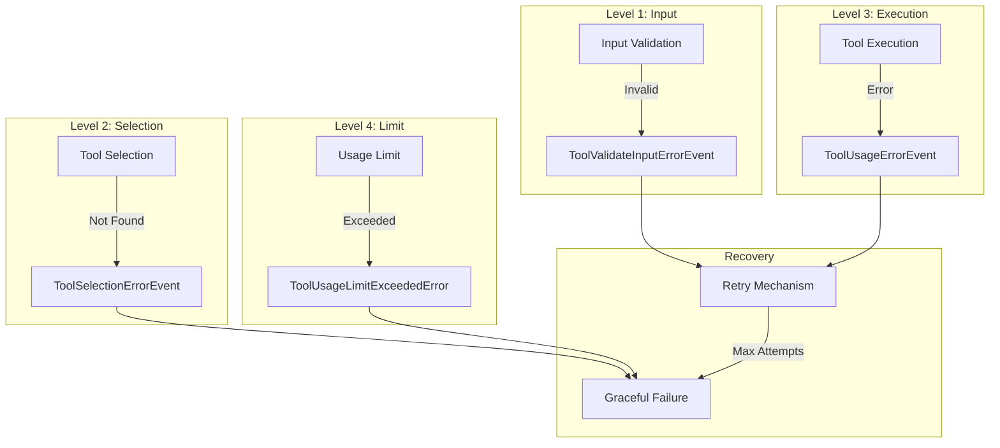
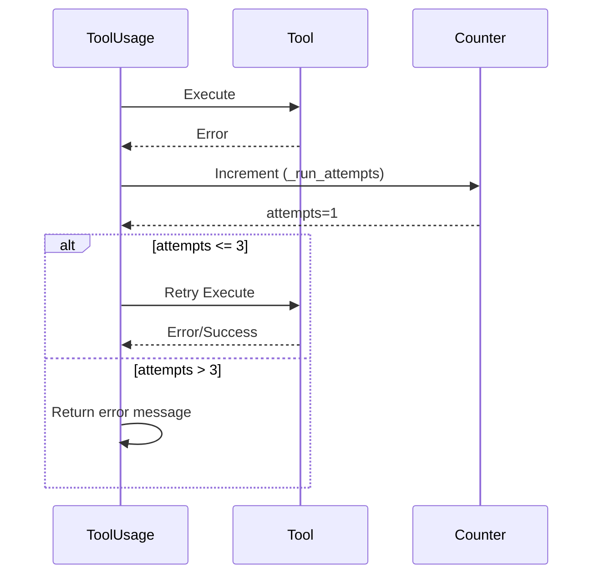

# Tool Error Handling

## TL;DR
CrewAI xử lý tool errors qua **multi-level strategy**: Input validation → Selection errors → Execution errors → Retry mechanism. Mỗi error emits event cho observability. Max 3 retry attempts trước khi fail gracefully với error message.

---

## 1. Error Handling Levels



---

## 2. Error Types

### 2.1 ToolUsageError

```python
# File: lib/crewai/src/crewai/tools/tool_usage.py:20-25

class ToolUsageError(Exception):
    """Exception raised for errors in tool usage."""

    def __init__(self, message: str) -> None:
        self.message = message
        super().__init__(self.message)
```

### 2.2 ToolUsageLimitExceededError

```python
# File: lib/crewai/src/crewai/tools/structured_tool.py:20-21

class ToolUsageLimitExceededError(Exception):
    """Exception raised when tool reaches max usage limit."""
    pass
```

### 2.3 OutputParserError

```python
# File: lib/crewai/src/crewai/agents/parser.py

class OutputParserError(Exception):
    """Exception raised when output cannot be parsed."""
    pass
```

---

## 3. Input Validation Errors

### 3.1 Validation Logic

```python
# File: lib/crewai/src/crewai/tools/tool_usage.py:858-912

def _validate_tool_input(self, tool_input: str | None) -> dict[str, Any]:
    """Validate and parse tool input."""

    if tool_input is None:
        return {}

    if not isinstance(tool_input, str) or not tool_input.strip():
        self._emit_validate_input_error(
            "Tool input must be a valid dictionary"
        )
        raise Exception("Invalid tool input format")

    # Try multiple parsing strategies
    # ... (JSON, literal_eval, JSON5, repair)

    # All attempts failed
    error_message = "Tool input must be valid JSON or dict format"
    self._emit_validate_input_error(error_message)
    raise Exception(error_message)
```

### 3.2 Error Event Emission

```python
# File: lib/crewai/src/crewai/tools/tool_usage.py:914-931

def _emit_validate_input_error(self, final_error: str) -> None:
    """Emit validation error event."""

    event_data = {
        "agent_key": getattr(self.agent, "key", None),
        "agent_role": getattr(self.agent, "role", None),
        "tool_name": self.action.tool,
        "tool_args": str(self.action.tool_input),
        "tool_class": self.__class__.__name__,
    }

    if self.fingerprint_context:
        event_data.update(self.fingerprint_context)

    crewai_event_bus.emit(
        self,
        ToolValidateInputErrorEvent(**event_data, error=final_error),
    )
```

---

## 4. Tool Selection Errors

### 4.1 Selection Logic

```python
# File: lib/crewai/src/crewai/tools/tool_usage.py:733-776

def _select_tool(self, tool_name: str) -> CrewStructuredTool:
    """Select tool by name with fuzzy matching."""

    sanitized_input = sanitize_tool_name(tool_name)

    # Sort by similarity
    order_tools = sorted(
        self.tools,
        key=lambda tool: SequenceMatcher(
            None,
            sanitize_tool_name(tool.name),
            sanitized_input
        ).ratio(),
        reverse=True,
    )

    # Find match
    for tool in order_tools:
        sanitized_tool = sanitize_tool_name(tool.name)
        if (
            sanitized_tool == sanitized_input or
            SequenceMatcher(None, sanitized_tool, sanitized_input).ratio() > 0.85
        ):
            return tool

    # Not found - raise error
    error = f"Action '{tool_name}' doesn't exist. Available: {self.tools_description}"

    # Emit error event
    crewai_event_bus.emit(
        self,
        ToolSelectionErrorEvent(
            agent_role=self.agent.role,
            tool_name=tool_name,
            error=error,
        ),
    )

    raise Exception(error)
```

### 4.2 Error Handling in use()

```python
# File: lib/crewai/src/crewai/tools/tool_usage.py:126-167

def use(
    self,
    calling: ToolCalling,
    tool_string: str
) -> str:
    """Use a tool with error handling."""

    try:
        tool = self._select_tool(calling.tool_name)
    except Exception as e:
        error = getattr(e, "message", str(e))

        if self.task:
            self.task.increment_tools_errors()

        if self.agent and self.agent.verbose:
            self._printer.print(content=f"\n\n{error}\n", color="red")

        return error  # Return error as observation
```

---

## 5. Execution Errors

### 5.1 Try-Catch in _use()

```python
# File: lib/crewai/src/crewai/tools/tool_usage.py:453-580

def _use(self, tool_string, tool, calling) -> str:
    """Execute tool with error handling."""

    try:
        # ... check cache, limits, etc.

        # Execute tool
        result = tool.invoke(input=arguments)

        return self._format_result(result)

    except Exception as e:
        # Emit error event
        self.on_tool_error(tool=tool, tool_calling=calling, e=e)

        # Track attempt
        self._run_attempts += 1

        if self._run_attempts > self._max_parsing_attempts:
            # Max retries exceeded
            self._telemetry.tool_usage_error(llm=self.function_calling_llm)

            error_message = self._i18n.errors("tool_usage_exception").format(
                error=e,
                tool=sanitize_tool_name(tool.name),
                tool_inputs=tool.description,
            )

            result = ToolUsageError(
                f"\n{error_message}.\nMoving on. "
                f"{self._i18n.slice('format').format(tool_names=self.tools_names)}"
            ).message

            if self.task:
                self.task.increment_tools_errors()

            return result
        else:
            # Retry
            if self.task:
                self.task.increment_tools_errors()
            return self.use(calling=calling, tool_string=tool_string)
```

### 5.2 Error Event

```python
# File: lib/crewai/src/crewai/tools/tool_usage.py:933-956

def on_tool_error(
    self,
    tool: CrewStructuredTool,
    tool_calling: ToolCalling,
    e: Exception,
) -> None:
    """Handle and emit tool error event."""

    event_data = self._prepare_event_data(tool, tool_calling)
    event_data.update({
        "task_id": str(self.task.id) if self.task else None,
        "task_name": self.task.name if self.task else None,
    })

    crewai_event_bus.emit(
        self,
        ToolUsageErrorEvent(**{**event_data, "error": e}),
    )
```

---

## 6. Usage Limit Errors

### 6.1 Limit Check

```python
# File: lib/crewai/src/crewai/tools/tool_usage.py:715-731

@staticmethod
def _check_usage_limit(tool: CrewStructuredTool, tool_name: str) -> str | None:
    """Check if tool has reached usage limit."""

    if (
        hasattr(tool, "max_usage_count") and
        tool.max_usage_count is not None and
        tool.current_usage_count >= tool.max_usage_count
    ):
        return f"Tool '{tool_name}' has reached its usage limit of {tool.max_usage_count} times"

    return None
```

### 6.2 In CrewStructuredTool

```python
# File: lib/crewai/src/crewai/tools/structured_tool.py:280-291

def has_reached_max_usage_count(self) -> bool:
    """Check if tool reached max usage."""
    return (
        self.max_usage_count is not None and
        self.current_usage_count >= self.max_usage_count
    )

async def ainvoke(self, input, **kwargs):
    if self.has_reached_max_usage_count():
        raise ToolUsageLimitExceededError(
            f"Tool '{self.name}' has reached maximum usage limit"
        )
    # ... continue execution
```

---

## 7. Retry Mechanism

### 7.1 Retry Configuration

```python
# File: lib/crewai/src/crewai/tools/tool_usage.py

class ToolUsage:
    _max_parsing_attempts: int = 3
    _run_attempts: int = 0

    def __init__(self, ...):
        self._run_attempts = 0
```

### 7.2 Retry Logic

```python
def _tool_calling(self, tool_string: str):
    try:
        # Try parsing
        return self._original_tool_calling(tool_string, raise_error=True)
    except Exception as e:
        self._run_attempts += 1

        if self._run_attempts > self._max_parsing_attempts:
            # Give up after 3 attempts
            return ToolUsageError(f"Failed to parse: {e}")

        # Retry
        return self._tool_calling(tool_string)
```

### 7.3 Retry Flow



---

## 8. Repeated Usage Detection

```python
# File: lib/crewai/src/crewai/tools/tool_usage.py:702-712

def _check_tool_repeated_usage(
    self,
    calling: ToolCalling
) -> bool:
    """Check if tool was just used with same arguments."""

    if not self.tools_handler:
        return False

    if last_tool_usage := self.tools_handler.last_used_tool:
        return (
            sanitize_tool_name(calling.tool_name) ==
            sanitize_tool_name(last_tool_usage.tool_name)
        ) and (calling.arguments == last_tool_usage.arguments)

    return False
```

---

## 9. Error Message Templates

```python
# File: lib/crewai/src/crewai/utilities/i18n.py

TOOL_ERRORS = {
    "tool_usage_exception": (
        "Error using tool {tool}: {error}. "
        "Tool accepts: {tool_inputs}"
    ),
    "task_repeated_usage": (
        "Tool {tool} was just used with the same input. "
        "Please try a different approach."
    ),
    "tool_not_found": (
        "Tool '{tool}' not found. Available tools: {available}"
    ),
}
```

---

## 10. Key Takeaways

1. **4-Level Error Handling**: Input validation, selection, execution, usage limit.

2. **Max 3 Retries**: Auto-retry up to 3 times before graceful failure.

3. **Event-Driven**: All errors emit observability events.

4. **Graceful Degradation**: Errors returned as observation, agent continues.

5. **Fuzzy Matching**: 85% similarity threshold prevents minor typo failures.

6. **Task Tracking**: Error counts tracked per task for metrics.

7. **Repeated Usage Detection**: Prevents infinite loops with same inputs.

---

## File References

| Component | Path |
|-----------|------|
| Tool Usage Errors | `lib/crewai/src/crewai/tools/tool_usage.py` |
| Structured Tool | `lib/crewai/src/crewai/tools/structured_tool.py` |
| Error Events | `lib/crewai/src/crewai/events/types/tool_usage_events.py` |
| I18N Messages | `lib/crewai/src/crewai/utilities/i18n.py` |
