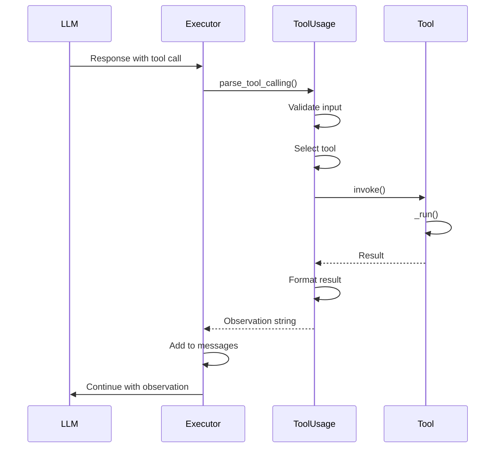
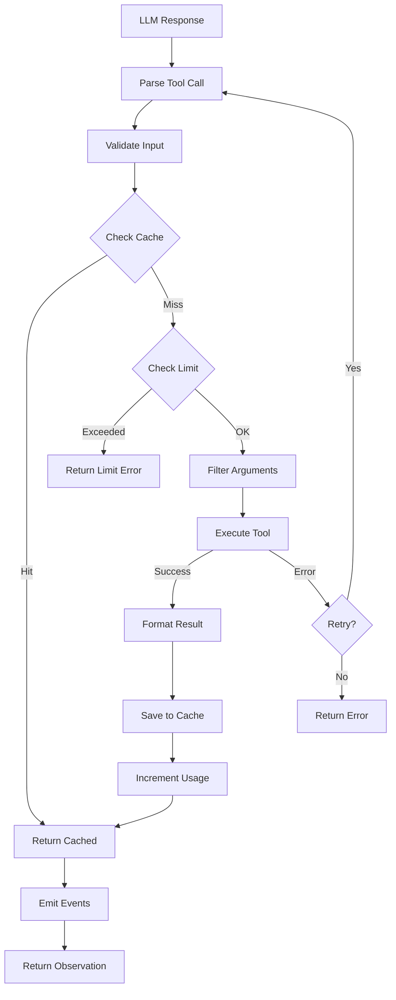

# Tool Execution Flow

## TL;DR
Tool execution trong crewAI theo flow: **Parse** (extract tool name + args từ LLM output) → **Validate** (check schema + limits) → **Execute** (call tool function) → **Format** (format result for observation). Hỗ trợ cả ReAct text parsing và native function calling.

---

## 1. Execution Flow Overview



---

## 2. Tool Parsing

### 2.1 ReAct Text Parsing

```python
# File: lib/crewai/src/crewai/tools/tool_usage.py:835-856

def _tool_calling(
    self, tool_string: str
) -> ToolCalling | InstructorToolCalling | ToolUsageError:
    """Parse tool call from LLM text output."""
    try:
        try:
            # Try original parsing first
            return self._original_tool_calling(tool_string, raise_error=True)
        except Exception:
            if self.function_calling_llm:
                # Fall back to LLM-assisted parsing
                return self._function_calling(tool_string)
            return self._original_tool_calling(tool_string)
    except Exception as e:
        self._run_attempts += 1
        if self._run_attempts > self._max_parsing_attempts:
            return ToolUsageError(f"Failed to parse: {e}")
        return self._tool_calling(tool_string)  # Retry
```

### 2.2 Text Pattern Parsing

```python
def _original_tool_calling(
    self,
    tool_string: str,
    raise_error: bool = False
) -> ToolCalling | ToolUsageError:
    """Parse using regex patterns."""

    # Expected format:
    # Action: tool_name
    # Action Input: {"param": "value"}

    action_match = re.search(r"Action:\s*(.+?)(?:\n|$)", tool_string)
    input_match = re.search(r"Action Input:\s*(.+?)(?:\n|$)", tool_string, re.DOTALL)

    if not action_match:
        if raise_error:
            raise Exception("Could not parse Action")
        return ToolUsageError("Could not parse Action")

    tool_name = action_match.group(1).strip()
    tool_input = input_match.group(1).strip() if input_match else None

    return ToolCalling(
        tool_name=tool_name,
        arguments=self._validate_tool_input(tool_input),
    )
```

### 2.3 Input Validation

```python
# File: lib/crewai/src/crewai/tools/tool_usage.py:858-912

def _validate_tool_input(self, tool_input: str | None) -> dict[str, Any]:
    """Multi-strategy input parsing."""

    if tool_input is None:
        return {}

    # Attempt 1: JSON
    try:
        arguments = json.loads(tool_input)
        if isinstance(arguments, dict):
            return arguments
    except JSONDecodeError:
        pass

    # Attempt 2: Python literal
    try:
        arguments = ast.literal_eval(tool_input)
        if isinstance(arguments, dict):
            return arguments
    except (ValueError, SyntaxError):
        pass

    # Attempt 3: JSON5
    try:
        arguments = json5.loads(tool_input)
        if isinstance(arguments, dict):
            return arguments
    except:
        pass

    # Attempt 4: JSON repair
    try:
        repaired = str(repair_json(tool_input, skip_json_loads=True))
        arguments = json.loads(repaired)
        if isinstance(arguments, dict):
            return arguments
    except:
        pass

    raise Exception("Tool input must be valid JSON or dict format")
```

---

## 3. Native Function Calling

### 3.1 Tool Call List Handling

```python
# File: lib/crewai/src/crewai/agents/crew_agent_executor.py:458-581

def _handle_native_tool_calls(
    self,
    tool_calls: list,
    available_functions: dict,
) -> AgentFinish | None:
    """Handle native tool calls from LLM."""

    for tool_call in tool_calls:
        function_name = tool_call.function.name
        function_args = json.loads(tool_call.function.arguments)

        # Execute tool
        function = available_functions[function_name]
        result = function(**function_args)

        # Add result to messages
        self.messages.append({
            "role": "tool",
            "tool_call_id": tool_call.id,
            "content": str(result),
        })

        # Check if result_as_answer
        tool = next(
            (t for t in self.tools if sanitize_tool_name(t.name) == function_name),
            None
        )
        if tool and tool.result_as_answer:
            return AgentFinish(output=result, thought="", text=str(result))

    return None  # Continue loop
```

---

## 4. Tool Selection

### 4.1 Fuzzy Matching

```python
# File: lib/crewai/src/crewai/tools/tool_usage.py:714-776

def _select_tool(self, tool_name: str) -> Any:
    """Select tool using fuzzy matching."""

    sanitized_input = sanitize_tool_name(tool_name)

    # Sort by similarity ratio
    order_tools = sorted(
        self.tools,
        key=lambda tool: SequenceMatcher(
            None,
            sanitize_tool_name(tool.name),
            sanitized_input
        ).ratio(),
        reverse=True,
    )

    # Find match (>85% similar)
    for tool in order_tools:
        sanitized_tool = sanitize_tool_name(tool.name)
        if (
            sanitized_tool == sanitized_input or
            SequenceMatcher(None, sanitized_tool, sanitized_input).ratio() > 0.85
        ):
            return tool

    # Not found
    error = f"Action '{tool_name}' doesn't exist. Available: {self.tools_names}"
    raise Exception(error)
```

### 4.2 Name Sanitization

```python
# File: lib/crewai/src/crewai/utilities/string_utils.py

def sanitize_tool_name(name: str) -> str:
    """Sanitize tool name for matching."""
    return name.lower().strip().replace(" ", "_").replace("-", "_")
```

---

## 5. Tool Invocation

### 5.1 Sync Execution

```python
# File: lib/crewai/src/crewai/tools/tool_usage.py:453-681

def _use(
    self,
    tool_string: str,
    tool: CrewStructuredTool,
    calling: ToolCalling,
) -> str:
    """Execute tool and return formatted result."""

    started_at = time.time()

    # Emit started event
    crewai_event_bus.emit(self, ToolUsageStartedEvent(...))

    try:
        # Check cache
        if self.tools_handler and self.tools_handler.cache:
            input_str = json.dumps(calling.arguments)
            result = self.tools_handler.cache.read(
                tool=sanitize_tool_name(calling.tool_name),
                input=input_str
            )
            if result is not None:
                return self._format_result(result)

        # Check usage limit
        if self._check_usage_limit(tool, calling.tool_name):
            return self._format_result("Usage limit reached")

        # Filter arguments to match schema
        acceptable_args = tool.args_schema.model_json_schema()["properties"].keys()
        arguments = {
            k: v for k, v in calling.arguments.items()
            if k in acceptable_args
        }

        # Add fingerprint metadata
        arguments = self._add_fingerprint_metadata(arguments)

        # Execute tool
        result = tool.invoke(input=arguments)

        # Cache result if applicable
        if self.tools_handler:
            should_cache = True
            cache_func = getattr(tool, "cache_function", None)
            if cache_func:
                should_cache = cache_func(calling.arguments, result)

            self.tools_handler.on_tool_use(
                calling=calling,
                output=result,
                should_cache=should_cache
            )

        # Increment usage count
        tool.current_usage_count += 1

        return self._format_result(result)

    except Exception as e:
        self.on_tool_error(tool=tool, tool_calling=calling, e=e)
        self._run_attempts += 1

        if self._run_attempts > self._max_parsing_attempts:
            error_message = f"Tool error: {e}"
            return error_message
        else:
            return self.use(calling=calling, tool_string=tool_string)  # Retry

    finally:
        # Emit finished event
        self.on_tool_use_finished(
            tool=tool,
            tool_calling=calling,
            started_at=started_at,
            result=result,
        )
```

### 5.2 Async Execution

```python
# File: lib/crewai/src/crewai/tools/structured_tool.py:213-248

async def ainvoke(
    self,
    input: str | dict,
    config: dict | None = None,
    **kwargs: Any,
) -> Any:
    """Asynchronously invoke the tool."""

    parsed_args = self._parse_args(input)

    # Check usage limit
    if self.has_reached_max_usage_count():
        raise ToolUsageLimitExceededError(
            f"Tool '{self.name}' reached max usage limit"
        )

    self._increment_usage_count()

    try:
        if inspect.iscoroutinefunction(self.func):
            return await self.func(**parsed_args, **kwargs)

        # Run sync function in thread pool
        return await asyncio.get_event_loop().run_in_executor(
            None,
            lambda: self.func(**parsed_args, **kwargs)
        )
    except Exception:
        raise
```

---

## 6. Result Formatting

### 6.1 Format Result

```python
# File: lib/crewai/src/crewai/tools/tool_usage.py:683-700

def _format_result(self, result: Any) -> str:
    """Format tool result for observation."""

    if self.task:
        self.task.used_tools += 1

    # Add format reminder periodically
    if self._should_remember_format():
        result = self._remember_format(result=result)

    return str(result)


def _remember_format(self, result: str) -> str:
    """Add tool descriptions reminder to result."""
    result = str(result)
    result += "\n\n" + self._i18n.slice("tools").format(
        tools=self.tools_description,
        tool_names=self.tools_names
    )
    return result
```

### 6.2 Observation Message

```python
# Added to message history
{
    "role": "user",
    "content": f"Observation: {formatted_result}"
}
```

---

## 7. Execution Flow Diagram



---

## 8. Event Emission

```python
# Started event
crewai_event_bus.emit(
    self,
    ToolUsageStartedEvent(
        agent_key=self.agent.key,
        agent_role=self.agent.role,
        tool_name=calling.tool_name,
        tool_args=calling.arguments,
        task_id=str(self.task.id),
    )
)

# Completed event
crewai_event_bus.emit(
    self,
    ToolUsageCompletedEvent(
        tool_name=calling.tool_name,
        tool_args=calling.arguments,
        tool_output=result,
        execution_time_ms=(time.time() - started_at) * 1000,
        from_cache=from_cache,
    )
)

# Error event
crewai_event_bus.emit(
    self,
    ToolUsageErrorEvent(
        tool_name=calling.tool_name,
        error=str(e),
    )
)
```

---

## 9. Key Takeaways

1. **Multi-Strategy Parsing**: JSON → Python literal → JSON5 → JSON repair.

2. **Fuzzy Tool Selection**: 85% similarity threshold cho typo tolerance.

3. **Caching Built-in**: Results cached based on tool name + input.

4. **Usage Limits**: Optional max_usage_count prevents infinite tool calls.

5. **Retry Mechanism**: Auto-retry up to 3 times on parsing errors.

6. **Event-Driven**: All execution stages emit observability events.

7. **Native Function Calling**: Direct tool execution when LLM supports it.

---

## File References

| Component | Path |
|-----------|------|
| Tool Usage | `lib/crewai/src/crewai/tools/tool_usage.py` |
| Structured Tool | `lib/crewai/src/crewai/tools/structured_tool.py` |
| Executor | `lib/crewai/src/crewai/agents/crew_agent_executor.py` |
| String Utils | `lib/crewai/src/crewai/utilities/string_utils.py` |
