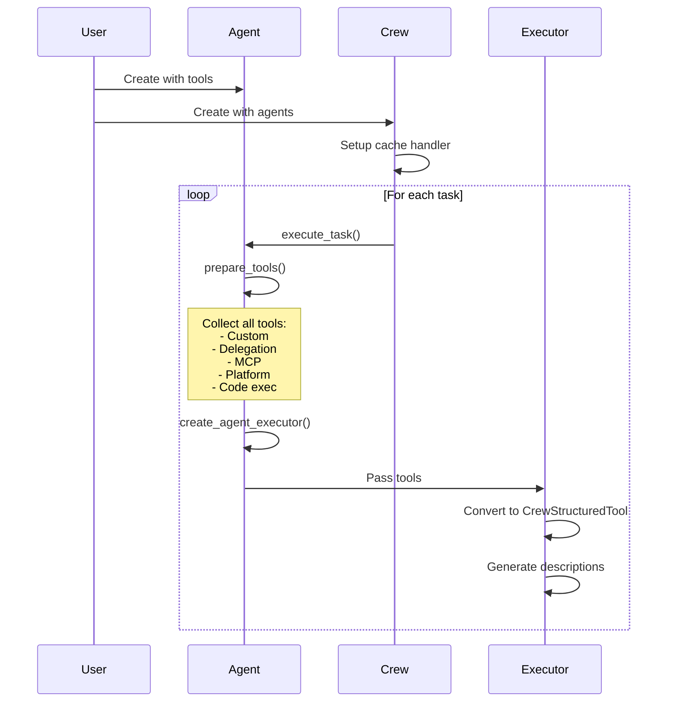

# Tool Registry & Management

## TL;DR
Tools được quản lý qua **ToolsHandler** (caching, tracking) và được register vào Agent/Crew. CrewAI hỗ trợ multiple tool sources: custom tools, delegation tools, MCP tools, platform apps, và code execution tools. Tools được convert sang CrewStructuredTool trước khi execute.

---

## 1. Tool Registration Flow

```mermaid
graph TB
    subgraph "Tool Sources"
        CT[Custom Tools]
        DT[Delegation Tools]
        MCP[MCP Tools]
        PA[Platform Apps]
        CE[Code Execution]
    end

    subgraph "Registration"
        Agent[Agent.tools]
        Crew[Crew agents]
        Prepare[prepare_tools()]
    end

    subgraph "Management"
        TH[ToolsHandler]
        Cache[CacheHandler]
    end

    subgraph "Execution"
        Executor[AgentExecutor]
        CST[CrewStructuredTool]
    end

    CT --> Agent
    Agent --> Prepare
    DT --> Prepare
    MCP --> Prepare
    PA --> Prepare
    CE --> Prepare

    Prepare --> TH
    TH --> Cache
    Prepare --> Executor
    Executor --> CST
```

---

## 2. Tool Sources

### 2.1 Custom Tools (User-Defined)

```python
# Defined by user and passed to agent
from crewai.tools import BaseTool, tool

class MySearchTool(BaseTool):
    name = "search"
    description = "Search the web"

    def _run(self, query: str) -> str:
        return search(query)

@tool
def calculator(a: int, b: int) -> int:
    """Add two numbers."""
    return a + b

agent = Agent(
    role="Researcher",
    tools=[MySearchTool(), calculator],  # Register tools
)
```

### 2.2 Delegation Tools

```python
# File: lib/crewai/src/crewai/agent/core.py:881-883

def get_delegation_tools(self, agents: list[BaseAgent]) -> list[BaseTool]:
    """Get tools for delegating to other agents."""
    agent_tools = AgentTools(agents=agents)
    return agent_tools.tools()
```

```python
# File: lib/crewai/src/crewai/tools/agent_tools/agent_tools.py

class AgentTools:
    """Generate delegation tools for communicating with other agents."""

    def __init__(self, agents: list[BaseAgent]):
        self.agents = agents

    def tools(self) -> list[BaseTool]:
        """Generate delegation tools."""
        tools = []

        for agent in self.agents:
            # Create tool to delegate to this agent
            delegate_tool = self._create_delegate_tool(agent)
            tools.append(delegate_tool)

            # Create tool to ask this agent
            ask_tool = self._create_ask_tool(agent)
            tools.append(ask_tool)

        return tools
```

### 2.3 MCP Tools

```python
# File: lib/crewai/src/crewai/agent/core.py:896-923

def get_mcp_tools(self) -> list[BaseTool]:
    """Get tools from MCP servers."""
    if not self.mcps:
        return []

    mcp_tools = []
    for mcp_ref in self.mcps:
        # Create MCP client based on type
        if isinstance(mcp_ref, str):
            if mcp_ref.startswith("crewai-amp:"):
                client = self._create_amp_client(mcp_ref)
            else:
                client = MCPClient(MCPServerHTTP(url=mcp_ref))
        elif isinstance(mcp_ref, MCPServerConfig):
            client = MCPClient(mcp_ref)

        self._mcp_clients.append(client)

        # Get tools from MCP server
        server_tools = client.get_tools()
        mcp_tools.extend(server_tools)

    return mcp_tools
```

### 2.4 Platform Apps

```python
# File: lib/crewai/src/crewai/agent/core.py:885-894

def get_platform_tools(self) -> list[BaseTool]:
    """Get tools for enterprise platform apps."""
    if not self.apps:
        return []

    platform_tools = []
    for app in self.apps:
        # Create tool for each platform app action
        tools = app.get_tools()
        platform_tools.extend(tools)

    return platform_tools
```

### 2.5 Code Execution Tools

```python
# File: lib/crewai/src/crewai/agent/core.py:1444-1457

def get_code_execution_tools(self) -> list[BaseTool]:
    """Get code execution tools if enabled."""
    if not self.allow_code_execution:
        return []

    from crewai_tools import CodeInterpreterTool
    return [CodeInterpreterTool()]
```

---

## 3. Tool Preparation

### 3.1 prepare_tools Function

```python
# File: lib/crewai/src/crewai/agent/utils.py

def prepare_tools(
    agent: Agent,
    tools: list[BaseTool] | None,
    task: Task,
) -> None:
    """Prepare all tools for agent execution."""

    # Start with provided tools or agent's tools
    all_tools = list(tools or agent.tools or [])

    # Add delegation tools if allowed
    if agent.allow_delegation and agent.crew:
        other_agents = [a for a in agent.crew.agents if a != agent]
        all_tools.extend(agent.get_delegation_tools(other_agents))

    # Add MCP tools
    all_tools.extend(agent.get_mcp_tools())

    # Add platform tools
    all_tools.extend(agent.get_platform_tools())

    # Add code execution tools
    all_tools.extend(agent.get_code_execution_tools())

    # Convert to structured tools
    agent.tools = all_tools

    # Update tools handler
    if agent.tools_handler:
        agent.tools_handler.tools = all_tools
```

### 3.2 Tool Conversion

```python
# File: lib/crewai/src/crewai/tools/base_tool.py

def to_langchain(
    tools: list[BaseTool | CrewStructuredTool],
) -> list[CrewStructuredTool]:
    """Convert all tools to CrewStructuredTool."""
    return [
        t.to_structured_tool() if isinstance(t, BaseTool) else t
        for t in tools
    ]
```

---

## 4. ToolsHandler

### 4.1 Handler Structure

```python
# File: lib/crewai/src/crewai/agents/tools_handler.py

class ToolsHandler:
    """Manages tool caching and usage tracking."""

    def __init__(self, cache: CacheHandler | None = None):
        self.cache = cache
        self.last_used_tool: ToolCalling | None = None
        self.tools: list[CrewStructuredTool] = []

    def on_tool_use(
        self,
        calling: ToolCalling,
        output: Any,
        should_cache: bool = True,
    ) -> None:
        """Handle tool usage event."""
        # Track last used tool
        self.last_used_tool = calling

        # Cache result if applicable
        if self.cache and should_cache:
            input_str = json.dumps(calling.arguments) if calling.arguments else ""
            self.cache.add(
                tool=sanitize_tool_name(calling.tool_name),
                input=input_str,
                output=output,
            )
```

### 4.2 Cache Handler

```python
# File: lib/crewai/src/crewai/agents/cache/cache_handler.py

class CacheHandler:
    """Handles caching of tool results."""

    def __init__(self):
        self._cache: dict[str, Any] = {}

    def _build_key(self, tool: str, input: str) -> str:
        """Build cache key from tool name and input."""
        return f"{tool}:{hashlib.md5(input.encode()).hexdigest()}"

    def read(self, tool: str, input: str) -> Any | None:
        """Read from cache."""
        key = self._build_key(tool, input)
        return self._cache.get(key)

    def add(self, tool: str, input: str, output: Any) -> None:
        """Add to cache."""
        key = self._build_key(tool, input)
        self._cache[key] = output

    def clear(self) -> None:
        """Clear all cache."""
        self._cache = {}
```

---

## 5. Tool Description Generation

### 5.1 For Prompt

```python
# File: lib/crewai/src/crewai/tools/tool_usage.py

def render_text_description_and_args(
    tools: list[CrewStructuredTool]
) -> str:
    """Generate text description of tools for prompt."""

    descriptions = []
    for tool in tools:
        # Get schema
        schema = tool.args_schema.model_json_schema()
        properties = schema.get("properties", {})

        # Build arg description
        args_desc = []
        for name, prop in properties.items():
            arg_type = prop.get("type", "any")
            desc = prop.get("description", "")
            required = name in schema.get("required", [])
            req_str = "(required)" if required else "(optional)"
            args_desc.append(f"  - {name} ({arg_type}) {req_str}: {desc}")

        tool_desc = f"""
Tool Name: {tool.name}
Description: {tool.description}
Arguments:
{chr(10).join(args_desc)}
"""
        descriptions.append(tool_desc)

    return "\n---\n".join(descriptions)


def get_tool_names(tools: list[CrewStructuredTool]) -> str:
    """Get comma-separated list of tool names."""
    return ", ".join(tool.name for tool in tools)
```

### 5.2 Example Output

```
Tool Name: web_search
Description: Search the web for information
Arguments:
  - query (string) (required): Search query
  - max_results (integer) (optional): Maximum results to return

---

Tool Name: calculator
Description: Perform mathematical calculations
Arguments:
  - expression (string) (required): Math expression to evaluate
```

---

## 6. Tool Registry Lifecycle



---

## 7. Tool Discovery & Listing

```python
# In agent execution context
def _build_tool_info(self) -> dict:
    """Build tool information for the agent."""
    return {
        "tools": self.tools,
        "tools_names": get_tool_names(self.tools),
        "tools_description": render_text_description_and_args(self.tools),
    }

# Passed to executor
self.agent_executor = CrewAgentExecutor(
    tools=parsed_tools,
    tools_description=render_text_description_and_args(parsed_tools),
    tools_names=get_tool_names(parsed_tools),
)
```

---

## 8. Key Takeaways

1. **Multiple Sources**: Tools come from custom, delegation, MCP, platform, code execution.

2. **Unified Interface**: All tools convert to CrewStructuredTool for execution.

3. **ToolsHandler**: Central management for caching and tracking.

4. **Lazy Loading**: MCP and platform tools loaded on demand.

5. **Caching**: Results cached by tool name + input hash.

6. **Description Generation**: Auto-generated from Pydantic schema.

7. **Per-Task Preparation**: Tools prepared fresh for each task execution.

---

## File References

| Component | Path |
|-----------|------|
| Tool Preparation | `lib/crewai/src/crewai/agent/utils.py` |
| Tools Handler | `lib/crewai/src/crewai/agents/tools_handler.py` |
| Cache Handler | `lib/crewai/src/crewai/agents/cache/cache_handler.py` |
| Agent Tools | `lib/crewai/src/crewai/tools/agent_tools/agent_tools.py` |
| MCP Client | `lib/crewai/src/crewai/mcp/` |
| Tool Usage | `lib/crewai/src/crewai/tools/tool_usage.py` |
