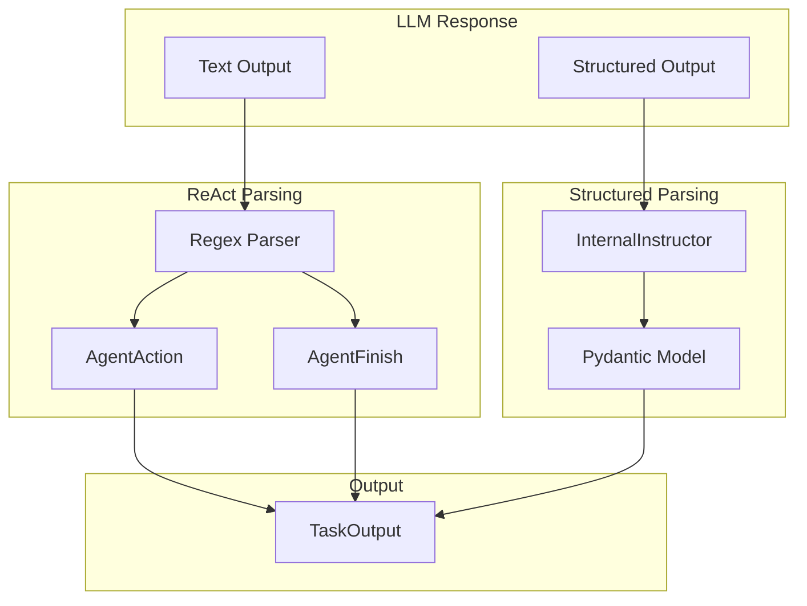

# Output Parser

## TL;DR
CrewAI parse LLM output qua **2 modes**: ReAct text parsing (regex) và Structured output (Pydantic via instructor). `InternalInstructor` wrap LLM để extract typed responses. Output format được validate và convert thành `TaskOutput` với raw/pydantic/json fields.

---

## 1. Output Parsing Modes



---

## 2. ReAct Text Parsing

### 2.1 Expected Format

```
Thought: I need to search for information about AI.
Action: web_search
Action Input: {"query": "artificial intelligence trends 2024"}
```

hoặc

```
Thought: I have gathered all the information needed.
Final Answer: Based on my research, the main AI trends in 2024 are...
```

### 2.2 Parser Implementation

```python
# File: lib/crewai/src/crewai/agents/parser.py

def process_llm_response(
    answer_str: str,
    use_stop_words: bool
) -> AgentAction | AgentFinish:
    """Parse LLM text response."""

    # Check for Final Answer
    if "Final Answer:" in answer_str:
        parts = answer_str.split("Final Answer:", 1)
        thought = parts[0].replace("Thought:", "").strip()
        output = parts[1].strip()

        return AgentFinish(
            thought=thought,
            output=output,
            text=answer_str,
        )

    # Parse Action
    thought_match = re.search(
        r"Thought:\s*(.*?)(?=Action:|$)",
        answer_str,
        re.DOTALL
    )
    action_match = re.search(
        r"Action:\s*(.+?)(?=Action Input:|$)",
        answer_str
    )
    input_match = re.search(
        r"Action Input:\s*(.+?)$",
        answer_str,
        re.DOTALL
    )

    if action_match:
        return AgentAction(
            thought=thought_match.group(1).strip() if thought_match else "",
            tool=action_match.group(1).strip(),
            tool_input=input_match.group(1).strip() if input_match else "",
            text=answer_str,
        )

    # Cannot parse
    raise OutputParserError(f"Could not parse LLM output: {answer_str}")
```

### 2.3 Data Classes

```python
@dataclass
class AgentAction:
    """Represents a tool call."""
    thought: str      # Reasoning
    tool: str         # Tool name
    tool_input: str   # Tool arguments (JSON string)
    text: str         # Full response

@dataclass
class AgentFinish:
    """Represents final answer."""
    thought: str      # Final reasoning
    output: str       # Final answer
    text: str         # Full response
```

---

## 3. Structured Output (Instructor)

### 3.1 InternalInstructor Class

```python
# File: lib/crewai/src/crewai/utilities/internal_instructor.py

class InternalInstructor(Generic[T]):
    """Wrapper for structured output generation."""

    def __init__(
        self,
        content: str,
        model: type[T],
        llm: BaseLLM,
    ):
        self.content = content
        self.model = model
        self.llm = llm

    def to_pydantic(self) -> T:
        """Convert content to Pydantic model."""

        if self.llm.is_litellm:
            # Use instructor with LiteLLM
            import instructor
            import litellm

            client = instructor.from_litellm(litellm.completion)

            result = client.chat.completions.create(
                model=self.llm.model,
                messages=[
                    {"role": "user", "content": self.content}
                ],
                response_model=self.model,
            )
            return result
        else:
            # Use native provider structured output
            return self._native_structured_output()

    def to_json(self) -> str:
        """Convert to JSON string."""
        result = self.to_pydantic()
        return result.model_dump_json()
```

### 3.2 Usage in LLM

```python
# File: lib/crewai/src/crewai/llm.py

def call(self, messages, response_model=None, **kwargs):
    # ... make LLM call

    if response_model:
        instructor_instance = InternalInstructor(
            content=response_content,
            model=response_model,
            llm=self,
        )
        result = instructor_instance.to_pydantic()
        return result.model_dump_json()

    return response_content
```

---

## 4. TaskOutput Building

### 4.1 TaskOutput Class

```python
# File: lib/crewai/src/crewai/tasks/task_output.py

class TaskOutput(BaseModel):
    """Output of a task execution."""

    description: str
    name: str | None = None
    expected_output: str
    summary: str | None = None

    # Output formats
    raw: str                           # Raw text output
    pydantic: BaseModel | None = None  # Structured output
    json_dict: dict | None = None      # JSON output

    agent: str
    output_format: OutputFormat = OutputFormat.RAW

    def to_dict(self) -> dict:
        """Convert to dictionary."""
        return {
            "description": self.description,
            "raw": self.raw,
            "pydantic": self.pydantic.model_dump() if self.pydantic else None,
            "json_dict": self.json_dict,
        }

    def __str__(self) -> str:
        """String representation."""
        if self.pydantic:
            return str(self.pydantic)
        if self.json_dict:
            return json.dumps(self.json_dict)
        return self.raw
```

### 4.2 Building TaskOutput

```python
# File: lib/crewai/src/crewai/task.py

def _build_output(
    self,
    result: str,
    agent: Agent,
) -> TaskOutput:
    """Build TaskOutput from execution result."""

    output = TaskOutput(
        description=self.description,
        name=self.name,
        expected_output=self.expected_output,
        raw=result,
        agent=agent.role,
    )

    # Parse structured output if configured
    if self.output_pydantic:
        try:
            output.pydantic = self.output_pydantic.model_validate_json(result)
            output.output_format = OutputFormat.PYDANTIC
        except ValidationError:
            pass  # Keep raw output

    if self.output_json:
        try:
            output.json_dict = json.loads(result)
            output.output_format = OutputFormat.JSON
        except JSONDecodeError:
            pass

    return output
```

---

## 5. Output Validation (Guardrails)

### 5.1 Guardrail Configuration

```python
# File: lib/crewai/src/crewai/agent/core.py

class Agent(BaseAgent):
    guardrail: GuardrailType | None = Field(
        default=None,
        description="Function or string for output validation"
    )
    guardrail_max_retries: int = Field(
        default=3,
        description="Max retries for guardrail validation"
    )
```

### 5.2 Guardrail Application

```python
# File: lib/crewai/src/crewai/utilities/guardrail.py

def apply_guardrail(
    result: str,
    guardrail: GuardrailType,
    agent: Agent,
    max_retries: int = 3,
) -> str:
    """Apply guardrail validation to output."""

    for attempt in range(max_retries):
        # Run guardrail check
        if callable(guardrail):
            is_valid, feedback = guardrail(result)
        else:
            # String guardrail - use LLM to validate
            is_valid, feedback = llm_validate(result, guardrail, agent.llm)

        if is_valid:
            return result

        # Retry with feedback
        result = agent.llm.call([
            {"role": "user", "content": f"""
            Your previous output failed validation.
            Feedback: {feedback}
            Please try again.
            """}
        ])

    raise GuardrailValidationError("Max retries exceeded")
```

---

## 6. JSON Repair

### 6.1 Malformed JSON Handling

```python
# File: lib/crewai/src/crewai/tools/tool_usage.py

from json_repair import repair_json

def _validate_tool_input(self, tool_input: str) -> dict:
    # ... try standard JSON parsing

    # Attempt JSON repair
    try:
        repaired = str(repair_json(tool_input, skip_json_loads=True))
        return json.loads(repaired)
    except:
        raise Exception("Invalid JSON format")
```

### 6.2 Common Repairs

- Missing quotes around keys
- Trailing commas
- Single quotes instead of double
- Unescaped characters

---

## 7. Output Format Summary

| Format | Source | Validation | Use Case |
|--------|--------|------------|----------|
| Raw | LLM text | None | Default |
| Pydantic | response_model | Pydantic | Structured data |
| JSON | output_json=True | json.loads | API responses |
| ReAct | Text parsing | Regex | Tool calling |

---

## 8. Key Takeaways

1. **Dual Parsing**: ReAct (text) và Structured (Pydantic) modes.

2. **Instructor Integration**: Uses instructor library cho structured extraction.

3. **JSON Repair**: Automatic fixing of malformed JSON from LLM.

4. **Guardrails**: Optional validation layer với retry mechanism.

5. **Multiple Output Formats**: raw, pydantic, json_dict trong TaskOutput.

6. **Graceful Degradation**: Falls back to raw if structured parsing fails.

7. **AgentAction/Finish**: Clear separation of tool calls vs final answers.

---

## File References

| Component | Path |
|-----------|------|
| Parser | `lib/crewai/src/crewai/agents/parser.py` |
| InternalInstructor | `lib/crewai/src/crewai/utilities/internal_instructor.py` |
| TaskOutput | `lib/crewai/src/crewai/tasks/task_output.py` |
| Guardrail | `lib/crewai/src/crewai/utilities/guardrail.py` |
| Tool Usage (JSON repair) | `lib/crewai/src/crewai/tools/tool_usage.py` |
