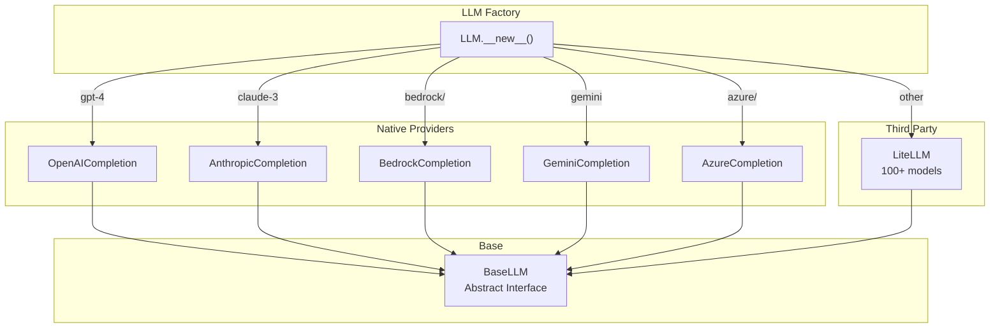

# Provider Abstraction Layer

## TL;DR
CrewAI sử dụng **hybrid provider pattern**: Native SDKs (OpenAI, Anthropic, Bedrock, Gemini, Azure) cho optimal performance, **LiteLLM** làm fallback cho 100+ models khác. `LLM` class tự động route đến provider phù hợp dựa trên model name.

---

## 1. Provider Architecture



---

## 2. BaseLLM Interface

```python
# File: lib/crewai/src/crewai/llms/base_llm.py

class BaseLLM(ABC):
    """Abstract base class for all LLM providers."""

    # Core attributes
    model: str
    temperature: float | None = None
    stop: list[str] = []
    api_key: str | None = None
    base_url: str | None = None

    # Token tracking
    _token_usage: dict = {
        "total_tokens": 0,
        "prompt_tokens": 0,
        "completion_tokens": 0,
        "successful_requests": 0,
        "cached_prompt_tokens": 0,
    }

    @abstractmethod
    def call(
        self,
        messages: list[dict],
        tools: list[dict] | None = None,
        callbacks: list | None = None,
    ) -> str:
        """Make LLM API call."""
        pass

    @abstractmethod
    async def acall(
        self,
        messages: list[dict],
        tools: list[dict] | None = None,
        callbacks: list | None = None,
    ) -> str:
        """Async LLM API call."""
        pass

    def stream(self, messages: list[dict]) -> Iterator[str]:
        """Stream LLM response."""
        pass

    def supports_function_calling(self) -> bool:
        """Check if model supports native function calling."""
        return False

    def get_context_window_size(self) -> int:
        """Get model's context window size."""
        pass
```

---

## 3. Provider Routing

### 3.1 LLM Factory

```python
# File: lib/crewai/src/crewai/llm.py

class LLM(BaseLLM):
    def __new__(cls, model: str = None, **kwargs):
        """Factory method to route to correct provider."""

        # Check for explicit provider
        provider = kwargs.get("provider")
        if provider:
            return cls._get_native_provider(provider, model, **kwargs)

        # Check model prefix pattern
        if "/" in model:
            provider_prefix, model_name = model.split("/", 1)

            if cls._validate_model_in_constants(provider_prefix, model_name):
                return cls._get_native_provider(provider_prefix, model_name, **kwargs)

            # Unknown provider - use LiteLLM
            return super().__new__(cls)

        # Infer provider from model name
        inferred_provider = cls._infer_provider_from_model(model)
        if inferred_provider:
            return cls._get_native_provider(inferred_provider, model, **kwargs)

        # Fallback to LiteLLM
        return super().__new__(cls)
```

### 3.2 Provider Detection

```python
# File: lib/crewai/src/crewai/llm.py

@staticmethod
def _infer_provider_from_model(model: str) -> str | None:
    """Infer provider from model name."""

    model_lower = model.lower()

    # OpenAI patterns
    if any(p in model_lower for p in ["gpt-", "o1", "chatgpt", "text-davinci"]):
        return "openai"

    # Anthropic patterns
    if any(p in model_lower for p in ["claude", "anthropic"]):
        return "anthropic"

    # Google patterns
    if any(p in model_lower for p in ["gemini", "palm", "bard"]):
        return "gemini"

    # AWS patterns
    if any(p in model_lower for p in ["bedrock", "titan", "amazon"]):
        return "bedrock"

    # Azure patterns
    if "azure" in model_lower:
        return "azure"

    return None


@staticmethod
def _validate_model_in_constants(provider: str, model: str) -> bool:
    """Check if model exists in provider constants."""

    provider_constants = {
        "openai": OPENAI_MODELS,
        "anthropic": ANTHROPIC_MODELS,
        "gemini": GEMINI_MODELS,
        "bedrock": BEDROCK_MODELS,
        "azure": AZURE_MODELS,
    }

    models = provider_constants.get(provider, [])

    # Check exact match
    if model in models:
        return True

    # Check pattern match
    if LLM._matches_provider_pattern(provider, model):
        return True

    return False
```

### 3.3 Native Provider Instantiation

```python
@staticmethod
def _get_native_provider(
    provider: str,
    model: str,
    **kwargs
) -> BaseLLM:
    """Get native provider instance."""

    providers = {
        "openai": ("crewai.llms.providers.openai", "OpenAICompletion"),
        "anthropic": ("crewai.llms.providers.anthropic", "AnthropicCompletion"),
        "bedrock": ("crewai.llms.providers.bedrock", "BedrockCompletion"),
        "gemini": ("crewai.llms.providers.gemini", "GeminiCompletion"),
        "azure": ("crewai.llms.providers.azure", "AzureCompletion"),
    }

    if provider not in providers:
        raise ValueError(f"Unknown provider: {provider}")

    module_path, class_name = providers[provider]

    # Lazy import
    module = importlib.import_module(module_path)
    provider_class = getattr(module, class_name)

    return provider_class(model=model, **kwargs)
```

---

## 4. Native Provider Examples

### 4.1 OpenAI Provider

```python
# File: lib/crewai/src/crewai/llms/providers/openai/completion.py

class OpenAICompletion(BaseLLM):
    """OpenAI native SDK implementation."""

    def __init__(
        self,
        model: str = "gpt-4o",
        api_key: str | None = None,
        base_url: str | None = None,
        **kwargs
    ):
        self.model = model
        self.client = OpenAI(
            api_key=api_key or os.getenv("OPENAI_API_KEY"),
            base_url=base_url,
        )

    def call(
        self,
        messages: list[dict],
        tools: list[dict] | None = None,
        **kwargs
    ) -> str:
        """Make OpenAI API call."""

        params = {
            "model": self.model,
            "messages": messages,
            "temperature": self.temperature,
        }

        if tools:
            params["tools"] = tools

        response = self.client.chat.completions.create(**params)
        return response.choices[0].message.content

    def supports_function_calling(self) -> bool:
        return True  # OpenAI supports native function calling
```

### 4.2 Anthropic Provider

```python
# File: lib/crewai/src/crewai/llms/providers/anthropic/completion.py

class AnthropicCompletion(BaseLLM):
    """Anthropic native SDK implementation."""

    def __init__(
        self,
        model: str = "claude-3-5-sonnet-20241022",
        api_key: str | None = None,
        **kwargs
    ):
        self.model = model
        self.client = Anthropic(
            api_key=api_key or os.getenv("ANTHROPIC_API_KEY")
        )

    def call(
        self,
        messages: list[dict],
        tools: list[dict] | None = None,
        **kwargs
    ) -> str:
        """Make Anthropic API call."""

        # Extract system message
        system = None
        user_messages = []
        for msg in messages:
            if msg["role"] == "system":
                system = msg["content"]
            else:
                user_messages.append(msg)

        params = {
            "model": self.model,
            "messages": user_messages,
            "max_tokens": self.max_tokens or 4096,
        }

        if system:
            params["system"] = system

        if tools:
            params["tools"] = self._convert_tools(tools)

        response = self.client.messages.create(**params)
        return response.content[0].text

    def supports_function_calling(self) -> bool:
        return True
```

---

## 5. LiteLLM Fallback

```python
# File: lib/crewai/src/crewai/llm.py

class LLM(BaseLLM):
    """LLM wrapper with LiteLLM fallback."""

    is_litellm: bool = True  # Flag for non-native models

    def call(
        self,
        messages: list[dict],
        tools: list[dict] | None = None,
        **kwargs
    ) -> str:
        """Call via LiteLLM."""

        import litellm

        params = self._prepare_completion_params(
            messages=messages,
            tools=tools,
        )

        if self.stream:
            return self._handle_streaming_response(params, **kwargs)

        response = litellm.completion(**params)
        return response.choices[0].message.content

    def _prepare_completion_params(
        self,
        messages: list[dict],
        tools: list[dict] | None = None,
    ) -> dict:
        """Prepare parameters for LiteLLM."""

        params = {
            "model": self.model,
            "messages": messages,
            "temperature": self.temperature,
            "max_tokens": self.max_tokens,
            "stop": self.stop,
        }

        if tools:
            params["tools"] = tools

        # Remove None values
        return {k: v for k, v in params.items() if v is not None}
```

---

## 6. Model Constants

```python
# File: lib/crewai/src/crewai/llms/constants.py

OPENAI_MODELS = [
    "gpt-4",
    "gpt-4-32k",
    "gpt-4-turbo",
    "gpt-4o",
    "gpt-4o-mini",
    "o1",
    "o1-mini",
    "o1-preview",
    "gpt-3.5-turbo",
]

ANTHROPIC_MODELS = [
    "claude-3-opus-20240229",
    "claude-3-sonnet-20240229",
    "claude-3-haiku-20240307",
    "claude-3-5-sonnet-20240620",
    "claude-3-5-sonnet-20241022",
    "claude-3-5-haiku-20241022",
]

GEMINI_MODELS = [
    "gemini-pro",
    "gemini-1.0-pro",
    "gemini-1.5-pro",
    "gemini-1.5-flash",
]

BEDROCK_MODELS = [
    "anthropic.claude-3-opus",
    "anthropic.claude-3-sonnet",
    "anthropic.claude-3-haiku",
    "amazon.titan-text-express-v1",
    "meta.llama3-70b-instruct-v1",
]
```

---

## 7. Provider Comparison

| Provider | Native SDK | Function Calling | Streaming | Best For |
|----------|-----------|-----------------|-----------|----------|
| OpenAI | ✓ | ✓ | ✓ | GPT models |
| Anthropic | ✓ | ✓ | ✓ | Claude models |
| Bedrock | ✓ | ✓ | ✓ | AWS integration |
| Gemini | ✓ | ✓ | ✓ | Google models |
| Azure | ✓ | ✓ | ✓ | Enterprise |
| LiteLLM | Wrapper | Varies | ✓ | 100+ other models |

---

## 8. Key Takeaways

1. **Hybrid Approach**: Native SDKs cho major providers, LiteLLM cho còn lại.

2. **Auto-Routing**: Model name tự động route đến provider phù hợp.

3. **BaseLLM Interface**: Common interface cho tất cả providers.

4. **Lazy Import**: Provider classes loaded on demand.

5. **Function Calling**: Native providers support structured tool calling.

6. **Consistent API**: Same `call()` method across all providers.

7. **Extensible**: Easy to add new native providers.

---

## File References

| Component | Path |
|-----------|------|
| LLM Factory | `lib/crewai/src/crewai/llm.py` |
| BaseLLM | `lib/crewai/src/crewai/llms/base_llm.py` |
| Constants | `lib/crewai/src/crewai/llms/constants.py` |
| OpenAI | `lib/crewai/src/crewai/llms/providers/openai/` |
| Anthropic | `lib/crewai/src/crewai/llms/providers/anthropic/` |
| Bedrock | `lib/crewai/src/crewai/llms/providers/bedrock/` |
| Gemini | `lib/crewai/src/crewai/llms/providers/gemini/` |
| Azure | `lib/crewai/src/crewai/llms/providers/azure/` |
