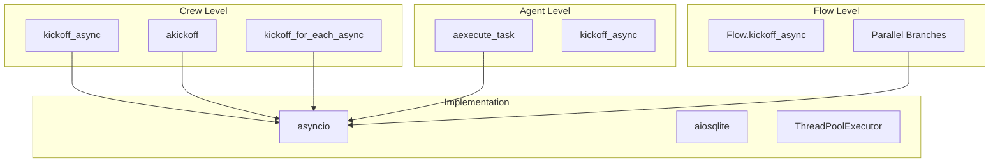

# Concurrency & Async

## TL;DR
CrewAI hỗ trợ **async execution** qua `kickoff_async()`, `akickoff()`, và Flow parallel branches. `kickoff_for_each_async()` cho parallel crew execution trên multiple inputs. Async operations sử dụng `asyncio` và `aiosqlite` cho non-blocking I/O.

---

## 1. Async Execution Options



---

## 2. Crew Async Methods

### 2.1 kickoff_async

```python
# File: lib/crewai/src/crewai/crew.py:803-848

async def kickoff_async(
    self,
    inputs: dict[str, Any] | None = None,
    input_files: dict[str, FileInput] | None = None,
) -> CrewOutput | CrewStreamingOutput:
    """Async wrapper around sync kickoff (runs in thread)."""

    if self.stream:
        # Handle streaming async
        ctx = StreamingContext(use_async=True)

        async def run_crew():
            self.stream = False
            result = await asyncio.to_thread(self.kickoff, inputs, input_files)
            ctx.result_holder.append(result)

        return CrewStreamingOutput(
            async_iterator=create_async_chunk_generator(ctx.state, run_crew)
        )

    # Run sync kickoff in thread pool
    return await asyncio.to_thread(self.kickoff, inputs, input_files)
```

### 2.2 akickoff (Native Async)

```python
# File: lib/crewai/src/crewai/crew.py:876-950

async def akickoff(
    self,
    inputs: dict[str, Any] | None = None,
    input_files: dict[str, FileInput] | None = None,
) -> CrewOutput | CrewStreamingOutput:
    """Native async kickoff using async throughout.

    Unlike kickoff_async which wraps sync in thread,
    this uses native async for all operations.
    """

    inputs = await prepare_kickoff_async(self, inputs, input_files)

    if self.process == Process.sequential:
        result = await self._arun_sequential_process()
    elif self.process == Process.hierarchical:
        result = await self._arun_hierarchical_process()

    return result
```

### 2.3 kickoff_for_each_async

```python
# File: lib/crewai/src/crewai/crew.py:850-874

async def kickoff_for_each_async(
    self,
    inputs: list[dict[str, Any]],
    input_files: dict[str, FileInput] | None = None,
) -> list[CrewOutput]:
    """Execute crew for multiple inputs concurrently."""

    async def kickoff_fn(crew: Crew, input_data: dict):
        return await crew.kickoff_async(inputs=input_data, input_files=input_files)

    return await run_for_each_async(self, inputs, kickoff_fn)
```

### 2.4 Parallel Execution Helper

```python
# File: lib/crewai/src/crewai/utilities/async_utils.py

async def run_for_each_async(
    crew: Crew,
    inputs: list[dict],
    kickoff_fn: Callable,
) -> list[CrewOutput]:
    """Run crew for each input in parallel."""

    tasks = []
    for input_data in inputs:
        crew_copy = crew.copy()
        task = asyncio.create_task(kickoff_fn(crew_copy, input_data))
        tasks.append(task)

    results = await asyncio.gather(*tasks)
    return results
```

---

## 3. Agent Async Methods

### 3.1 aexecute_task

```python
# File: lib/crewai/src/crewai/agent/core.py:558-720

async def aexecute_task(
    self,
    task: Task,
    context: str | None = None,
    tools: list[BaseTool] | None = None,
) -> Any:
    """Async task execution."""

    # Reasoning
    handle_reasoning(self, task)

    # Build prompt
    task_prompt = task.prompt()

    # Async memory retrieval
    if self._is_any_available_memory():
        memory = await self._abuild_contextual_memory(task, context)
        task_prompt += memory

    # Async knowledge retrieval
    task_prompt = await ahandle_knowledge_retrieval(...)

    # Execute
    return await self._aexecute_without_timeout(task_prompt, task)
```

### 3.2 Async Memory Retrieval

```python
# File: lib/crewai/src/crewai/memory/contextual/contextual_memory.py

async def abuild_context_for_task(self, task: Task, context: str) -> str:
    """Build context with concurrent memory fetches."""

    query = f"{task.description} {context}".strip()

    # Concurrent fetches
    results = await asyncio.gather(
        self._afetch_ltm_context(task.description),
        self._afetch_stm_context(query),
        self._afetch_entity_context(query),
        self._afetch_external_context(query),
    )

    return "\n".join(filter(None, results))
```

---

## 4. Flow Parallelism

### 4.1 Parallel Branches

```python
class ParallelFlow(Flow):
    @start()
    def begin(self):
        return "start"

    @listen("begin")
    async def branch_a(self, _):
        """Runs in parallel with branch_b."""
        await asyncio.sleep(1)
        return "A"

    @listen("begin")
    async def branch_b(self, _):
        """Runs in parallel with branch_a."""
        await asyncio.sleep(1)
        return "B"

    @listen("branch_a", "branch_b")
    def merge(self, results):
        """Waits for both branches."""
        return f"Merged: {results}"
```

### 4.2 Async Flow Execution

```python
flow = MyFlow()
result = await flow.kickoff_async()
```

---

## 5. Async Storage Operations

### 5.1 aiosqlite for LongTermMemory

```python
# File: lib/crewai/src/crewai/memory/storage/ltm_sqlite_storage.py

import aiosqlite

async def aload(
    self,
    task_description: str,
    latest_n: int
) -> list[dict]:
    """Async load from SQLite."""

    async with aiosqlite.connect(self.db_path) as conn:
        cursor = await conn.execute(
            """
            SELECT metadata, datetime, score
            FROM long_term_memories
            WHERE task_description = ?
            ORDER BY datetime DESC
            LIMIT ?
            """,
            (task_description, latest_n),
        )
        rows = await cursor.fetchall()
        return [self._format_row(row) for row in rows]


async def asave(
    self,
    task_description: str,
    metadata: dict,
    datetime: str,
    score: float,
) -> None:
    """Async save to SQLite."""

    async with aiosqlite.connect(self.db_path) as conn:
        await conn.execute(
            """
            INSERT INTO long_term_memories
            (task_description, metadata, datetime, score)
            VALUES (?, ?, ?, ?)
            """,
            (task_description, json.dumps(metadata), datetime, score),
        )
        await conn.commit()
```

### 5.2 Async RAG Storage

```python
# File: lib/crewai/src/crewai/memory/storage/rag_storage.py

async def asearch(
    self,
    query: str,
    limit: int = 5,
    score_threshold: float = 0.6,
) -> list[Any]:
    """Async semantic search."""
    return await self._client.asearch(
        collection_name=self.collection_name,
        query=query,
        limit=limit,
        score_threshold=score_threshold,
    )


async def asave(self, value: Any, metadata: dict) -> None:
    """Async save with embeddings."""
    await self._client.aadd_documents(
        collection_name=self.collection_name,
        documents=[{"content": value, "metadata": metadata}],
    )
```

---

## 6. Usage Examples

### 6.1 Parallel Crew Execution

```python
# Process multiple items in parallel
inputs = [
    {"topic": "AI"},
    {"topic": "ML"},
    {"topic": "DL"},
]

# All three run concurrently
results = await crew.kickoff_for_each_async(inputs)
```

### 6.2 Async Agent Standalone

```python
# Async standalone execution
result = await agent.kickoff_async(
    prompt="Analyze data",
    inputs={"data": "..."},
)
```

### 6.3 Mixed Sync/Async

```python
# In sync context, use asyncio.run
import asyncio

result = asyncio.run(crew.kickoff_async(inputs={"topic": "AI"}))

# Or use kickoff (sync)
result = crew.kickoff(inputs={"topic": "AI"})
```

---

## 7. Concurrency Patterns

| Pattern | Method | Use Case |
|---------|--------|----------|
| Single Async | `kickoff_async()` | One crew, async context |
| Native Async | `akickoff()` | Full async operations |
| Batch Parallel | `kickoff_for_each_async()` | Multiple inputs |
| Flow Parallel | `@listen` multiple | Parallel branches |
| Memory Concurrent | `abuild_context_for_task()` | Parallel fetches |

---

## 8. Key Takeaways

1. **Two Async Modes**: `kickoff_async()` (thread wrapper) vs `akickoff()` (native).

2. **Parallel Batch**: `kickoff_for_each_async()` for concurrent crew runs.

3. **Flow Parallelism**: Multiple `@listen` decorators create parallel branches.

4. **Async Storage**: aiosqlite and async ChromaDB operations.

5. **Concurrent Memory**: Memory fetches run in parallel with `asyncio.gather`.

6. **Thread Pool**: Sync operations wrapped in `asyncio.to_thread()`.

7. **Non-Blocking**: Async operations don't block event loop.

---

## File References

| Component | Path |
|-----------|------|
| Crew Async | `lib/crewai/src/crewai/crew.py:803-950` |
| Agent Async | `lib/crewai/src/crewai/agent/core.py:558-720` |
| Memory Async | `lib/crewai/src/crewai/memory/contextual/contextual_memory.py` |
| SQLite Async | `lib/crewai/src/crewai/memory/storage/ltm_sqlite_storage.py` |
| Flow | `lib/crewai/src/crewai/flow/flow.py` |
