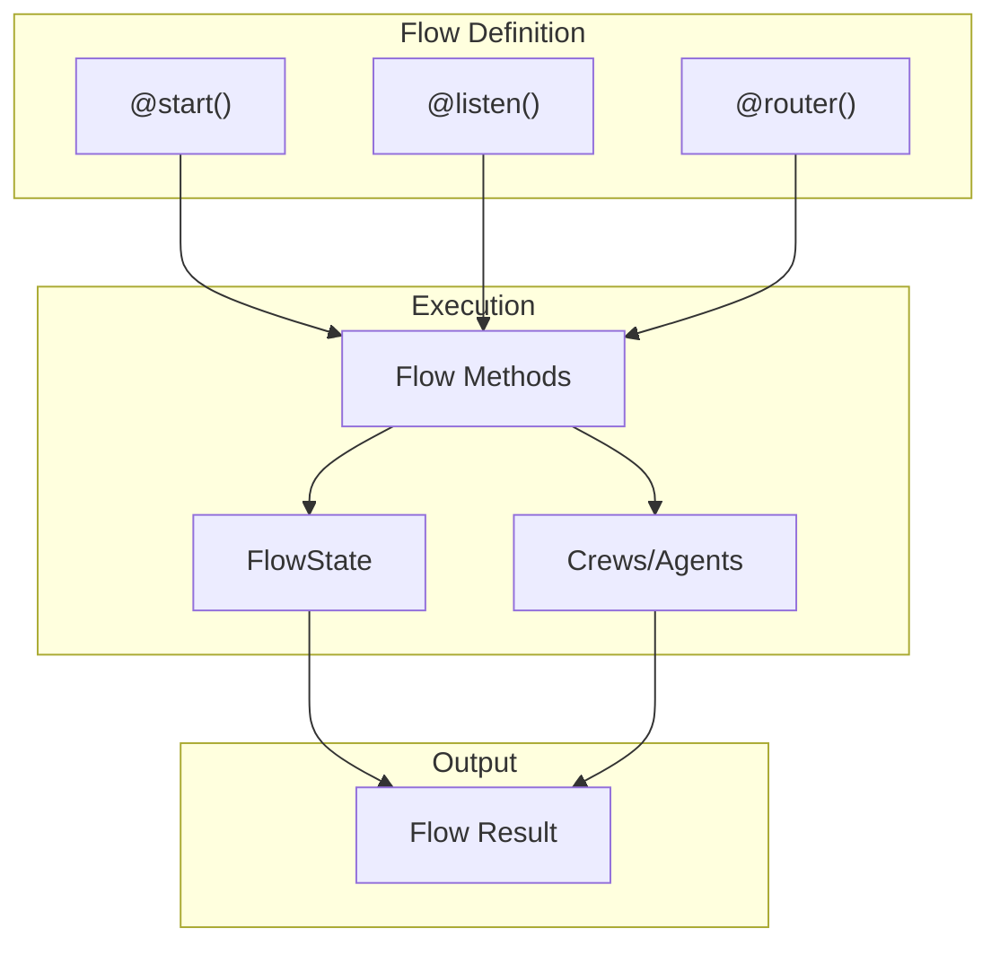
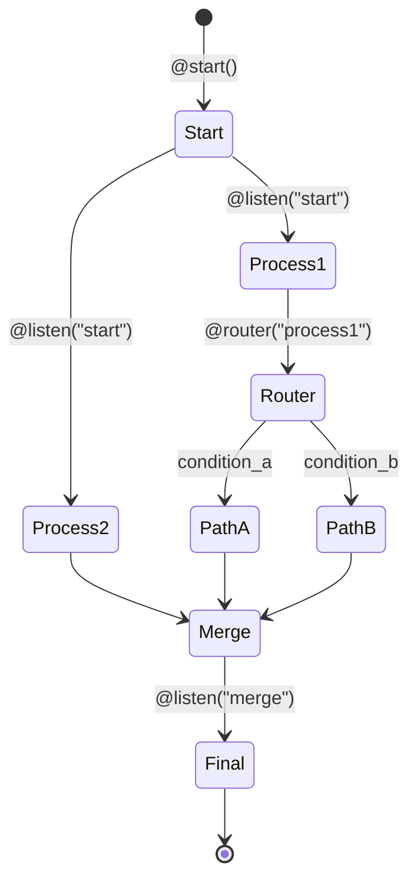

# Execution Graph (Flow)

## TL;DR
CrewAI **Flow** system cung cấp event-driven workflow orchestration với decorators `@start`, `@listen`, `@router`. Flow cho phép complex execution graphs với conditional branching, state management, và crew composition. Flow là higher-level abstraction trên Crew.

---

## 1. Flow Architecture



---

## 2. Flow Decorators

### 2.1 @start

```python
from crewai.flow.flow import Flow, start, listen, router

class MyFlow(Flow):
    @start()
    def begin(self):
        """Starting point of the flow."""
        return "Flow started"
```

### 2.2 @listen

```python
class MyFlow(Flow):
    @start()
    def begin(self):
        return {"data": "initial"}

    @listen("begin")  # Listens to 'begin' method
    def process(self, result):
        """Executes after 'begin' completes."""
        return f"Processed: {result['data']}"

    @listen("process")
    def finalize(self, result):
        """Executes after 'process' completes."""
        return f"Final: {result}"
```

### 2.3 @router

```python
class MyFlow(Flow):
    @start()
    def analyze(self):
        # Return data for routing decision
        return {"score": 85}

    @router("analyze")
    def route(self, result):
        """Route based on analysis result."""
        if result["score"] > 80:
            return "high_quality_path"
        else:
            return "improvement_path"

    @listen("high_quality_path")
    def publish(self, result):
        return "Published!"

    @listen("improvement_path")
    def improve(self, result):
        return "Needs improvement"
```

---

## 3. Flow State Management

### 3.1 Typed State

```python
from pydantic import BaseModel

class ResearchState(BaseModel):
    topic: str = ""
    findings: list[str] = []
    summary: str = ""

class ResearchFlow(Flow[ResearchState]):
    @start()
    def set_topic(self):
        self.state.topic = "AI in Healthcare"
        return self.state.topic

    @listen("set_topic")
    def research(self, topic):
        self.state.findings = ["Finding 1", "Finding 2"]
        return self.state.findings

    @listen("research")
    def summarize(self, findings):
        self.state.summary = f"Summary of {len(findings)} findings"
        return self.state.summary
```

### 3.2 State Access

```python
class MyFlow(Flow):
    @start()
    def init(self):
        # Access state directly
        self.state.counter = 0
        return "initialized"

    @listen("init")
    def increment(self, _):
        self.state.counter += 1
        return self.state.counter
```

---

## 4. Flow with Crews

### 4.1 Crew Composition

```python
class ContentFlow(Flow):
    @start()
    def research_phase(self):
        """Execute research crew."""
        research_crew = Crew(
            agents=[researcher],
            tasks=[research_task],
        )
        return research_crew.kickoff()

    @listen("research_phase")
    def writing_phase(self, research_output):
        """Execute writing crew with research context."""
        writing_crew = Crew(
            agents=[writer],
            tasks=[Task(
                description=f"Write based on: {research_output}",
                agent=writer,
            )],
        )
        return writing_crew.kickoff()

    @listen("writing_phase")
    def review_phase(self, draft):
        """Execute review crew."""
        review_crew = Crew(
            agents=[editor],
            tasks=[Task(
                description=f"Review: {draft}",
                agent=editor,
            )],
        )
        return review_crew.kickoff()
```

### 4.2 Using @crew Decorator

```python
from crewai.project import CrewBase, crew, agent, task

class MyFlow(Flow):
    @start()
    @crew
    def research_crew(self) -> Crew:
        return Crew(
            agents=[self.researcher()],
            tasks=[self.research_task()],
        )

    @listen("research_crew")
    @crew
    def writing_crew(self) -> Crew:
        return Crew(
            agents=[self.writer()],
            tasks=[self.writing_task()],
        )
```

---

## 5. Complex Flow Patterns

### 5.1 Parallel Execution

```python
class ParallelFlow(Flow):
    @start()
    def begin(self):
        return "start"

    @listen("begin")
    def branch_a(self, _):
        return "A result"

    @listen("begin")
    def branch_b(self, _):
        return "B result"

    @listen("branch_a", "branch_b")  # Wait for both
    def merge(self, results):
        return f"Merged: {results}"
```

### 5.2 Conditional Branching

```python
class ConditionalFlow(Flow):
    @start()
    def evaluate(self):
        return {"quality": "high", "score": 95}

    @router("evaluate")
    def decide_path(self, result):
        if result["score"] > 90:
            return "premium_path"
        elif result["score"] > 70:
            return "standard_path"
        else:
            return "review_path"

    @listen("premium_path")
    def premium_processing(self, _):
        return "Premium handling"

    @listen("standard_path")
    def standard_processing(self, _):
        return "Standard handling"

    @listen("review_path")
    def review_processing(self, _):
        return "Needs review"
```

### 5.3 Loop Pattern

```python
class IterativeFlow(Flow[IterativeState]):
    @start()
    def init(self):
        self.state.iteration = 0
        self.state.max_iterations = 3
        return "start"

    @listen("init", "improve")
    @router()
    def check_quality(self, result):
        if self.state.iteration >= self.state.max_iterations:
            return "finalize"
        if self._is_quality_good(result):
            return "finalize"
        return "improve"

    @listen("improve")
    def improve(self, result):
        self.state.iteration += 1
        return self._improve_result(result)

    @listen("finalize")
    def finalize(self, result):
        return f"Final after {self.state.iteration} iterations"
```

---

## 6. Flow Execution

### 6.1 Running Flow

```python
# Create and run flow
flow = MyFlow()
result = flow.kickoff()

# With inputs
result = flow.kickoff(inputs={"topic": "AI"})

# Async
result = await flow.kickoff_async()
```

### 6.2 Flow Visualization

```python
# Generate flow diagram
flow = MyFlow()
flow.plot()  # Creates mermaid diagram
```

---

## 7. Flow Events

```python
# Flow events emitted during execution
- FlowCreatedEvent
- FlowStartedEvent
- MethodExecutionStartedEvent
- MethodExecutionCompletedEvent
- FlowFinishedEvent
```

---

## 8. Execution Graph Diagram



---

## 9. Key Takeaways

1. **Event-Driven**: Methods trigger based on completion of other methods.

2. **Decorators**: `@start`, `@listen`, `@router` define flow graph.

3. **Typed State**: Pydantic models for flow state management.

4. **Crew Composition**: Flows can orchestrate multiple crews.

5. **Conditional Logic**: `@router` enables branching paths.

6. **Parallel Execution**: Multiple listeners can run in parallel.

7. **Visualization**: Built-in flow diagram generation.

---

## File References

| Component | Path |
|-----------|------|
| Flow Class | `lib/crewai/src/crewai/flow/flow.py` |
| Flow Decorators | `lib/crewai/src/crewai/flow/flow.py` |
| Flow State | `lib/crewai/src/crewai/flow/flow.py` |
| Flow Events | `lib/crewai/src/crewai/events/types/flow_events.py` |
| Visualization | `lib/crewai/src/crewai/flow/visualization/` |
