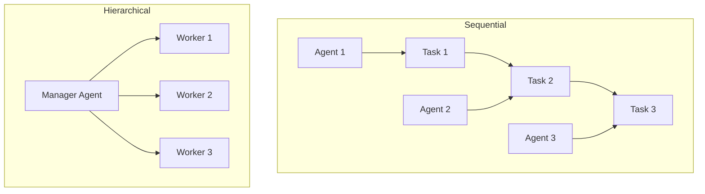
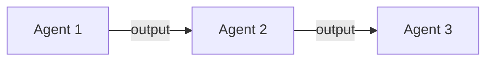
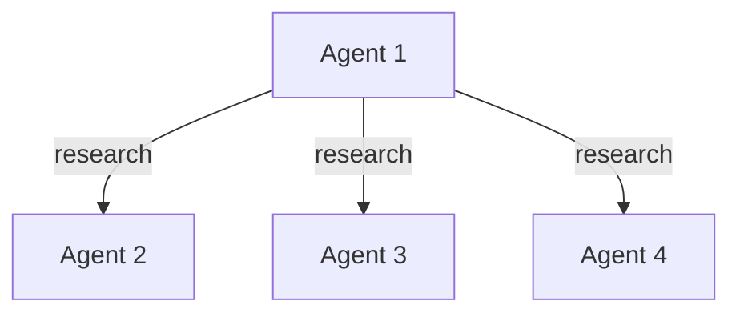
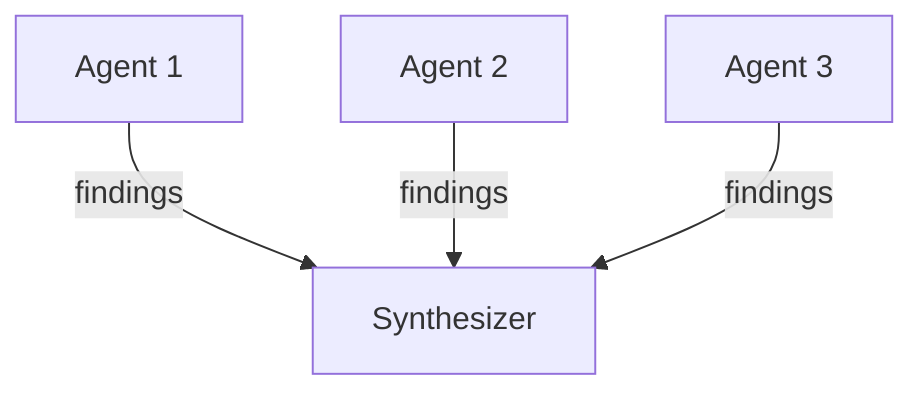

# Multi-Agent Orchestration

## TL;DR
CrewAI hỗ trợ **2 process types** cho multi-agent: Sequential (tasks chạy tuần tự) và Hierarchical (manager delegate cho workers). Agents giao tiếp qua **task context** (output của task trước) và **delegation tools** (ask/delegate to other agents).

---

## 1. Process Types



---

## 2. Sequential Process

### 2.1 Configuration

```python
from crewai import Agent, Task, Crew, Process

researcher = Agent(
    role="Researcher",
    goal="Find relevant information",
    backstory="Expert researcher",
)

writer = Agent(
    role="Writer",
    goal="Write compelling content",
    backstory="Expert writer",
)

editor = Agent(
    role="Editor",
    goal="Polish and refine content",
    backstory="Expert editor",
)

# Tasks execute in order
research_task = Task(
    description="Research AI in healthcare",
    expected_output="Research findings",
    agent=researcher,
)

write_task = Task(
    description="Write article based on research",
    expected_output="Article draft",
    agent=writer,
    context=[research_task],  # Receives research output
)

edit_task = Task(
    description="Edit and polish the article",
    expected_output="Final article",
    agent=editor,
    context=[write_task],  # Receives draft
)

crew = Crew(
    agents=[researcher, writer, editor],
    tasks=[research_task, write_task, edit_task],
    process=Process.sequential,  # Execute in order
)
```

### 2.2 Execution Flow

```python
# File: lib/crewai/src/crewai/crew.py

def _run_sequential_process(self) -> CrewOutput:
    """Execute tasks sequentially."""

    task_outputs: list[TaskOutput] = []

    for task in self.tasks:
        # Build context from previous task outputs
        context = self._build_context_for_task(task, task_outputs)

        # Execute task with its assigned agent
        output = task.execute_sync(
            agent=task.agent,
            context=context,
            tools=task.tools,
        )

        task_outputs.append(output)

    return self._build_crew_output(task_outputs)
```

---

## 3. Hierarchical Process

### 3.1 Configuration

```python
manager = Agent(
    role="Project Manager",
    goal="Coordinate team to complete project",
    backstory="Experienced manager",
    llm="gpt-4o",  # Strong model for planning
)

developer = Agent(
    role="Developer",
    goal="Write clean code",
    backstory="Senior developer",
)

tester = Agent(
    role="QA Tester",
    goal="Ensure quality",
    backstory="QA expert",
)

# Single high-level task
project_task = Task(
    description="Build a REST API for user management",
    expected_output="Working API with tests",
)

crew = Crew(
    agents=[developer, tester],  # Workers only
    tasks=[project_task],
    process=Process.hierarchical,
    manager_agent=manager,  # Or manager_llm="gpt-4o"
)
```

### 3.2 Manager Execution

```python
# File: lib/crewai/src/crewai/crew.py

def _run_hierarchical_process(self) -> CrewOutput:
    """Execute with manager delegation."""

    # Create or get manager agent
    if self.manager_agent:
        manager = self.manager_agent
    else:
        manager = Agent(
            role="Crew Manager",
            goal="Manage crew to complete tasks",
            backstory="Expert project manager",
            llm=self.manager_llm,
            allow_delegation=True,
        )

    # Give manager delegation tools
    delegation_tools = manager.get_delegation_tools(self.agents)
    manager.tools = delegation_tools

    # Manager executes all tasks by delegating
    for task in self.tasks:
        output = manager.execute_task(
            task=task,
            context=self._build_context_for_task(task, []),
        )

    return self._build_crew_output([output])
```

---

## 4. Agent Communication

### 4.1 Delegation Tools

```python
# File: lib/crewai/src/crewai/tools/agent_tools/agent_tools.py

class AgentTools:
    """Generate delegation tools for agent communication."""

    def tools(self) -> list[BaseTool]:
        tools = []

        for agent in self.agents:
            # Delegate Work tool
            tools.append(self._create_delegate_tool(agent))

            # Ask Question tool
            tools.append(self._create_ask_tool(agent))

        return tools

    def _create_delegate_tool(self, agent: Agent) -> BaseTool:
        """Create tool to delegate task to agent."""

        @tool(f"Delegate work to {agent.role}")
        def delegate_work(task: str, context: str = "") -> str:
            f"""Delegate a task to {agent.role}.
            The {agent.role} is: {agent.backstory}
            """
            return agent.execute_task(
                Task(description=task, expected_output="Result"),
                context=context,
            )

        return delegate_work

    def _create_ask_tool(self, agent: Agent) -> BaseTool:
        """Create tool to ask agent a question."""

        @tool(f"Ask {agent.role}")
        def ask_question(question: str) -> str:
            f"""Ask {agent.role} a question.
            The {agent.role} is: {agent.backstory}
            """
            return agent.execute_task(
                Task(description=question, expected_output="Answer"),
            )

        return ask_question
```

### 4.2 Context Passing

```python
# Context from previous tasks passed to next
task2 = Task(
    description="Write summary",
    agent=writer,
    context=[task1],  # Receives task1.output
)

# Multiple contexts
task3 = Task(
    description="Combine findings",
    agent=synthesizer,
    context=[task1, task2],  # Both outputs available
)
```

### 4.3 Context Building

```python
# File: lib/crewai/src/crewai/crew.py

def _build_context_for_task(
    self,
    task: Task,
    task_outputs: list[TaskOutput],
) -> str:
    """Build context string from previous outputs."""

    context_parts = []

    # Add outputs from context tasks
    if task.context:
        for ctx_task in task.context:
            # Find output for this context task
            for output in task_outputs:
                if output.description == ctx_task.description:
                    context_parts.append(
                        f"Output from {ctx_task.name or 'previous task'}:\n{output.raw}"
                    )

    return "\n\n".join(context_parts)
```

---

## 5. Agent Interaction Patterns

### 5.1 Chain Pattern



```python
# Tasks form a chain
tasks = [
    Task(description="Research", agent=researcher),
    Task(description="Write", agent=writer, context=[tasks[0]]),
    Task(description="Edit", agent=editor, context=[tasks[1]]),
]
```

### 5.2 Fan-Out Pattern



```python
# Manager delegates to multiple agents
manager_task = Task(
    description="Coordinate research on multiple topics",
    agent=manager,
)
# Manager uses delegation tools to assign work
```

### 5.3 Fan-In Pattern



```python
# Multiple inputs to one task
synthesis_task = Task(
    description="Synthesize all findings",
    agent=synthesizer,
    context=[task1, task2, task3],  # All previous outputs
)
```

---

## 6. Collaboration Example

```python
# Complete multi-agent workflow
from crewai import Agent, Task, Crew, Process

# Define specialized agents
market_analyst = Agent(
    role="Market Analyst",
    goal="Analyze market trends",
    backstory="Expert in market analysis",
    tools=[market_data_tool],
)

competitor_analyst = Agent(
    role="Competitor Analyst",
    goal="Analyze competitor strategies",
    backstory="Expert in competitive intelligence",
    tools=[competitor_data_tool],
)

strategist = Agent(
    role="Business Strategist",
    goal="Develop winning strategies",
    backstory="Expert strategist",
)

# Define tasks with dependencies
market_task = Task(
    description="Analyze market trends for Q1 2025",
    expected_output="Market analysis report",
    agent=market_analyst,
)

competitor_task = Task(
    description="Analyze top 3 competitors",
    expected_output="Competitor analysis report",
    agent=competitor_analyst,
)

strategy_task = Task(
    description="Develop market entry strategy",
    expected_output="Strategic plan",
    agent=strategist,
    context=[market_task, competitor_task],  # Both analyses
)

# Create crew
crew = Crew(
    agents=[market_analyst, competitor_analyst, strategist],
    tasks=[market_task, competitor_task, strategy_task],
    process=Process.sequential,
    memory=True,  # Shared memory
)

result = crew.kickoff()
```

---

## 7. Key Takeaways

1. **Two Process Types**: Sequential (ordered) and Hierarchical (managed).

2. **Context Passing**: Task outputs flow to next task via context parameter.

3. **Delegation Tools**: Manager can delegate/ask other agents.

4. **Shared Memory**: All agents access same memory when enabled.

5. **Flexible Patterns**: Chain, fan-out, fan-in patterns supported.

6. **Manager Agent**: Can be explicit agent or auto-created from LLM.

7. **Task Dependencies**: Define via `context=[task1, task2]`.

---

## File References

| Component | Path |
|-----------|------|
| Crew Process | `lib/crewai/src/crewai/crew.py` |
| Agent Tools | `lib/crewai/src/crewai/tools/agent_tools/` |
| Process Enum | `lib/crewai/src/crewai/process.py` |
| Task Context | `lib/crewai/src/crewai/task.py` |
