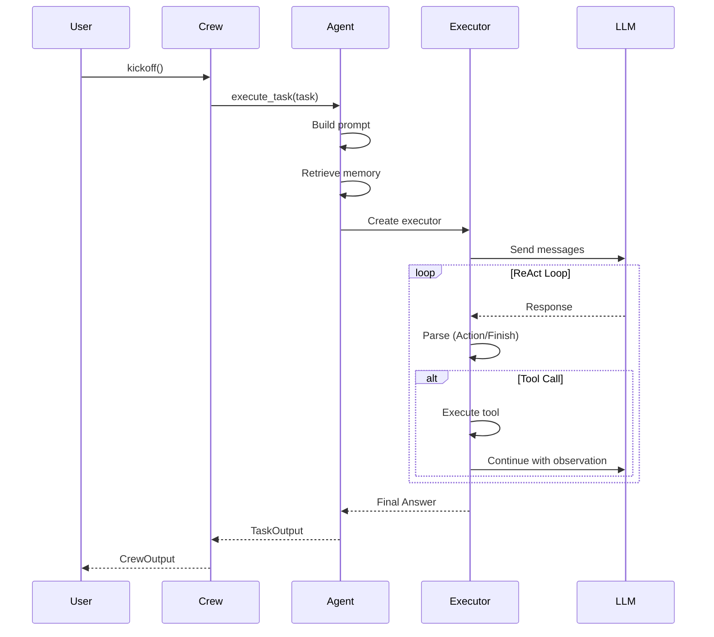

# Single Agent Flow

## TL;DR
Single agent flow trong crewAI cho phép **standalone agent execution** via `agent.kickoff()` hoặc execution trong Crew với single task. Agent nhận prompt, execute ReAct loop, return `LiteAgentOutput`. Flow đơn giản hơn multi-agent nhưng vẫn có full tool/memory support.

---

## 1. Single Agent Execution Options

```mermaid
graph TB
    subgraph "Standalone"
        Kickoff[agent.kickoff()]
        KA[kickoff_async()]
    end

    subgraph "In Crew"
        SingleTask[Crew with 1 agent, 1 task]
    end

    subgraph "Execution"
        Executor[AgentExecutor]
        ReAct[ReAct Loop]
    end

    subgraph "Output"
        LAO[LiteAgentOutput]
        TO[TaskOutput]
    end

    Kickoff --> Executor
    KA --> Executor
    SingleTask --> Executor

    Executor --> ReAct
    ReAct --> LAO
    ReAct --> TO
```

---

## 2. Standalone Execution (kickoff)

### 2.1 Basic Usage

```python
from crewai import Agent

agent = Agent(
    role="Data Analyst",
    goal="Analyze data and provide insights",
    backstory="Expert in statistical analysis",
    llm="gpt-4o",
    tools=[calculator, search_tool],
)

# Standalone execution
result = agent.kickoff(
    prompt="Analyze the sales data for Q4 2024",
    inputs={"data_source": "sales_db"},
)

print(result.raw)  # Raw text output
```

### 2.2 kickoff Implementation

```python
# File: lib/crewai/src/crewai/agent/core.py:1762-1839

def kickoff(
    self,
    inputs: dict[str, Any] | None = None,
    prompt: str | None = None,
    response_format: type[BaseModel] | None = None,
) -> LiteAgentOutput | Coroutine[Any, Any, LiteAgentOutput]:
    """Standalone agent execution without crew/task.

    Args:
        inputs: Variables for prompt interpolation
        prompt: Task prompt (or use agent's default)
        response_format: Pydantic model for structured output

    Returns:
        LiteAgentOutput with raw/pydantic/json output
    """

    # Check if inside async context (Flow)
    if is_inside_flow():
        return self._kickoff_async(inputs, prompt, response_format)

    # Prepare execution
    executor, inputs_dict, agent_info, tools = self._prepare_kickoff(
        inputs, prompt, response_format
    )

    # Execute and build output
    return self._execute_and_build_output(
        executor, inputs_dict, agent_info, response_format
    )
```

### 2.3 Async Variant

```python
async def kickoff_async(
    self,
    inputs: dict | None = None,
    prompt: str | None = None,
    response_format: type[BaseModel] | None = None,
) -> LiteAgentOutput:
    """Async standalone execution."""

    executor, inputs_dict, agent_info, tools = self._prepare_kickoff(
        inputs, prompt, response_format
    )

    return await self._aexecute_and_build_output(
        executor, inputs_dict, agent_info, response_format
    )
```

---

## 3. LiteAgentOutput

```python
# File: lib/crewai/src/crewai/lite_agent_output.py

class LiteAgentOutput(BaseModel):
    """Output from standalone agent execution."""

    raw: str                           # Raw text output
    pydantic: BaseModel | None = None  # Structured output
    json_dict: dict | None = None      # JSON output
    token_usage: UsageMetrics | None = None

    def __str__(self) -> str:
        if self.pydantic:
            return str(self.pydantic)
        if self.json_dict:
            return json.dumps(self.json_dict)
        return self.raw
```

---

## 4. Single Agent in Crew

### 4.1 Configuration

```python
from crewai import Agent, Task, Crew

agent = Agent(
    role="Researcher",
    goal="Find accurate information",
    backstory="Expert researcher",
    llm="gpt-4o",
)

task = Task(
    description="Research AI trends in healthcare",
    expected_output="Comprehensive report",
    agent=agent,
)

crew = Crew(
    agents=[agent],
    tasks=[task],
    process=Process.sequential,  # Only one process type needed
)

result = crew.kickoff()
```

### 4.2 Execution Flow



---

## 5. With Structured Output

### 5.1 Pydantic Model

```python
from pydantic import BaseModel

class AnalysisReport(BaseModel):
    summary: str
    key_findings: list[str]
    recommendations: list[str]
    confidence_score: float

# Standalone with structured output
result = agent.kickoff(
    prompt="Analyze the market data",
    response_format=AnalysisReport,
)

print(result.pydantic.summary)
print(result.pydantic.key_findings)
```

### 5.2 In Task

```python
task = Task(
    description="Analyze market trends",
    expected_output="Structured analysis report",
    agent=agent,
    output_pydantic=AnalysisReport,  # Structured output
)
```

---

## 6. With Tools

```python
from crewai.tools import tool

@tool
def search_database(query: str) -> str:
    """Search internal database."""
    return db.search(query)

@tool
def calculate(expression: str) -> float:
    """Calculate mathematical expression."""
    return eval(expression)

agent = Agent(
    role="Analyst",
    goal="Analyze data",
    backstory="Data expert",
    tools=[search_database, calculate],
)

# Tools available during execution
result = agent.kickoff(prompt="Find total sales and calculate growth rate")
```

---

## 7. With Memory

```python
from crewai import Crew
from crewai.memory import ShortTermMemory

# Memory enabled via crew
crew = Crew(
    agents=[agent],
    tasks=[task],
    memory=True,  # Enable memory
)

# Or with custom memory
crew = Crew(
    agents=[agent],
    tasks=[task],
    short_term_memory=ShortTermMemory(
        embedder_config={"provider": "openai"}
    ),
)

# Agent can access memory during execution
result = crew.kickoff()
```

---

## 8. Guardrails

```python
def validate_output(output: str) -> tuple[bool, str]:
    """Custom validation function."""
    if len(output) < 100:
        return False, "Output too short. Please provide more detail."
    if "error" in output.lower():
        return False, "Output contains error. Please fix."
    return True, ""

agent = Agent(
    role="Writer",
    goal="Write detailed content",
    backstory="Expert writer",
    guardrail=validate_output,
    guardrail_max_retries=3,
)
```

---

## 9. Key Takeaways

1. **Two Modes**: Standalone (`kickoff()`) và in-Crew execution.

2. **LiteAgentOutput**: Simplified output for standalone mode.

3. **Full Feature Support**: Tools, memory, guardrails all available.

4. **Structured Output**: Pydantic models for typed responses.

5. **Async Support**: `kickoff_async()` for non-blocking execution.

6. **Auto-Detection**: `kickoff()` detects async context (Flow) automatically.

7. **ReAct Loop**: Same execution loop as multi-agent scenarios.

---

## File References

| Component | Path |
|-----------|------|
| kickoff | `lib/crewai/src/crewai/agent/core.py:1762-1839` |
| LiteAgentOutput | `lib/crewai/src/crewai/lite_agent_output.py` |
| Executor | `lib/crewai/src/crewai/agents/crew_agent_executor.py` |
| Task | `lib/crewai/src/crewai/task.py` |
