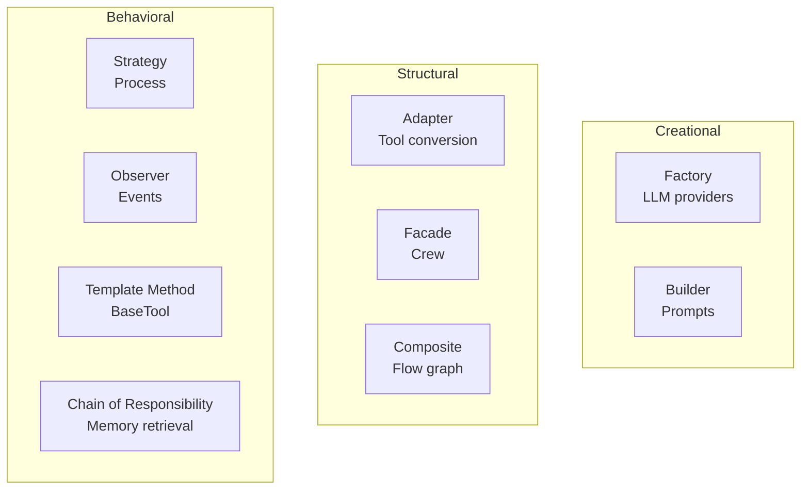

# Design Patterns

## TL;DR
CrewAI sử dụng nhiều **classic design patterns**: Factory (LLM provider routing), Strategy (Process types), Observer (Event bus), Decorator (Flow DSL), và Template Method (BaseTool). Patterns này cho phép extensibility, loose coupling, và clean architecture.

---

## 1. Patterns Overview



---

## 2. Factory Pattern

### 2.1 LLM Factory

```python
# File: lib/crewai/src/crewai/llm.py

class LLM(BaseLLM):
    def __new__(cls, model: str = None, **kwargs):
        """Factory method to create appropriate LLM instance."""

        # Determine provider
        provider = cls._infer_provider_from_model(model)

        # Create appropriate instance
        if provider == "openai":
            return OpenAICompletion(model=model, **kwargs)
        elif provider == "anthropic":
            return AnthropicCompletion(model=model, **kwargs)
        elif provider == "bedrock":
            return BedrockCompletion(model=model, **kwargs)
        # ... more providers

        # Fallback to LiteLLM
        return super().__new__(cls)
```

### 2.2 Benefits
- Client code doesn't know concrete provider
- Easy to add new providers
- Centralized instantiation logic

---

## 3. Strategy Pattern

### 3.1 Process Strategies

```python
# File: lib/crewai/src/crewai/process.py

class Process(str, Enum):
    sequential = "sequential"
    hierarchical = "hierarchical"

# File: lib/crewai/src/crewai/crew.py

def kickoff(self):
    if self.process == Process.sequential:
        result = self._run_sequential_process()  # Strategy 1
    elif self.process == Process.hierarchical:
        result = self._run_hierarchical_process()  # Strategy 2
    return result
```

### 3.2 Executor Strategies

```python
# Different execution strategies
def _invoke_loop(self) -> AgentFinish:
    if self._supports_native_tool_calling():
        return self._invoke_loop_native_tools()  # Strategy 1
    else:
        return self._invoke_loop_react()  # Strategy 2
```

---

## 4. Observer Pattern (Event Bus)

### 4.1 Event Bus Implementation

```python
# File: lib/crewai/src/crewai/events/event_bus.py

class EventBus:
    """Pub-sub event system."""

    def __init__(self):
        self._listeners: dict[type, list[Callable]] = {}

    def subscribe(self, event_type: type, listener: Callable):
        """Subscribe to event type."""
        if event_type not in self._listeners:
            self._listeners[event_type] = []
        self._listeners[event_type].append(listener)

    def emit(self, source: Any, event: Event):
        """Emit event to all listeners."""
        event_type = type(event)
        for listener in self._listeners.get(event_type, []):
            listener(source, event)

# Global instance
crewai_event_bus = EventBus()
```

### 4.2 Usage

```python
# Emitting events
crewai_event_bus.emit(
    self,
    AgentExecutionStartedEvent(agent=self, task=task)
)

# Subscribing to events
crewai_event_bus.subscribe(
    AgentExecutionStartedEvent,
    lambda src, evt: print(f"Agent {evt.agent.role} started")
)
```

---

## 5. Template Method Pattern

### 5.1 BaseTool Template

```python
# File: lib/crewai/src/crewai/tools/base_tool.py

class BaseTool(BaseModel, ABC):
    """Template for all tools."""

    # Template method
    def run(self, *args, **kwargs) -> Any:
        """Fixed algorithm with customizable steps."""
        # Pre-processing (fixed)
        self._validate_args(*args, **kwargs)

        # Customizable execution (abstract)
        result = self._run(*args, **kwargs)

        # Post-processing (fixed)
        self.current_usage_count += 1

        return result

    @abstractmethod
    def _run(self, *args, **kwargs) -> Any:
        """Subclasses implement this."""
        pass
```

### 5.2 Memory Template

```python
class Memory(BaseModel):
    """Template for memory types."""

    def save(self, value: Any, metadata: dict = None):
        """Template method for saving."""
        metadata = metadata or {}
        # Delegate to storage (customizable)
        self.storage.save(value, metadata)

    def search(self, query: str, limit: int = 5):
        """Template method for searching."""
        # Delegate to storage (customizable)
        return self.storage.search(query, limit)
```

---

## 6. Decorator Pattern

### 6.1 Flow Decorators

```python
# File: lib/crewai/src/crewai/flow/flow.py

def start():
    """Decorator marking flow entry point."""
    def decorator(func):
        func._is_start = True
        return func
    return decorator

def listen(*method_names):
    """Decorator marking method as listener."""
    def decorator(func):
        func._listens_to = method_names
        return func
    return decorator

def router(*method_names):
    """Decorator for conditional routing."""
    def decorator(func):
        func._is_router = True
        func._routes_from = method_names
        return func
    return decorator
```

### 6.2 Project Decorators

```python
# File: lib/crewai/src/crewai/project/annotations.py

def agent(func):
    """Decorator to mark agent factory methods."""
    func._is_agent = True
    return func

def task(func):
    """Decorator to mark task factory methods."""
    func._is_task = True
    return func

def crew(func):
    """Decorator to mark crew factory methods."""
    func._is_crew = True
    return func
```

---

## 7. Adapter Pattern

### 7.1 Tool Adapter

```python
# File: lib/crewai/src/crewai/tools/base_tool.py

def to_langchain(
    tools: list[BaseTool | CrewStructuredTool]
) -> list[CrewStructuredTool]:
    """Adapt tools to unified interface."""
    return [
        t.to_structured_tool() if isinstance(t, BaseTool) else t
        for t in tools
    ]

class BaseTool:
    def to_structured_tool(self) -> CrewStructuredTool:
        """Adapt BaseTool to CrewStructuredTool."""
        return CrewStructuredTool(
            name=self.name,
            description=self.description,
            args_schema=self.args_schema,
            func=self._run,
        )
```

### 7.2 Message Adapter

```python
def _format_messages_for_provider(
    messages: list[dict],
    provider: str
) -> list[dict]:
    """Adapt messages to provider format."""
    if provider == "anthropic":
        # Anthropic needs system separate
        return _format_for_anthropic(messages)
    elif provider == "openai":
        return messages  # OpenAI format is default
    # ... other providers
```

---

## 8. Facade Pattern

### 8.1 Crew Facade

```python
# Crew provides simple interface to complex subsystem
crew = Crew(
    agents=[agent1, agent2],
    tasks=[task1, task2],
    process=Process.sequential,
)

# Simple interface hides complexity
result = crew.kickoff(inputs={"topic": "AI"})

# Under the hood:
# - Agent initialization
# - Memory setup
# - Tool preparation
# - Task execution
# - Event emission
# - Output collection
```

---

## 9. Chain of Responsibility

### 9.1 Memory Retrieval Chain

```python
class ContextualMemory:
    def build_context_for_task(self, task, context):
        """Chain of memory handlers."""
        context_parts = []

        # Handler 1: Long-term memory
        if self.ltm:
            context_parts.append(self._fetch_ltm_context(task))

        # Handler 2: Short-term memory
        if self.stm:
            context_parts.append(self._fetch_stm_context(query))

        # Handler 3: Entity memory
        if self.em:
            context_parts.append(self._fetch_entity_context(query))

        # Handler 4: External memory
        if self.exm:
            context_parts.append(self._fetch_external_context(query))

        return "\n".join(filter(None, context_parts))
```

### 9.2 Input Parsing Chain

```python
def _validate_tool_input(self, tool_input: str) -> dict:
    """Chain of parsers."""
    # Try JSON
    try:
        return json.loads(tool_input)
    except: pass

    # Try literal eval
    try:
        return ast.literal_eval(tool_input)
    except: pass

    # Try JSON5
    try:
        return json5.loads(tool_input)
    except: pass

    # Try JSON repair
    try:
        return json.loads(repair_json(tool_input))
    except: pass

    raise Exception("Could not parse input")
```

---

## 10. Singleton Pattern

### 10.1 Event Bus Singleton

```python
# File: lib/crewai/src/crewai/events/__init__.py

# Single global event bus instance
crewai_event_bus = EventBus()

# All components use same instance
from crewai.events import crewai_event_bus
```

---

## 11. Key Takeaways

| Pattern | Usage | Benefit |
|---------|-------|---------|
| **Factory** | LLM providers | Extensibility |
| **Strategy** | Process types | Flexibility |
| **Observer** | Event bus | Loose coupling |
| **Template** | BaseTool, Memory | Reusability |
| **Decorator** | Flow DSL | Clean syntax |
| **Adapter** | Tool conversion | Compatibility |
| **Facade** | Crew | Simplicity |
| **Chain** | Memory retrieval | Extensibility |
| **Singleton** | Event bus | Consistency |

---

## File References

| Pattern | File Path |
|---------|-----------|
| Factory | `lib/crewai/src/crewai/llm.py` |
| Strategy | `lib/crewai/src/crewai/crew.py` |
| Observer | `lib/crewai/src/crewai/events/event_bus.py` |
| Template | `lib/crewai/src/crewai/tools/base_tool.py` |
| Decorator | `lib/crewai/src/crewai/flow/flow.py` |
| Adapter | `lib/crewai/src/crewai/tools/base_tool.py` |
| Facade | `lib/crewai/src/crewai/crew.py` |
