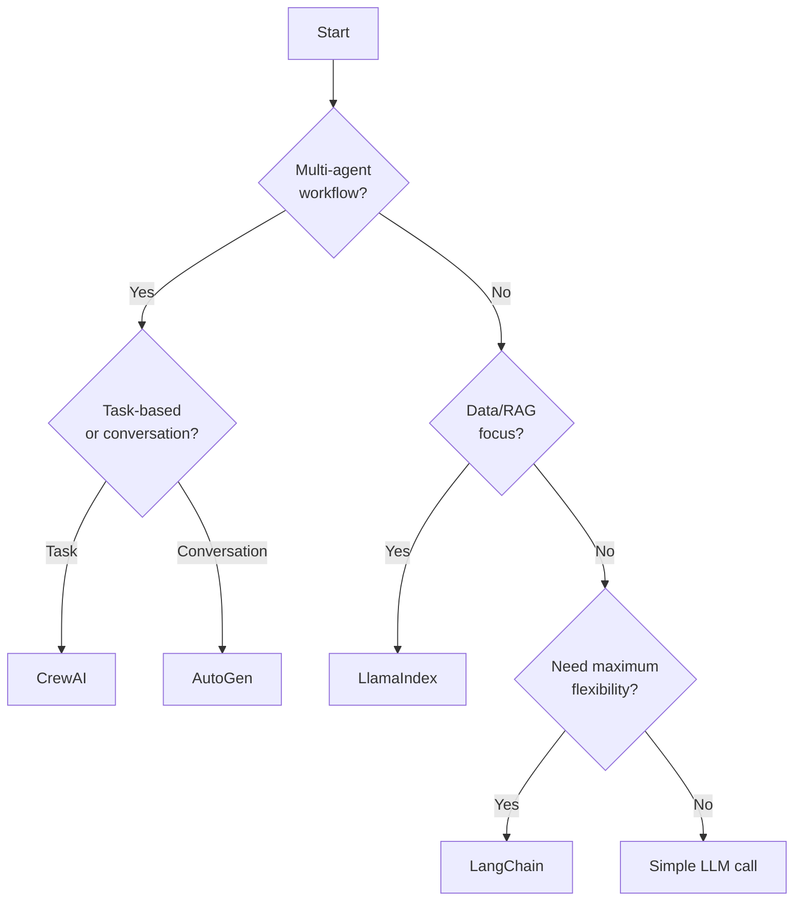

# Framework Comparison

## TL;DR
CrewAI so với các framework khác: **LangChain** (more comprehensive, steeper learning curve), **AutoGen** (conversation-focused), **LlamaIndex** (data-focused). CrewAI nổi bật với **role-based agents**, **simple API**, và **production features**.

---

## 1. Comparison Overview

| Feature | CrewAI | LangChain | AutoGen | LlamaIndex |
|---------|--------|-----------|---------|------------|
| **Focus** | Multi-agent orchestration | General LLM framework | Conversational agents | Data & retrieval |
| **Complexity** | Medium | High | Medium | Medium |
| **Agent Model** | Role-based | Chain-based | Conversation-based | Query-based |
| **Learning Curve** | Low-Medium | High | Medium | Medium |
| **Production Ready** | Yes | Yes | Partial | Yes |

---

## 2. CrewAI vs LangChain

### 2.1 Architecture Comparison

```
CrewAI:
Agent → Task → Crew → Flow
(Simple hierarchy)

LangChain:
Chain → Agent → Tool → Memory → Retriever → ...
(Many primitives to compose)
```

### 2.2 Key Differences

| Aspect | CrewAI | LangChain |
|--------|--------|-----------|
| **Abstraction** | High-level | Low-level building blocks |
| **Agent Definition** | role/goal/backstory | Prompt templates |
| **Multi-agent** | Native (Crew) | Via LangGraph |
| **Memory** | Built-in multi-tier | Pluggable, manual setup |
| **Learning Curve** | Days | Weeks |

### 2.3 When to Choose

**Choose CrewAI when:**
- Building multi-agent systems
- Need quick prototyping
- Role-based agents fit use case
- Want simpler API

**Choose LangChain when:**
- Need maximum flexibility
- Building custom LLM applications
- Want fine-grained control
- Complex chain compositions

### 2.4 Code Comparison

```python
# CrewAI
from crewai import Agent, Task, Crew

researcher = Agent(
    role="Researcher",
    goal="Find information",
    backstory="Expert researcher",
)
task = Task(description="Research AI", agent=researcher)
crew = Crew(agents=[researcher], tasks=[task])
result = crew.kickoff()

# LangChain (equivalent)
from langchain.agents import AgentExecutor, create_openai_tools_agent
from langchain_openai import ChatOpenAI
from langchain_core.prompts import ChatPromptTemplate

llm = ChatOpenAI()
prompt = ChatPromptTemplate.from_messages([
    ("system", "You are a researcher..."),
    ("human", "{input}"),
])
agent = create_openai_tools_agent(llm, tools, prompt)
executor = AgentExecutor(agent=agent, tools=tools)
result = executor.invoke({"input": "Research AI"})
```

---

## 3. CrewAI vs AutoGen

### 3.1 Architecture Comparison

```
CrewAI:
Role-based agents with tasks
Sequential/Hierarchical processes

AutoGen:
Conversational agents
Multi-turn dialogues
Group chat patterns
```

### 3.2 Key Differences

| Aspect | CrewAI | AutoGen |
|--------|--------|---------|
| **Model** | Task execution | Conversation |
| **Communication** | Via context/output | Direct messages |
| **Human-in-loop** | Task level | Conversation level |
| **Code execution** | Optional tool | Native feature |
| **Multi-agent** | Crew orchestration | Group chat |

### 3.3 When to Choose

**Choose CrewAI when:**
- Task-oriented workflows
- Clear input → output pipelines
- Production deployments
- Role-based specialization

**Choose AutoGen when:**
- Conversational AI systems
- Code generation/execution focus
- Research/experimentation
- Agent-to-agent dialogue

### 3.4 Code Comparison

```python
# CrewAI
researcher = Agent(role="Researcher", ...)
writer = Agent(role="Writer", ...)
crew = Crew(agents=[researcher, writer], tasks=[...])
result = crew.kickoff()

# AutoGen
from autogen import AssistantAgent, UserProxyAgent

researcher = AssistantAgent("researcher", llm_config={...})
writer = AssistantAgent("writer", llm_config={...})
user = UserProxyAgent("user")

user.initiate_chat(researcher, message="Research AI")
researcher.initiate_chat(writer, message="Write about...")
```

---

## 4. CrewAI vs LlamaIndex

### 4.1 Architecture Comparison

```
CrewAI:
Agents for task execution
Memory for context
Tools for actions

LlamaIndex:
Indexes for data
Retrievers for search
Query engines for QA
Agents for complex queries
```

### 4.2 Key Differences

| Aspect | CrewAI | LlamaIndex |
|--------|--------|------------|
| **Focus** | Agent orchestration | Data retrieval |
| **Strength** | Multi-agent workflows | RAG pipelines |
| **Data Handling** | Via knowledge/memory | Core feature |
| **Agents** | Primary concept | Secondary feature |

### 4.3 When to Choose

**Choose CrewAI when:**
- Complex agent workflows
- Multiple specialized agents
- Task-based execution
- Workflow orchestration

**Choose LlamaIndex when:**
- Document Q&A
- Knowledge base search
- RAG applications
- Data indexing focus

### 4.4 Complementary Use

```python
# Use both together
from llama_index import VectorStoreIndex
from crewai import Agent, Tool

# LlamaIndex for knowledge
index = VectorStoreIndex.from_documents(documents)
query_engine = index.as_query_engine()

# Wrap as CrewAI tool
@tool
def search_knowledge(query: str) -> str:
    """Search the knowledge base."""
    return query_engine.query(query).response

# Use in CrewAI agent
agent = Agent(
    role="Knowledge Expert",
    tools=[search_knowledge],
)
```

---

## 5. Feature Matrix

| Feature | CrewAI | LangChain | AutoGen | LlamaIndex |
|---------|:------:|:---------:|:-------:|:----------:|
| Multi-agent | ✓✓✓ | ✓✓ | ✓✓✓ | ✓ |
| RAG | ✓✓ | ✓✓✓ | ✓ | ✓✓✓ |
| Memory | ✓✓✓ | ✓✓ | ✓ | ✓✓ |
| Streaming | ✓✓ | ✓✓✓ | ✓ | ✓✓ |
| Observability | ✓✓✓ | ✓✓ | ✓ | ✓✓ |
| Async | ✓✓ | ✓✓✓ | ✓✓ | ✓✓ |
| Production | ✓✓✓ | ✓✓✓ | ✓ | ✓✓✓ |
| Learning Curve | Low | High | Med | Med |

---

## 6. Integration Possibilities

### 6.1 CrewAI + LangChain

```python
# Use LangChain tools in CrewAI
from langchain_community.tools import WikipediaQueryRun
from crewai.tools import BaseTool

class WikipediaTool(BaseTool):
    name = "wikipedia"
    description = "Search Wikipedia"

    def _run(self, query: str) -> str:
        lc_tool = WikipediaQueryRun()
        return lc_tool.run(query)
```

### 6.2 CrewAI + LlamaIndex

```python
# Use LlamaIndex retriever in CrewAI
from llama_index import VectorStoreIndex

@tool
def search_docs(query: str) -> str:
    """Search indexed documents."""
    return index.as_query_engine().query(query).response

agent = Agent(tools=[search_docs])
```

---

## 7. Decision Framework



---

## 8. Key Takeaways

1. **CrewAI**: Best for role-based multi-agent task execution
2. **LangChain**: Best for maximum flexibility and custom chains
3. **AutoGen**: Best for conversational agent systems
4. **LlamaIndex**: Best for RAG and document applications

5. **Not Mutually Exclusive**: Frameworks can be combined
6. **Choose Based on Primary Use Case**: Not trying to do everything
7. **Consider Team Experience**: Simpler is often better

---

## References

| Framework | Documentation |
|-----------|---------------|
| CrewAI | https://docs.crewai.com |
| LangChain | https://python.langchain.com |
| AutoGen | https://microsoft.github.io/autogen |
| LlamaIndex | https://docs.llamaindex.ai |
