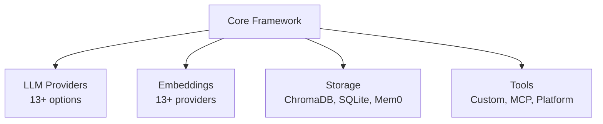

# Key Insights từ CrewAI

## TL;DR
CrewAI là **production-ready multi-agent framework** với kiến trúc layered, plugin-based extensibility, và event-driven observability. Những insights quan trọng: ReAct pattern cho agent reasoning, Provider abstraction cho LLM, Memory hierarchy cho context, và Flow cho complex workflows.

---

## 1. Architecture Insights

### 1.1 Layered Composition

```
Flow → Crew → Agent → Task → LLM
```

**Insight**: Mỗi layer có single responsibility và communicate qua well-defined interfaces.

- **Flow**: Event-driven workflow orchestration
- **Crew**: Multi-agent coordination
- **Agent**: Autonomous execution unit
- **Task**: Work definition
- **LLM**: Language model abstraction

### 1.2 Plugin Architecture



**Insight**: Pluggable components cho phép swap implementations without code changes.

---

## 2. Agent Design Insights

### 2.1 Identity Triplet

```python
Agent(
    role="Senior Researcher",      # WHO
    goal="Find accurate info",      # WHAT
    backstory="10 years experience" # WHY/HOW
)
```

**Insight**: Role, goal, backstory inject vào system prompt, tạo persona cho agent. Đây là cách đơn giản nhưng hiệu quả để customize agent behavior.

### 2.2 ReAct Pattern

```
Thought → Action → Observation → Thought → ... → Final Answer
```

**Insight**: ReAct (Reasoning + Acting) cho phép agent:
- Reasoning trước khi action
- Learn từ tool results
- Self-correct through iterations
- Explain decision process

### 2.3 Dual LLM Support

```python
Agent(
    llm="gpt-4o",                    # Main reasoning
    function_calling_llm="gpt-4o-mini"  # Tool parsing
)
```

**Insight**: Separate LLM cho tool calling saves cost - smaller model cho structured parsing, larger model cho reasoning.

---

## 3. Memory System Insights

### 3.1 Memory Hierarchy

| Type | Scope | Purpose |
|------|-------|---------|
| Short-term | Session | Recent insights |
| Long-term | Persistent | Task history |
| Entity | Persistent | Structured facts |
| External | Distributed | Cross-system |

**Insight**: Multi-tier memory mirrors human cognition - working memory (STM), episodic memory (LTM), semantic memory (Entity).

### 3.2 Semantic Search

**Insight**: RAG-based memory retrieval với embeddings cho phép:
- Semantic similarity search
- Not just keyword matching
- Context-aware retrieval
- Scalable với large memory

---

## 4. Tool System Insights

### 4.1 Schema-First Design

```python
class MyToolSchema(BaseModel):
    query: str = Field(description="Search query")

class MyTool(BaseTool):
    args_schema = MyToolSchema
```

**Insight**: Pydantic schema cho phép:
- Runtime validation
- Auto-generate descriptions for LLM
- Type safety
- Documentation built-in

### 4.2 Fuzzy Tool Selection

**Insight**: 85% similarity threshold cho tool matching giúp handle typos và variations từ LLM output. Đây là practical solution cho imperfect LLM outputs.

### 4.3 Retry Mechanism

**Insight**: Max 3 retries với graceful degradation. Khi tool fails, return error as observation để agent có thể adapt, thay vì crash.

---

## 5. LLM Integration Insights

### 5.1 Provider Abstraction

```python
# Same code, different providers
LLM("gpt-4o")      # OpenAI
LLM("claude-3")    # Anthropic
LLM("gemini-pro")  # Google
```

**Insight**: Factory pattern với auto-detection cho phép seamless provider switching. Native SDKs cho major providers, LiteLLM fallback cho 100+ others.

### 5.2 Streaming-First

**Insight**: Streaming output improves UX significantly. Users see progress instead of waiting. Implemented via generator pattern với event emission cho each chunk.

### 5.3 Prompt Engineering

**Insight**: Prompt structure:
```
System: Identity (role/goal/backstory) + Tools + Format instructions
User: Task + Context + Memory + Knowledge + Schema
```

Clear separation cho phép customization tại each layer.

---

## 6. Orchestration Insights

### 6.1 Process Types

- **Sequential**: Simple, predictable, good for pipelines
- **Hierarchical**: Manager delegates, good for complex projects

**Insight**: Two process types cover most use cases. Sequential cho explicit workflows, Hierarchical cho dynamic delegation.

### 6.2 Context Passing

```python
task2.context = [task1]  # task1's output → task2's context
```

**Insight**: Explicit context passing cho phép:
- Clear data flow
- Selective information sharing
- Traceable execution

### 6.3 Flow Decorators

```python
@start() → @listen("method") → @router("method")
```

**Insight**: DSL via decorators makes complex workflows readable. Implicit execution graph từ decorator relationships.

---

## 7. Observability Insights

### 7.1 Event-Driven Architecture

**Insight**: Every significant action emits event:
- Decoupled observability
- Easy to add custom listeners
- OpenTelemetry integration
- Debugging made easy

### 7.2 Usage Metrics

```python
crew.usage_metrics.total_tokens
crew.usage_metrics.successful_requests
```

**Insight**: Built-in cost tracking essential cho production. Know exactly how many tokens used.

---

## 8. Best Practices Learned

### 8.1 From Architecture

1. **Composition > Inheritance**: Flow contains Crew, Crew contains Agents
2. **Interface > Implementation**: BaseLLM, BaseTool, Storage interface
3. **Events > Direct Calls**: Decoupled observability

### 8.2 From Implementation

1. **Pydantic for Everything**: Validation, serialization, documentation
2. **Async Support**: Dual sync/async methods for flexibility
3. **Graceful Degradation**: Retry, fallback, error as data

### 8.3 From Patterns

1. **Factory for Providers**: Easy to extend
2. **Strategy for Process**: Easy to swap
3. **Template for Tools**: Consistent interface

---

## 9. Quantitative Insights

| Metric | Value |
|--------|-------|
| Core files | ~15 major modules |
| Total LOC (core) | ~15,000 |
| LLM providers | 5 native + 100+ via LiteLLM |
| Embedding providers | 13+ |
| Memory types | 5 |
| Event types | 15+ |

---

## 10. Key Takeaways

1. **Agent = LLM + Tools + Memory + Identity**: Simple but powerful formula

2. **ReAct is Core**: Iterative reasoning enables complex tasks

3. **Memory Matters**: Context retention crucial for coherent behavior

4. **Events Everywhere**: Observability built-in, not bolted-on

5. **Pydantic Power**: Type safety + validation + documentation

6. **Provider Agnostic**: Switch LLMs without code changes

7. **Flow for Complexity**: When Crew isn't enough, use Flow

8. **Production Ready**: Token tracking, caching, rate limiting built-in

---

## File References

| Insight Area | Key Files |
|--------------|-----------|
| Architecture | `__init__.py`, `crew.py` |
| Agent | `agent/core.py`, `agents/crew_agent_executor.py` |
| Memory | `memory/*.py` |
| Tools | `tools/base_tool.py`, `tools/tool_usage.py` |
| LLM | `llm.py`, `llms/providers/*.py` |
| Orchestration | `crew.py`, `flow/flow.py` |
| Events | `events/*.py` |
